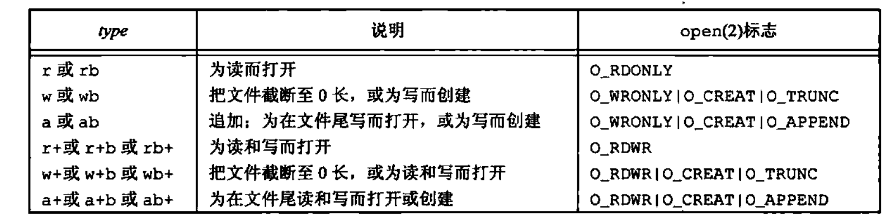

# APUE

## 0. 前置知识

- ``IS_ERR`` ``PRR_ERR`` ``ERR_PTR``

    内核空间的最后一个页专门为错误码保留，即内核用最后一页捕捉错误，因此一般人不会用到指向内核空间最后一页的指针

- ``likely`` ``unlikely``

    ```c++
    #define likely(x) __builtin_expect(!!(x), 1)
    #define unlikely(x) __builtin_expect(!!(x), 0)
    // 可以优化程序编译后的指令序列，从而优化流水线的效率
    ```

- ``BUG_ON ...``

    ```c++
    BUG() // 无条件触发
    BUG_ON(condiction)
    WARN_ON(condiction)
    ...
    ```

- ``restrict``

    用于告知编译器一个指针式访问数据对象的唯一且初始的方式，这能够使得编译器假设指针所指向的数据不会被其他指针所改变，从而带来更好的编译优化效果

- ``offsetof`` ``coniner_of``

    ```c++
    #define offsetof(TYPE, MEMBER) ((size_t) &((TYPE *)0)->MEMBER) // 把0地址强制转化为type类型，然后取成员地址，转化成为偏移即可
    #define container_of(ptr, type, member) ({          \
        const typeof( ((type *)0)->member ) *__mptr = (ptr);    \
        (type *)( (char *)__mptr - offsetof(type, member) );})

    ```

- ``__user`` ``__kernel`` ``__iomem``

    保证指针空间必须在用户/内核/设备地址空间

- ``LDREX`` ``STREX``

    ```c++
    /*
    LDREX : Load Register Exclusive
    STREX : Store Register Exclusive


    ldrex 指令从内存中加载一个值到寄存器，并标记该内存地址开始一个独占访问。这意味着该指令告诉处理器，接下来对这个地址的操作希望是独占的，即在本次 ldrex 操作和接下来的 strex 操作完成之前，不希望其他处理器对这个地址进行写操作。

    strex 指令尝试将一个寄存器的值存储到先前由 ldrex 指令标记为独占的内存地址。如果自 ldrex 执行以来没有其他处理器写入该内存地址，strex 将写入成功，并返回 0；如果有其他处理器介入修改了该地址，则 strex 写入失败，返回非零值。

    STERXPL STREXEQ 是拓展的条件执行版本，允许在满足特定条件的情况下才执行存储操作
    */
    ```

- 内嵌汇编指令

    ```c++
    // 基本语法如下所示：
    asm volatile (assembly code : output operands : input operands : clobbered registers); // volatile 可选，告诉编译器不要优化这段编译代码

    // 操作数约束 r(寄存器) m(内存) g(编译器选择最合适的方式) i(立即数) ...
    // 特殊约束操作符 =(约束的是一个输出操作数) &(通常和=搭配使用，表示不能与任何输入操作数共享寄存器)
    // 按顺序使用 %0， %1 ... 引用操作数
    ```

## 00. Linux 中常见的数据结构

### 基础数据结构

- 链表

    >如果链表不能包容万物，就让万物包容链表

    ```c++
    struct list_head {
        struct list_head *next, *prev;
    };
    ```

- 哈希表

    ```c++
    struct hlist_head {
        struct hlist_node *first;
    };

    struct hlist_node {
        struct hlist_node *next, **pprev;
    };

    // 通过这种设计，可以优化内存使用
    ```

### 并发控制

- ``atomic_t``

    ```c++
    typedef struct {
        volatile int counter;
    } atomic_t;
    // volatile 关键字保证编译器不在进行优化，系统总是重新从他所在的内存读取数据
    ```

    单处理器系统中，处理器的执行流程只会收到中断机制的影响，因此可以通过 “提供能完成多步操作的单条指令” 或者 ”关中断“ 的方式实现原子操作

    多处理器系统中，即使是一条指令执行的期间也会收到其他干扰，不同架构提供了不同的实现原子操作的方式，比如 **X86** 架构可以通过对总线加锁保证只允许一个处理器访问， **ARM** 可以通过独占内存实现， RISC-V 可以通过 **CAS** 实现原子操作

    ```c++
    // X86 架构实现
    static inline void atomic_add(int i, atomic_t *v)
    {
        asm volatile(LOCK_PREFIX "addl %1,%0"
                : "+m" (v->counter)
                : "ir" (i));
    }

    // ARM 架构实现
    static inline int atomic_add_return(int i, atomic_t *v)
    {
        unsigned long tmp;
        int result;

        smp_mb();

        __asm__ __volatile__("@ atomic_add_return\n"
    "1:	ldrex	%0, [%2]\n" // 独占内存指令
    "	add	%0, %0, %3\n"
    "	strex	%1, %0, [%2]\n"
    "	teq	%1, #0\n"
    "	bne	1b"
            : "=&r" (result), "=&r" (tmp)
            : "r" (&v->counter), "Ir" (i)
            : "cc");

        smp_mb();

        return result;
    }
    ```

- ``per-cpu``

    静态的 ``per-cpu`` 变量会在链接时被放置在ELF文件的特定段 ``.data..percpu`` 中，所有变量的布局是连续的，从 ``__per_cpu_start`` 开始到 ``__per_cpu_end`` 结束，每个 **cpu** 都会有一个独立的内存副本。变量的访问通过计算偏移量实现，内核使用一个数组 ``__per_cpu_offset`` 存储每个 **cpu** 的偏移量。

    动态的 ``per_cpu`` 变量通过内核的动态内存分配机制实现，内核维护了一个专用的 ``per_cpu`` 内存池实现

- ``memory_barrier``

    确保内存操作执行顺序符合预期，防止由于处理器乱序执行或者编译器优化策略导致数据不一致的静态条件

    常见的比如 ``mb`` ``smp_mb`` ``smp_wmb`` ``smp_rmb``

    ```c++
    // 一些使用场景记录
    
    // case1: 多核数据共享
    // Core 1
    data = 42;
    smp_wmb();  // 写内存屏障
    flag = 1;

    // Core 2
    while (flag == 0);
    smp_rmb();  // 读内存屏障
    assert(data == 42);

    // case2: 锁实现
    lock();
    smp_mb();  // 获取锁后的屏障
    critical_section();
    smp_mb();  // 释放锁前的屏障
    unlock();
    ```

- ``spinlock_t``

    ``spinlock_t`` 简化的定义如下所示

    ```c++
    typedef struct raw_spinlock {
        arch_spinlock_t raw_lock;
    } raw_spinlock_t;

    typedef struct spinlock {
        struct raw_spinlock rlock; 
    } spinlock_t;
    ```

    `spin_lock` 源码解析

    ```c++
    static inline void spin_lock(spinlock_t *lock)
    {
        raw_spin_lock(&lock->rlock);
    }

    #define raw_spin_lock(lock)    _raw_spin_lock(lock)

    // 在UP环境中，由于同一时刻只有一个执行线程，自旋锁主要通过禁用抢占和中断来保证代码块的原子执行，而不是通过真正的自旋等待。
    // 在SMP环境中，自旋锁需要实现真正的自旋等待

    // UP中的实现：
    #define _raw_spin_lock(lock)            __LOCK(lock)
    #define __LOCK(lock) \
    do { preempt_disable(); __acquire(lock); (void)(lock); } while (0)

    // 通过preempt_disable 可以禁止抢占
    #define preempt_disable() \
    do { \
        inc_preempt_count(); \
        barrier(); \
    } while (0)

    // __acquire(lock) 用作静态代码检查，确保成对使用，默认情况下是一个空语句
    // (void)(lock) 空语句，防止编译器警告局部变量没有使用
    // do{ ... } whle(0) 保证宏语法的正确性，保证正确的代码块闭合

    // SMP的实现：
    #define _raw_spin_lock(lock) __raw_spin_lock(lock)
    static inline void __raw_spin_lock(raw_spinlock_t *lock)
    {
        preempt_disable();
        spin_acquire(&lock->dep_map, 0, 0, _RET_IP_);
        LOCK_CONTENDED(lock, do_raw_spin_trylock, do_raw_spin_lock);
    }

    static inline void do_raw_spin_lock(raw_spinlock_t *lock) __acquires(lock)
    {
        __acquire(lock);
        arch_spin_lock(&lock->raw_lock);
    }

    // ARM 架构下的arch_spin_lock实现
    typedef struct {
        volatile unsigned int lock;
    } arch_spinlock_t;

    static inline void arch_spin_lock(arch_spinlock_t *lock)
    {
        unsigned long tmp;

        __asm__ __volatile__(
    "1:	ldrex	%0, [%1]\n"             // 加载并且标记锁变量，和原子变量的实现类似，通过独占内存指令实现
    "	teq	%0, #0\n"                   // 测试锁是否为锁定状态，更新条件标志
    #ifdef CONFIG_CPU_32v6K       
    "	wfene\n"                        // wait for event指令，在自旋等待中减少能耗
    #endif
    "	strexeq	%0, %2, [%1]\n"         // 在 %0 为 0 的条件下执行，尝试将 %2 的值写入到lock中，并且把是否成功的信息保存在 0% 中
    "	teqeq	%0, #0\n"               // 检查是否成功获取到锁
    "	bne	1b"                         // 如果没有退回到1
        : "=&r" (tmp)
        : "r" (&lock->lock), "r" (1)
        : "cc");

        smp_mb();                       // 全屏障，确保在获取锁之后的任何指令不会被重排到获取锁之前
    }

    /*
    实际上针对不同的中断类型，spin_lock给出了不同的接口
    不会在任何中断例程中操作临界区: spin_lock
    软件/硬件中断可能会操作临界区: spin_lock_bh/spin_lock_irq
    ...
    */

    /*************************************ticket_based spin lock*************************************/

    /*
    实际上这种简单的实现，会带来极大的不公平性，由于存在缓存一致性的问题 ——> 释放锁之后，可能会导致其他cpu保存在 L1 Cache 中的数据失效，
    从而释放锁变量的 cpu 能够有更大的机会获取锁，这是一种不公平的竞争，下面展示了一种新的定义方式
    */
    // ticket_based spin lock 
    typedef struct {
        union {
            u32 slock;
            struct __raw_tickets {
                u16 next;  // 当前持有锁的票据号
                u16 owner;   // 下一个将要获取锁的票据号
            } tickets;
        };
    } arch_spinlock_t;

    static inline void arch_spin_lock(arch_spinlock_t *lock)
    {

        /*
        主要包括了三个动作：
            * 获取了自己的号码牌（next值）和允许哪一个号码牌进入临界区（owner）
            * 设定下一个进入临界区的号码牌（next++）
            * 判断自己的号码牌是否是允许进入的那个号码牌，如果是则进入，不是则等待 
        */

        unsigned long tmp;
        u32 newval;
        arch_spinlock_t lockval;

        prefetchw(&lock->slock);
        __asm__ __volatile__(
    "1:     ldrex   %0, [%3]\n"     /* 原子方式，读取锁的值赋值给lockval */
    "       add     %1, %0, %4\n"   /* 将next字段++之后的值存在newval中 */
    "       strex   %2, %1, [%3]\n" /* 原子方式，将新的值存在lock中，写入否成功结果存入在tmp中 */
    "       teq     %2, #0\n"       /* 判断是否写入成功，不成功跳到标号1重新执行 */
    "       bne     1b"
            : "=&r" (lockval), "=&r" (newval), "=&r" (tmp)
            : "r" (&lock->slock), "I" (1 << TICKET_SHIFT)
            : "cc");

        /* 查询是否可以拿锁，若next != owner说明已有人持锁，自旋 */
        while (lockval.tickets.next != lockval.tickets.owner) {
            wfe();  // 降低等待消耗
            lockval.tickets.owner = READ_ONCE(lock->tickets.owner);
        }
    
        smp_mb();   
    }
    
    /* 释放锁比较简单，将owner++即可 */
    static inline void arch_spin_unlock(arch_spinlock_t *lock)
    {
        smp_mb();
        lock->tickets.owner++;
        dsb_sev();
    }

    /*************************************MSC spin lock*************************************/

    // ticket_based spin lock 解决了公平性的问题，但是在性能上还存在一些问题。由于多个 CPU 线程均在同一个共享变量 lock.slock 上自旋，
    // 而申请和释放必须对 lock.slock 进行修改，这将导致所有参与排队的处理器的缓存变得无效，在锁竞争激烈的情况下，频繁的缓存同步操作将会导致
    // 饭中的系统总线和内存流量，大大降低系统性能

    // MSC spin lock 设计思想：每个锁的等待者在本 CPU 上自旋，访问本地变量，而不是全局的 spinlock 变量

    /*
    * struct mcs_node结构体用于描述本地节点，mcs_node中包含2个变量，next指针用于指向下一个等待者，而另外一个变量，则用于自旋锁的自旋。
    * 很明显，mcs_node结构可以让所有等待者变成一个单向链表。
    */
    struct mcs_node {
        struct mcs_node *next;   /* 指向下一个等待者，通过这种方式能够减少缓存行的震荡 */
        int is_locked;           /* 本地自旋变量 */
    }
    
    /*
    * 全局spinlock中含有一个mcs_node指针，指向最后一个锁的申请者。而当锁处于空闲时，该指针为NULL。
    */
    struct spinlock_t {
        mcs_node *queue;    
    }
    
    //加锁函数
    mcs_spin_lock(spinlock_t *lock, mcs_node *my_node)
    {
        my_node->next = NULL;               
        mcs_node *predecessor = fetch_and_store(lock->queue, my_node);  
        if (predecessor != NULL) {        
            my_node->is_locked = true;     
            predecessor.next = my_node;   
            while (my_node->is_locked)     
                cpu_relax();
        }
    }


    //放锁函数
    mcs_spin_unlock(spinlock_t *lock, mcs_node *my_node)
    {
        if (my_node->next == NULL) {        
            if (compare_and_swap(lock->queue, my_node, NULL)) { 
                return;
            }
            else {
                while (my_node->next == NULL) 
                    cpu_relax();
            }
        }
        my_node->next->is_locked = false;    
    }

    /*************************************Queue spin lock*************************************/ 

    typedef struct qspinlock {
	union {
		atomic_t val;
 
        struct {
            u8	locked;
            u8	pending;
        };
        struct {
            u16	locked_pending;
            u16	tail;
        };
    }
    } arch_spinlock_t;
    ```

- ``rwlock_t``

    简化的定义如下所示：

    ```c++
    typedef struct {
        arch_rwlock_t raw_lock;
    } rwlock_t;
    
    // arm 架构下的定义如下
    typedef struct {
	    volatile unsigned int lock;
    } arch_rwlock_t;
    ```

    具体实现分析

    ```c++
    // UP环境下的rwlock实现和UP环境的spinlock实现没有区别

    // arch/arm/include/asm/spinlock.h
    // rwlock 的 write_lock 和 write_unlock 的实现和 spin_lock基本一致，最终会进入到arch_write_lock函数
    static inline void arch_write_lock(arch_rwlock_t *rw)
    {
        unsigned long tmp;

        __asm__ __volatile__(
            ...
        : "r" (&rw->lock), "r" (0x80000000)
        // 写入0x0x80000000表示被一个写者拥有
        : "cc");

        smp_mb();
    }

    static inline void arch_write_unlock(arch_rwlock_t *rw)
    {
        smp_mb();

        __asm__ __volatile__(
        "str	%1, [%0]\n"
        :
        : "r" (&rw->lock), "r" (0)
        : "cc");

        dsb_sev(); // barrier + send event
    }

    static inline void arch_read_lock(arch_rwlock_t *rw)
    {
        unsigned long tmp, tmp2;

        __asm__ __volatile__(
    "1:	ldrex	%0, [%2]\n"             // 把rw->lock的值加载到寄存器 %0 中                  
    "	adds	%0, %0, #1\n"           // 将 %0 寄存器中的值加 1 同时更新条件标志位
    "	strexpl	%1, %0, [%2]\n"         // strexpl指令会在满足条件（之前的adds指令没有被设置负标志）执行
    #ifdef CONFIG_CPU_32v6K
    "	wfemi\n"                        // 在支持该指令的架构中，减少等待循环的能耗，使处理器进入一个事件等待模式
    #endif
    "	rsbpls	%0, %1, #0\n"           // 如果上一条strex指令不成功， %1 不为 0，这条指令把 %0 设置为 -%1，如果成功，不执行该指令
    "	bmi	1b"                         // 如果最后的结果为负，重回1
        : "=&r" (tmp), "=&r" (tmp2)
        : "r" (&rw->lock)
        : "cc");

        smp_mb();
    }

    static inline void arch_read_unlock(arch_rwlock_t *rw)
    {
        unsigned long tmp, tmp2;

        smp_mb();

        __asm__ __volatile__(
    "1:	ldrex	%0, [%2]\n"
    "	sub	%0, %0, #1\n"
    "	strex	%1, %0, [%2]\n"
    "	teq	%1, #0\n"
    "	bne	1b"
        : "=&r" (tmp), "=&r" (tmp2)
        : "r" (&rw->lock)
        : "cc");

        if (tmp == 0)
            dsb_sev();
    }
    ```

- ``seqlock_t``

    >读操作不用加锁，写操作通过自旋锁保护，非常适合读多写少的场景

    通过奇偶性判断是否存在写进程

    ```c++
    typedef struct {
        unsigned sequence;
        spinlock_t lock;
    } seqlock_t;

    static inline void write_seqlock(seqlock_t *sl)
    {
        spin_lock(&sl->lock);
        ++sl->sequence;
        smp_wmb();  // 确保序列号增加操作完成
    }

    static inline void write_sequnlock(seqlock_t *sl)
    {
        smp_wmb();  // 确保写操作完成
        sl->sequence++;
        spin_unlock(&sl->lock);
    }

    static __always_inline unsigned read_seqbegin(const seqlock_t *sl)
    {
        unsigned ret;

    repeat:
        ret = sl->sequence;
        smp_rmb();
        if (unlikely(ret & 1)) {
            cpu_relax();
            goto repeat;
        }

        return ret;
    }

    static __always_inline int read_seqretry(const seqlock_t *sl, unsigned start)
    {
        smp_rmb();

        return (sl->sequence != start);
    }

    ```

- ``rcu``

    随着计算机硬件技术的发展，CPU运算速度越来越快，相比之下， 存储器件的速度发展较为滞后，在这种背景下，获取基于 **Counter** 机制的锁的开销比较大，无法满足性能的需求

    适用场景

    - RCU 只能保护动态分配的数据结构，并且必须是通过指针访问该数据结构
    - RCU 保护的临界区内不能 **sleep**
    - 读写不对称，对写的性能没有特别要求，但是对读的性能要求极高
    - 读端对新旧数据不敏感

    ```c++
    /**
     * struct rcu_head - callback structure for use with RCU
    * @next: next update requests in a list
    * @func: actual update function to call after the grace period.
    */
    struct rcu_head { // read copy update  -> 随意读，但更新数据的时候，需要先复制一份副本，在副本上修改，在一次性的替换旧数据
        struct rcu_head *next;
        void (*func)(struct rcu_head *head);
    };
    ```

- ``mutex``

    ```c++
    struct mutex {
        atomic_long_t		owner;              //原子计数，用于指向锁持有者的task struct结构
        spinlock_t		wait_lock;              //自旋锁，用于wait_list链表的保护操作
    #ifdef CONFIG_MUTEX_SPIN_ON_OWNER
        struct optimistic_spin_queue osq;       //osq锁
    #endif
        struct list_head	wait_list;          //链表，用于管理所有在该互斥锁上睡眠的进程
        ...                                     // for Debug
    };

    /*
    Fast-path:
        这是最快的路径，当没有竞争时使用。它尝试通过一个原子操作（通常是 cmpxchg）直接将 owner 设置为当前任务。如果成功，进程就获取了锁而不需要进一步的操作。
    Mid-path:
        如果 fast-path 失败，互斥锁代码将尝试 mid-path，其中包括使用 OSQ 锁。这时，系统会检查锁的持有者是否正在运行在同一 CPU 上。如果是，执行自旋等待，因为锁很可能很快就会被释放。
    Slow-path:
        如果锁不能在 mid-path 被获取，控制流进入 slow-path。在这个路径上，进程将被加入到 wait_list，并进入睡眠状态，直到锁变为可用。这需要对 wait_list 进行加锁操作，通常使用 wait_lock。

    */
    ```

- ``rw_semaphore``

### 文件管理

- ``files_struct`` ``fdtable`` ``file``

    每个进程会维护一个 ``files_struct`` 来记录该进程打开文件的信息

    ```c++
    struct fdtable {
        unsigned int max_fds;
        struct file ** fd;      /* current fd array */
        fd_set *close_on_exec;
        fd_set *open_fds;
        struct rcu_head rcu;
        struct fdtable *next;
    };
    ```

    ```c++
    struct files_struct {
    /*
    * read mostly part
    */
        atomic_t count;
        struct fdtable *fdt;
        struct fdtable fdtab;        
    /*
    * written part on a separate cache line in SMP
    */
        spinlock_t file_lock ____cacheline_aligned_in_smp;
        int next_fd;
        struct embedded_fd_set close_on_exec_init;
        struct embedded_fd_set open_fds_init;
        struct file * fd_array[NR_OPEN_DEFAULT];
    };
    ```

    

    系统中的每个打开的文件在内核空间都有一个关联的 ``file`` , 在文件的所有实例都关闭后，内核会释放这个结构

    一个磁盘上的文件可以对应多个 ``file``

    ```c++
    struct file {
        union {
            struct list_head	fu_list;
            struct rcu_head 	fu_rcuhead;
        } f_u;
        struct path		f_path;
    #define f_dentry	f_path.dentry
    #define f_vfsmnt	f_path.mnt
        const struct file_operations	*f_op;
        spinlock_t		f_lock;         /* f_ep_links, f_flags, no IRQ */
        atomic_long_t		f_count;    // 文件计数
        unsigned int 		f_flags;    // 文件标志
        fmode_t			f_mode;         // 访问模式
        loff_t			f_pos;          // 文件偏移量
        struct fown_struct	f_owner;    // 与异步IO通知相关
        const struct cred	*f_cred;    // 打开文件使用的安全凭证
        struct file_ra_state	f_ra;   // 用于管理文件的预读取状态
        ...
    };

    ```

- ``dentry ( directory entry )``

    ``inode`` 仅仅保存了文件对象的属性信息，包括权限、属组、数据块的位置、时间戳等，但是没有包含文件名，通过 ``dentry`` 能够在内存中维护文件系统的目录树，是一个纯粹的内存结构，由文件系统提供文件访问的过程中直接在内存建立

    ``inode``可以理解为对应于物理磁盘上的具体对象， ``dentry`` 是一个内存实体，每个 ``dentry`` 都有唯一对应的 ``inode``

    ```c++
    struct dentry {
        atomic_t d_count;
        unsigned int d_flags;		/* protected by d_lock */
        spinlock_t d_lock;		    /* per dentry lock */
        int d_mounted;
        struct inode *d_inode;		/* Where the name belongs to - NULL is negative */
        /*
        * The next three fields are touched by __d_lookup.  Place them here
        * so they all fit in a cache line.
        */
        struct hlist_node d_hash;	/* lookup hash list */
        struct dentry *d_parent;	/* parent directory */
        struct qstr d_name;

        struct list_head d_lru;		/* LRU list */
        /*
        * d_child and d_rcu can share memory
        */
        union {
            struct list_head d_child;	/* child of parent list */
            struct rcu_head d_rcu;
        } d_u;
        struct list_head d_subdirs;	/* our children */
        struct list_head d_alias;	/* inode alias list */
        unsigned long d_time;		/* used by d_revalidate */
        const struct dentry_operations *d_op;
        struct super_block *d_sb;	/* The root of the dentry tree */
        void *d_fsdata;			    /* fs-specific data */

        unsigned char d_iname[DNAME_INLINE_LEN_MIN];	/* small names */
    };
    ```

- ``vfs_mount``

    ```c++
    struct vfsmount {
        struct list_head mnt_hash;
        struct vfsmount *mnt_parent;	/* fs we are mounted on */
        struct dentry *mnt_mountpoint;	/* dentry of mountpoint */
        struct dentry *mnt_root;	/* root of the mounted tree */
        struct super_block *mnt_sb;	/* pointer to superblock */
        struct list_head mnt_mounts;	/* list of children, anchored here */
        struct list_head mnt_child;	/* and going through their mnt_child */
        int mnt_flags;
        /* 4 bytes hole on 64bits arches */
        const char *mnt_devname;	/* Name of device e.g. /dev/dsk/hda1 */
        struct list_head mnt_list;
        struct list_head mnt_expire;	/* link in fs-specific expiry list */
        struct list_head mnt_share;	/* circular list of shared mounts */
        struct list_head mnt_slave_list;/* list of slave mounts */
        struct list_head mnt_slave;	/* slave list entry */
        struct vfsmount *mnt_master;	/* slave is on master->mnt_slave_list */
        struct mnt_namespace *mnt_ns;	/* containing namespace */
        int mnt_id;			/* mount identifier */
        int mnt_group_id;		/* peer group identifier */
        /*
        * We put mnt_count & mnt_expiry_mark at the end of struct vfsmount
        * to let these frequently modified fields in a separate cache line
        * (so that reads of mnt_flags wont ping-pong on SMP machines)
        */
        atomic_t mnt_count;
        int mnt_expiry_mark;		/* true if marked for expiry */
        int mnt_pinned;
        int mnt_ghosts;
    #ifdef CONFIG_SMP
        int __percpu *mnt_writers;
    #else
        int mnt_writers;
    #endif
    };
    ```

- ``path``

    ```c++
    struct path {
        struct vfsmount *mnt;
        struct dentry *dentry;
    };
    ```

- ``fs_struct``

    ```c++
    struct fs_struct {
        int users;
        rwlock_t lock;
        int umask;
        int in_exec;
        struct path root, pwd;
    };
    ```

- ``inode``

- ``super_block``

- ``vs_area_struct``

### 进程管理

- ``task_struct``

## 3. 文件 I/O

### ``open`` ``openat``

```c++
int open(const char *path, int flag, ... /* mode_t mode*/);
int openat(int fd, const char *path, int flag, ... /* mode_t mode*/);
// 当路径为相对路径的时候，打开的是相对于fd所指向目录的路径

int create(const char *path,, mode_t);

// ... -> do_sys_open -> get_unused_fd_flags -> alloc_fd(0, (flags)) -> do_filp_open -> fd_install
// 在alloc_fd 的过程中会修改fdtable->close_on_exec
// do_filp_open 会记录其他flags的信息
```

### ``close``

```c++
int close(int fd);
```

### ``lseek``

```c++
off_t lseek(int fd, off_t offset, int whence); // SEEK_SET -> 0, SEEK_CUR -> 1, SEEK_END -> 2

off_t offset = lseek(fd, 0, 1); // 获取当前文件偏移量

off_t ret = lseek(fd, size, 0); // 创建一个size大小的空洞文件
```

### ``read`` ``write``

```c++
sszie_t read(int fd, void *buf, size_t nbytes);
ssize_t write(int fd, const void *buf, size_t nbytes);
```

### 原子操作

```c++
sszie_t pread(int fd, void *buf, size_t nbytes, off_t offset);
size_t pwrite(int fd, const void *buf, size_t nbytes, off_t offset);

// 将寻位和读写封装成原子操作，O_APPEND也可以实现同样的效果
// pread不从文件表获取当前偏移，直接使用用户传递的偏移，不会更改当前文件的偏移量

/*
    关于append能够实现原子的读写:                
        write -> vfs_write(file, buf, count, &pos) -> do_sync_write -> file->f_op->aio_write
        Linux 大多数文件系统将 aio_write 绑定到 generic_file_aio_write

        generic_file_aio_write中的部分实现: （通过加锁对inode进行了保护） 
            mutex_lock(&inode->i_mutex);
            ret = __generic_file_aio_write(iocb, iov, nr_segs, &iocb->ki_pos);
            mutex_unlock(&inode->i_mutex);
        
        __generic_file_aio_write -> generic_write_check:
            if (file->f_flags & O_APPEND)
                *pos = i_size_read(inode);
        
        可以看到对于表示append的文件，会直接读取文件的大小，进行操作，因此lseek不会对append表示的文件产生任何的影戏那个
*/
```

### ``dup`` ``dup2``

```c++
int dup(int fd);
int dup2(int fd, int fd2);

// 默认不会保留CLOEXEC标识
// 根本原因在于CLOEXEC标识的记录方式和其他flag不同，其他flag直接会保存到 struct file -> flags 中
// 标识CLOEXEC的文件会通过 fdtable->close_on_exec 保存

// 但是dup的调用逻辑 get_unused_fd(0, 0) -> alloc_fd -> fd_install
// 这里使用的get_unused_fd直接使用了0作为flag，所以会导致dup出来的fd没有办法继承CLOEXEC
```

### ``sync`` ``fsync`` ``fdatasync``

```c++
int fsync(int fd);      // 等待写操作结束才返回
int fdatasync(int fd);  // 只影响文件的数据部分
void sync(void);        // 将所有修改过的块缓冲区排入写队列，不等待实际的写磁盘操作结束
```

### ``fcntl``

```c++
int fcntl(int fd, int cmd, .../* int arg */);

/*
复制一个已有的描述符    F_DUPFD F_DUPFD_CLOEXEC
获取/设置文件描述符     F_GETFD F_SETFD --> FD_CLOEXEC ( 1 for set )
获取/设置文件状态标志   F_GETFL F_SETFL 在修改时候要谨慎，应该在当前的flag的基础上进行修改
获取/设置异步I/O所有权
获取/设置记录锁
*/
```

## 4. 文件和目录

### ``stat`` ``fstat`` ``fsatat`` `lstat`

```c++
int stat(const char *restrict pathname, struct stat *restrict buf);
int fstat(int fd, struct stat *buf);
int lstat(const char *restrict pathname, struct stat *restrict buf); // 返回符号链接本身，而不是引用文件的信息
int fstat(int fd, const char *restrict pathname, struct stat *restrict buf, int flag); 

// stat -> vfs_stat -> vfs_getattr -> generic_fillattr
// 通过 st_mode 可以查看文件类型和文件权限
```

### 文件类型

- 普通文件
- 目录文件
- 块特殊文件
- 字符特殊文件
- 命名管道
- 套接字
- 符号链接

### 文件访问权限

- 用名字打开任一类型的文件时，对该名字中包含的每一个目录，都应该具有执行权限，目录的执行权限位常常被称为搜索位
- 在目录中创建/删除文件，必须要有对目录的写权限和搜索权限

### `access` 和 ``faccessat``

```c++
int access(const char *pathname, int mode); // mode: R_OK W_OK X_OK
int faccess(int fd, const char *pathname, int mode); // pathname为绝对路径，或者fd取值为AT_FDCWD效果相同
```

### ``umask``

```c++
mode_t umask(mode_t umask);
// 返回原始的权限
```

### ``chmod`` ``fchowd`` ``fchownad``

```c++
int chmod(const char *pathname, mode_t mode);
int fchmod(int fd, mode_t mode);
int fchmodat(int fd, const char *pathname, mode_t mode, int flag);  // flag可以用来控制是否跟随符号链 
                                                                    // AT_SYMLINK_NOFOLLOW
```

### ``chown`` ``fchown`` ``fchownat`` ``lchown``

```c++
int chown(const char *pathname, uid_t owner, gid_t group);
int fchown(int fd, uid_t owner, gid_t group);
int fchownat(int fd, const char *pathname, uid_t owner, gid_t group, int flag);
int lchown(const char *pathname, uid_t owner, gid_t group);
```

### 文件截断

```c++
int truncate(const char *pathname, off_t length);
int ftruncate(int fd, off_t length);
```

### ``link`` `linkat` ``unlink`` ``unlinkat`` ``remove``

```c++
int link(const char *existingpath, const char *newpath);
int linkat(int efd, const char *existingpath, int nfd, const char *newpath, int flag);
int unlink(const char *pathname);
int unlinkat(int fd, const char *pathname, int flag); // 可以通过设置为AT_REMOVEDIR来达到删除目录的效果
int remove(const char *pathname) // 对于文件，功能和unlink相同，对于目录，功能和rmdir相同
```

### ``rename`` ``renameat``

```c++
int rename(const char *oldname, const char *newname);
int renameat(int oldfd, const char *oldname, int newfd, const char *newname);
```

### 创建和读取符号链接

```c++
int symlink(const char *actualpath, const char *sympath);
int symlinkat(const char *actualpath, int fd, const char *sympath);

size_t readlink(const char *restrict pathname, char *restrict buf, size_t bufsize);
size_t readlinkad(int fd, const char *restrict pathname, char *restrict buf, size_t bufsize);
```

### ``mkdir`` ``mkdirat`` ``rmdir``

```c++
int mkdir(const char *pathname, mode_t mode);
int mkdirat(int fd, const char *pathname, mode_t mode);
int rmdir(const char *pathname);
```

### 读目录

```c++
DIR *opendir(const char *pathname);
DIR *fdopendir(int fd);
struct dirent *readdir(DIR *dp);
void rewinddir(DIR *dp);
int closedir(DIR *dp);
long telldir(DIR *dp);
void seekdir(DIR *dp, long loc);
```

### ``chdir`` ``fchdir`` `getcwd`

```c++
int chdir(const char *pathname);
int fchdir(int fd);
char *getcwd(char *buf, size_t size);
```

## 5. 标准 IO 库

### 流 和 FILE 对象

```c++
int fwide(FILE *fp, int mode);
```

### 缓冲

```c++
void setbuf(FILE *restrict fp, char *restrict buf);
int setvbuf(FILE *restrict fp, char *restrict buf, int mode, size_t size); // mode : _IOFBF _IOLBF _IONBF

int fflush(FILE *fp);
```

### 打开流

```c++
FILE *fopen(const char *restrict pathname, const char *restrict type);
FILE *freopen(const char *restrict pathname, const char *restrict type, FILE *restrict fp);
// 在一个指定的流上打开指定的文件，如果流已经打开，则先关闭流；
FILE *fdopen(int fd, const char *type);
```



除非终端设备，不然默认全缓冲

### 读和写流

```c++
int getc(FILE *fp);         // 可能被实现为宏
int fgetc(FILE *fp);        // 一定是一个函数
int getchar(void);          // getc(stdin)

// 由于出错和EOF的返回值是一样的，为了区分这两种情况，需要调用
int ferror(FILE *fp);
int feof(FILE *fp);
void clearerr(FILE *fp);

int ungetc(int c, FILE *fp);
```

```c++
int putc(int c, FILE *fp);
int fputc(int c, FILE *fp);
int putchar(int c);
```

### 每次一行 IO

```c++
char *fgets(char *restrict buf, int n, FILE *restrict fp);
char *gets(char *buf);

int fputs(const char *restrict str, FILE *restrict fp);
int puts(const char *str);
```

### 二进制 IO

```c++
size_t fread(void *restrict ptr, size_t size, size_t nobj, FILE *restrict fp);
size_t fwrite(const void *restrict ptr, size_t size, size_t nobj, FILE *restrict fp);

// 只能在同一系统，原因有二：
// 同一个结构，不同的系统，可能会有不同的布局
// 不同系统的浮点数二进制格式可能也不相同
```

### 定位流

```c++
long ftell(FILE *fp);
int fseek(FILE *fp, long offset, int whence);
void rewind(FILE *fp);

off_t ftello(FILE *fp);
int fseeko(FILE *fp, off_t offset, int whence);

int fgetpos(FILE *restrict fp, fpos_t *restrict pos);
int fsetpos(FILE *fp, const fpos_t *pos);
```

### 格式化 IO

```c++
int printf(const char *restrict format, ...);
int fprintf(FILE *restrict fp, const char *restrict format, ...);
int dprintf(int fd, const char *restrict format, ...);
int sprintf(char *restrict buf, const char *restrict format, ...);
int snprintf(char *restrict buf, size_t n, const char *restrict format, ...);

int scanf(const char *restrict format, ...);
int fscanf(FILE *restrict fp, const char *restrict format, ...);
int sscanf(const char *restrict buf, const char *restrict format, ...);
```

### 实现细节

```c++
int fileno(FILE *fp);
```

### 临时文件

```c++
char *tmpnam(char *ptr);  // 多次调用会冲刷内部的静态缓冲区，因此要及时保存，不是原子操作，会存在竞态条件
FILE *tmpfile(void);    
```

### 内存流

```c++
FILE *fmemopen(void *restrict buf, size_t size, const char *restrict type);
```

## 进程控制

### `fork` `vfork` `clone`

- 调用方式

    ```c++
    pid_t fork(void);
    pid_t vfork(void);
    pid_t clone(int (*fn)(void *), void *child_stack, int flags, void *arg, ...);

    // ... -> do_fork -> copy_process
    ```

- 源码剖析

    ```c++
    // copy_process -> copy_files -> dup_fd

    // -------------------copy_files 代码截取-------------------
    ...

    if (clone_flags & CLONE_FILES) {
        atomic_inc(&oldf->count);
        goto out;
    }   // 可以看到这里如果标记了CLONE_FILES，子进程不会创建一个新的files_struct实例，能够实现高效的进程分叉

    newf = dup_fd(oldf, &error);

    // -------------------dup_fd 代码截取-------------------

	for (i = open_files; i != 0; i--) {
		struct file *f = *old_fds++;
		if (f) {
			get_file(f); // 这里只是增加了对应file结构体的引用计数，而没有产生真的复制，所以fork出来的子进程实际上会共享父进程的打开文件副本
		} else {
			FD_CLR(open_files - i, new_fdt->open_fds);
		}
		rcu_assign_pointer(*new_fds++, f);
	}
    ...

    ```

### `wait`

```c++
pid_t wait(int *status);
pid_t waitpid(pid_t pid, int *status, int options);

// waitpid可以指定要回收的进程，并且通过options参数实现了更精细的控制

/*
WNOHANG         ： 使waitpid成为非阻塞调用，如果指定的子进程没有结束，waitpid会立即返回0
WUNTRACED       ： 除了返回已终止的子进程信息外，还返回因信号而停止的子进程的信息
WCONTINUED      ： 返回哪些已经由停止状态继续执行但还未终止的子进程状态
WNOWAIT         ：（在某些系统中支持）是的调用清除子进程的状态，子进程状态仍然可以用于后续的waitpid调用
*/

int waitid(idtype_t idtype, id_t id, siginfo_t *infop, int options);

// idtype : P_PID, P_PGID, P_ALL
// options     ： WCONTINUED WEXITED WNOHANG WNOWAIT WSTOPPED  能够实现更精细的控制

pid_t wait3(int *statloc, int options, struct rusage *rusage);
pid_t wait4(pid_t pid, int *staloc, int options, struct rusage *rusage);
// 通过rusage能够返回更多的信息
```

### ``exec``


## 进程关系

### 进程组

```c++
// 作为一个统一接受信号的集合
// 每个进程组有一个组长进程，组长进程的进程组id和进程id相等，没有自动组长替代机制，如果组长进程终止或者离开进程组，不会产生新的组长
// 只要某个进程组中有一个进程存在，则该进程组就存在

pid_t getpgid(pid_t pid);
int setpgid(pid_t pid, pid_t pgid);
// 如果两个参数相等，那么pid指定的进程变成进程组组长
// 如果pid为0，那么为自己指定进程组，如果pgid为0，那么pid指定的进程id用作进程组id
// 一个进程只能为它或它的子进程设置进程组ID，在他的子进程调用了exec之后就不能再更改子进程的进程组ID
```

### 会话

```c++
pid_t setsid(void);
/*
如果此函数的进程不是一个进程组的组长，则此函数创建一个新会话，具体发生下面三件事
    * 该进程变成新会话的首进程
    * 该进程成为一个新进程组的组长进程
    * 该进程没有控制终端，如果在调用setsid之前该进程有一个控制终端，那么这种联系也被切断
*/
pid_t getsid(pid_t pid);
// 如果pid并不属于调用者所在的会话，那么调用进程就不能得到该会话首进程进程组ID
```

### 控制终端

一个会话可以有一个控制终端

建立与控制终端连接的会话首进程被称为控制进程

一个会话中进程组可以被分为前台进程组和多个后台进程组

无论何时键入终端的中断键或是退出键，都会将退出信号发送至前台进程组的所有进程

## 信号

### 信号说明

```c++
#define SIGHUP          1   // 终端控制进程结束时发送给相应进程
#define SIGINT          2   // 中断信号，通常由用户在终端按下Ctrl+C触发
#define SIGQUIT         3   // 退出信号，由Ctrl+\触发，通常导致进程终止并产生核心转储
#define SIGILL          4   // 非法指令信号，执行非法指令时发送
#define SIGTRAP         5   // 由断点指令或其他陷阱指令产生
#define SIGABRT         6   // 由abort()函数产生，退出信号
#define SIGIOT          6   // 同SIGABRT，退出信号
#define SIGBUS          7   // 总线错误，非法地址访问
#define SIGFPE          8   // 浮点异常，如除零操作
#define SIGKILL         9   // 杀死信号，用于立即结束程序执行   不能被忽略
#define SIGUSR1        10   // 用户自定义信号1
#define SIGSEGV        11   // 段错误信号，如访问未分配的内存
#define SIGUSR2        12   // 用户自定义信号2
#define SIGPIPE        13   // 向一个没有读端的管道写数据
#define SIGALRM        14   // 由alarm()函数设置的定时器超时时发送
#define SIGTERM        15   // 终止信号，用于结束程序
#define SIGSTKFLT      16   // 栈故障
#define SIGCHLD        17   // 子进程结束或停止时，发送给其父进程，默认行为是忽略
#define SIGCONT        18   // 使停止的进程继续执行
#define SIGSTOP        19   // 停止进程的执行，非终止         不能被忽略
#define SIGTSTP        20   // 停止信号，如Ctrl+Z
#define SIGTTIN        21   // 后台进程读终端
#define SIGTTOU        22   // 后台进程写终端
#define SIGURG         23   // 紧急情况信号，如网络上的紧急数据到达
#define SIGXCPU        24   // 超过CPU时间限制
#define SIGXFSZ        25   // 超过文件大小限制
#define SIGVTALRM      26   // 虚拟定时器到期
#define SIGPROF        27   // 实际时间定时器到期
#define SIGWINCH       28   // 窗口大小变化
#define SIGIO          29   // I/O现在可能进行
#define SIGPOLL        SIGIO  // 同SIGIO，轮询可能发生
#define SIGPWR         30   // 电源故障
#define SIGSYS         31   // 非法的系统调用
#define SIGUNUSED      31   // 未使用的信号（不再使用）
#define SIGRTMIN       32   // 实时信号范围的最小值
#define SIGRTMAX       _NSIG  // 实时信号范围的最大值，具体数值取决于系统

```

### ``signal`` 函数

```c++
void (*signal(int signo, void (*func)(int)))(int);
// 成功返回以前的信号处理配置，出错返回SIG_ERR
// SIG_IGN  -> #define SIG_IGN (void (*)()) 1表示忽略信号
// SIG_DFL  -> #define SIG_DFL (void (*)()) 0表示将信号的处理方式回复默认行为


// 启动一个程序的时候所有信号的状态都是系统默认或忽略，创建进程的时候，子进程会继承父进程的信号处理方式
// 信号处理函数不能调用不可重入函数，不然可能会导致不可预计的后果，调用 malloc 可能会导致死锁（重复获取不可重入锁）
```

### ``kill`` 和 ``raise``

```c++
int kill(pid_t pid, int signo);
/*
    pid > 0 将信号发送给进程ID为pid的进程
    pid = 0 将信号发送给同组进程，要有权限
    pid < 0 按组发送信号
    pid = -1 将信号发送给所有有权限发送的进程  
*/
int raise(int signo);
```

### ``alarm`` 和 ``pause``

```c++
unsigned int alarm(unsigned int seconds);
// 在将来某个时刻决定定时器会超时，产生SIGALRM信号，如果忽略或不捕获此信号，默认是终止调用alarm的进程
// 一个进程只能有一个闹钟时间，如果在调用alarm的时候，之前为该进程注册的闹钟函数还没有超时，则返回上次的剩余时间，并且更新新的alarm值

int pause(void);
// 只有执行了一个信号处理函数并且从其返回时候，pause才返回，在这种情况，pause返回-1，errno设置为EINTR
```

### 信号集

```c++
int sgiemptyset(sigset_t *set);
int sigfillset(sigset_t *set);
int sigaddset(sigset_t *set, int signo);
int sigdelset(sigset_t *set, int signo);
int sigismember(const sigset_t *set, int signo);
```

### ``sigprocmask``

```c++
int sigprocmask(int how, const sigset_t *restrict set, sigset_t *restrict oset);
// how 决定了如何修改当前的信号屏蔽字
// SIG_BLOCK
// SIG_UNBLOCK
// SIG_SETMASK
```

### ``sigpending``

```c++
int sigpending(sigset_t *set);
// 用于检查当前进程的挂起信号，可以了解哪些信号已经发送给进程但是由于某种原因尚未被处理
```

### ``sigaction``

```c++
int sigaction(int signo, const struct sigaction *restrict act, struct sigaction *restrict oact);

struct sigaction {
    void     (*sa_handler)(int);
    void     (*sa_sigaction)(int, siginfo_t *, void *);     // 另一个信号处理函数，提供了更多信息传递
    sigset_t   sa_mask;                                     // 指定在当前信号处理函数执行期间需要阻塞的附加信号
    int        sa_flags;            // 信号处理的各种选项和行为，常见的有SA_RESTART SA_NOCLDSTOP SA_SIGINFO
    void     (*sa_restorer)(void);  // 不再使用的字段
};

typedef struct siginfo {
    int      si_signo;     /* Signal number */
    int      si_errno;     /* An errno value */
    int      si_code;      /* Signal code */
    int      si_trapno;    /* Trap number that caused
                              hardware-generated signal
                              (unused on most architectures) */
    pid_t    si_pid;       /* Sending process ID */
    uid_t    si_uid;       /* Real user ID of sending process */
    int      si_status;    /* Exit value or signal */
    clock_t  si_utime;     /* User time consumed */
    clock_t  si_stime;     /* System time consumed */
    sigval_t si_value;     /* Signal value */
    int      si_int;       /* POSIX.1b signal */
    void    *si_ptr;       /* POSIX.1b signal */
    int      si_overrun;   /* Timer overrun count; POSIX.1b timers */
    int      si_timerid;   /* Timer ID; POSIX.1b timers */
    void    *si_addr;      /* Memory location which caused fault */
    long     si_band;      /* Band event */
    int      si_fd;        /* File descriptor */
    short    si_addr_lsb;  /* Least significant bit of address
                              (since Linux 2.6.32) */
} siginfo_t;

```

### ``abort``

此函数将 ``SIGABRT`` 信号发送给调用进程，ISO C 要求若捕捉次信号而且相应信号处理程序返回， ``abort`` 仍不会回到其调用者

## 线程

### 线程**Id**

```c++
int pthread_equal(pthread_t tid1, pthread_t tid2);
pthread_t pthread_self(void);
```

### 线程创建

```c++
int pthread_create(pthread_t *restrict tidp, const pthread_attr_t *restrict attr, void *(*start_rtn)(void *), void *restrict arg);
/*
tidp:       指向 pthread_t 类型的指针，该类型用于唯一标识新创建的线程。成功创建线程后，该标识符被写入此位置。
attr:       指向 pthread_attr_t 结构的指针，该结构定义了线程的属性（如堆栈大小、调度策略等）。如果传递 NULL，则使用默认线程属性。
start_rtn   指向函数的指针，该函数作为线程启动时执行的新例程。函数必须接受一个 void 类型的指针，并返回一个 void 类型的指针。
arg:        传递给 start_rtn 函数的单一参数。这可以用来提供多种数据给线程。
*/

/*
pthread_attr_t:     一个用于线程属性的数据结构。它通常在创建线程之前设置，并可以指定线程的多种属性，如堆栈大小、调度策略、继承调度、作用域等。

常用函数:
- pthread_attr_init:          初始化 pthread_attr_t 结构体到默认值。
- pthread_attr_destroy:       释放 pthread_attr_t 结构体占用的资源。
- pthread_attr_set/getstacksize:  设置线程的堆栈大小。
- pthread_attr_set/getscope:      设置线程的作用域（系统或进程间）。
- pthread_attr_set/getschedpolicy:设置线程的调度策略（如 SCHED_FIFO, SCHED_RR）。
- pthread_attr_set/getdetachstate:线程的分离状态（分离或非分离）。
*/
```

```c++
int pthread_attr_init(pthread_attr_t *attr);

/*
attr:       指向 pthread_attr_t 结构的指针，此函数初始化该结构到默认值，准备用于 pthread_create 中。
*/
```

### 线程终止

```c++
void pthread_exit(void *retval);

/*
retval:     指针，指向返回值，这个返回值可以被同一进程中的其他线程通过 pthread_join() 函数接收。如果线程不需要提供返回值，则可以传递 NULL。
*/

int pthread_join(pthread_t thread, void **retval);
/*
thread:     要等待的线程的标识符，该标识符由 pthread_create 函数返回。
retval:     指向指针的指针，用于存储线程通过 return 语句或 pthread_exit() 返回的退出状态。如果不关心线程的返回值，则可以设置为 NULL。
*/
// 调用线程将一直被阻塞，直到指定的线程调用pthread_exit、从启动例程中返回或者被取消，前两种方式会将返回值传递给retval，第三种会将指向的内存位置设置为PTHREAD_CANCELED
// 在pthread_join被调用之后，即使没有显示的调用pthred_detach，被join的线程资源也会自动释放，尝试对一个detach线程join调用会失败 

int pthread_cancel(pthread_t thread);

/*
thread:    要取消的线程的标识符。这是一个 pthread_t 类型的值，通常由 pthread_create() 函数返回。

描述: 请求取消同一进程中的另一个线程。被取消的线程并不会立即终止，取消请求会在线程到达某个取消点时生效，除非线程设置了异步取消能力。线程取消是协作性的，线程需要定期检查是否已被取消，并相应地清理资源。
返回值:   成功时返回 0；失败时返回错误码，如 ESRCH 表示没有找到相应线程。
*/

void pthread_cleanup_push(void (*routine)(void *), void *arg);

/*
routine:    指向要执行的清理函数的指针。此函数由线程调用，当线程退出时，无论是通过 pthread_exit 调用，还是响应取消请求，都会执行。
arg:        传递给清理函数的参数。这可以是指向任何类型的数据的指针，通常用于传递必须释放或清理的资源的信息。

描述:       pthread_cleanup_push 用于注册一个在线程终止时自动执行的清理处理程序。这个处理程序将被放置在一个堆栈上，线程终止时将按照后进先出的顺序执行。
注意        从启动例程中返回而终止的情况下，清理程序不会被调用，exit或者cancel的情况才会被调用
*/

void pthread_cleanup_pop(int execute);

/*
execute:    一个整数值，用于指示是否立即执行清理处理程序。
            - 如果为 0，则仅从清理堆栈中移除处理程序，不执行。
            - 如果非 0，则从堆栈中移除处理程序，并执行它。

描述:       pthread_cleanup_pop 用于移除最近注册的清理处理程序。根据传递给 execute 参数的值，它可以选择性地执行清理处理程序。通常与 pthread_cleanup_push 配对使用。
注意        在一些实现中，pthread_cleanup_push 和 pthread_cleanup_pop 需要在同一词法作用域内使用，因为它们可能被实现为宏，使用了 { 和 } 对于作用域的处理。这就要求它们必须在同一个函数中配对使用。
*/

int pthread_detach(pthread_t thread);

/*
thread:     要分离的线程的标识符，该标识符由 pthread_create 函数返回。

描述:       pthread_detach 函数用于将指定的线程置于分离状态。分离状态的线程在终止时会自动释放所有资源，包括线程描述符和堆栈。这意味着一旦线程终止，它的资源和状态不能通过 pthread_join 来回收或检查。

返回值:    成功时返回 0；如果失败，则返回一个错误码，例如：
            - EINVAL：指定的线程标识符不是一个正在运行的线程。
            - ESRCH：没有找到与给定线程标识符相对应的线程
*/

```

### 线程同步

#### 互斥量

```c++
// 静态分配
pthread_mutex_t mutex = PTHREAD_MUTEX_INITIALIZER;

// 动态分配
pthread_mutex_t *mutex = malloc(sizeof(pthread_mutex_t));
pthread_mutex_init(mutex, NULL); // 使用默认属性初始化互斥锁


int pthread_mutex_init(pthread_mutex_t *mutex, const pthread_mutexattr_t *attr);

/*
mutex:      指向互斥锁的指针。
attr:       指向互斥锁属性的指针。如果设置为 NULL，互斥锁使用默认属性。
注意事项:   互斥锁必须在使用前初始化。如果 attr 是 NULL，互斥锁将被初始化为默认属性。
*/
int pthread_mutex_destroy(pthread_mutex_t *mutex);

/*
mutex:      指向互斥锁的指针。
注意事项:   销毁互斥锁后，不应再使用它，除非再次初始化。尝试销毁一个正在被锁定的互斥锁会导致不可预测的行为。
*/

int pthread_mutex_lock(pthread_mutex_t *mutex);
int pthread_mutex_unlock(pthread_mutex_t *mutex);
int pthread_mutex_trylock(pthread_mutex_t *mutex);

/*
mutex:      指向互斥锁的指针。pthread_mutex_lock 用于获取互斥锁，而 pthread_mutex_unlock 用于释放互斥锁。
trylock注意事项:   尝试锁定互斥锁而不阻塞。如果互斥锁已经被其他线程锁定，函数将立即返回一个非零值（通常是EBUSY）。如果成功获取锁，返回0。
*/

// 关于pthread_mutexattr_t
int pthread_mutexattr_init(pthread_mutexattr_t *attr);
int pthread_mutexattr_destroy(pthread_mutexattr_t *attr);
int pthread_mutexattr_settype(pthread_mutexattr_t *attr, int type);

/*
attr:       指向互斥锁属性对象的指针。
type:       指定新的互斥锁类型。常用的类型包括：
            PTHREAD_MUTEX_NORMAL,
            PTHREAD_MUTEX_ERRORCHECK,
            PTHREAD_MUTEX_RECURSIVE。

注意事项:   设置互斥锁的类型可以改变互斥锁的行为。例如，PTHREAD_MUTEX_RECURSIVE 允许同一个线程多次锁定同一个互斥锁。
*/
```

#### `pthread_mutex_timedlock`

```c++
int pthread_mutex_timedlock(pthread_mutex_t *mutex, const struct timespec *timeout);

/*
mutex:      指向互斥锁的指针。
timeout:    指向 `timespec` 结构的指针，该结构定义了锁定操作应超时的绝对时间。

注意事项:   函数尝试锁定互斥锁。如果互斥锁已经被另一个线程锁定，调用线程将阻塞直到互斥锁变为可用或直到超过指定的 timeout 时间。如果在指定时间内互斥锁未能被锁定，则返回 ETIMEDOUT 错误码。这个函数对于实现具有超时的同步控制是非常有用的。
*/

```

#### 读写锁

```c++
int pthread_rwlock_init(pthread_rwlock_t *rwlock, const pthread_rwlockattr_t *attr);

/*
rwlock:     指向读写锁变量的指针。
attr:       指向读写锁属性的指针，可用于定义锁的行为。如果传入 NULL，使用默认属性。

注意事项:   读写锁在使用前必须初始化。attr 参数允许定义锁的行为，例如偏向读者或写者。
*/

int pthread_rwlock_destroy(pthread_rwlock_t *rwlock);

/*
rwlock:     指向读写锁变量的指针。

注意事项:   销毁后的读写锁不应再被使用，除非重新初始化。尝试销毁一个正在被使用的读写锁可能导致未定义行为。
*/

int pthread_rwlock_rdlock(pthread_rwlock_t *rwlock);

/*
rwlock:     指向读写锁变量的指针。

注意事项:   请求以读模式锁定读写锁。如果锁已被写者占用或等待，则调用线程将阻塞，直到可以获得读锁。
*/

int pthread_rwlock_wrlock(pthread_rwlock_t *rwlock);

/*
rwlock:     指向读写锁变量的指针。

注意事项:   请求以写模式锁定读写锁。如果锁已被其他读者或写者占用，则调用线程将阻塞，直到可以获得写锁。
*/

int pthread_rwlock_unlock(pthread_rwlock_t *rwlock);

/*
rwlock:     指向读写锁变量的指针。

注意事项:   解锁读写锁。只有锁定锁的线程才能解锁它。尝试解锁未被锁定的读写锁可能导致未定义行为。
*/

int pthread_rwlock_tryrdlock(pthread_rwlock_t *rwlock);

/*
rwlock:     指向读写锁变量的指针。

注意事项:   尝试以读模式锁定读写锁，但不阻塞。如果锁立即可用，则返回0，否则返回EBUSY。
*/

int pthread_rwlock_trywrlock(pthread_rwlock_t *rwlock);

/*
rwlock:     指向读写锁变量的指针。

注意事项:   尝试以写模式锁定读写锁，但不阻塞。如果锁立即可用，则返回0，否则返回EBUSY。
*/

/*-------------------------------------------关于rwlockattr_t-------------------------------------------*/

int pthread_rwlockattr_init(pthread_rwlockattr_t *attr);

/*
attr:       指向读写锁属性对象的指针。

注意事项:   用于初始化读写锁属性对象，该对象在配置读写锁行为时使用。
*/

int pthread_rwlockattr_destroy(pthread_rwlockattr_t *attr);

/*
attr:       指向读写锁属性对象的指针。

注意事项:   用于销毁读写锁属性对象，释放任何相关资源。销毁后的属性对象不应再被使用。
*/

int pthread_rwlockattr_setkind_np(pthread_rwlockattr_t *attr, int pref);

/*
attr:       指向读写锁属性对象的指针。
pref:       指定锁的类型，影响读写操作的优先级。常见的类型包括：
            PTHREAD_RWLOCK_PREFER_READER_NP,
            PTHREAD_RWLOCK_PREFER_WRITER_NP,
            PTHREAD_RWLOCK_PREFER_WRITER_NONRECURSIVE_NP.

注意事项:   选择合适的类型可以防止读者或写者饥饿，特别是在高负载条件下。
*/

int pthread_rwlockattr_getkind_np(const pthread_rwlockattr_t *attr, int *pref);

/*
attr:       指向读写锁属性对象的指针。
pref:       用来存储当前锁的类型配置。

注意事项:   用于查询设置的锁类型，理解锁行为有助于调试和性能优化。
*/

int pthread_rwlockattr_setpshared(pthread_rwlockattr_t *attr, int pshared);

/*
attr:       指向读写锁属性对象的指针。
pshared:    设置读写锁是否可以跨进程共享。取值可以是PTHREAD_PROCESS_SHARED或PTHREAD_PROCESS_PRIVATE。

注意事项:   通常在希望在多个进程间共享读写锁时设置为PTHREAD_PROCESS_SHARED。
*/

int pthread_rwlockattr_getpshared(const pthread_rwlockattr_t *attr, int *pshared);

/*
attr:       指向读写锁属性对象的指针。
pshared:    用来存储当前属性对象的进程共享设置。

注意事项:   用于查询读写锁的共享属性。
*/
```

#### 带有超时的读写锁

```c++
int pthread_rwlock_timedrdlock(pthread_rwlock_t *rwlock, const struct timespec *timeout);

/*
rwlock:     指向读写锁变量的指针。
timeout:    指定锁操作应该超时的绝对时间。

注意事项:   尝试以读模式锁定读写锁，但带有超时。如果在指定的时间内未能获取锁，则返回ETIMEDOUT。
*/

int pthread_rwlock_timedwrlock(pthread_rwlock_t *rwlock, const struct timespec *timeout);

/*
rwlock:     指向读写锁变量的指针。
timeout:    指定锁操作应该超时的绝对时间。

注意事项:   尝试以写模式锁定读写锁，但带有超时。如果在指定的时间内未能获取锁，则返回ETIMEDOUT。
*/

```

#### 条件变量

```c++
int pthread_cond_init(pthread_cond_t *cond, const pthread_condattr_t *attr);

/*
cond:       指向条件变量的指针。
attr:       指向条件变量属性的指针，可用于设置条件变量的属性。如果为 NULL，使用默认属性。

注意事项:   条件变量在使用前必须初始化。如果 attr 是 NULL，则条件变量被初始化为默认属性。
*/
int pthread_cond_destroy(pthread_cond_t *cond);

/*
cond:       指向条件变量的指针。

注意事项:   销毁后的条件变量不应再被使用，除非重新初始化。尝试销毁正在等待的条件变量可能导致未定义行为。
*/
int pthread_cond_wait(pthread_cond_t *cond, pthread_mutex_t *mutex);

/*
cond:       指向条件变量的指针。
mutex:      指向已锁定的互斥锁的指针。

注意事项:   调用线程在条件变量上等待，同时释放互斥锁。当被唤醒时，互斥锁将再次被锁定。这需要与 pthread_cond_signal 或 pthread_cond_broadcast 结合使用。
*/
int pthread_cond_timedwait(pthread_cond_t *cond, pthread_mutex_t *mutex, const struct timespec *timeout);

/*
cond:       指向条件变量的指针。
mutex:      指向已锁定的互斥锁的指针。
timeout:    指定等待应超时的绝对时间。

注意事项:   类似于 pthread_cond_wait，但有超时限制。如果在指定时间内条件未被触发，则返回 ETIMEDOUT。
*/
int pthread_cond_signal(pthread_cond_t *cond);

/*
cond:       指向条件变量的指针。

注意事项:   唤醒等待该条件变量的至少一个线程。如果没有线程在等待，该调用无效果。
*/
int pthread_cond_broadcast(pthread_cond_t *cond);

/*
cond:       指向条件变量的指针。

注意事项:   唤醒等待该条件变量的所有线程。如果没有线程在等待，该调用无效果。
*/

```

#### 自旋锁

```c++
int pthread_spin_init(pthread_spinlock_t *lock, int pshared);

/*
lock:       指向自旋锁变量的指针。
pshared:    指示自旋锁是否应该在多个进程间共享。如果值为PTHREAD_PROCESS_PRIVATE（默认），锁只在同一进程的线程间共享。如果值为PTHREAD_PROCESS_SHARED，则可在多个进程间共享。

注意事项:   自旋锁在使用前必须初始化。这个函数初始化自旋锁，设置它的共享模式。
*/

int pthread_spin_destroy(pthread_spinlock_t *lock);

/*
lock:       指向自旋锁变量的指针。

注意事项:   销毁自旋锁后，不应再使用它，除非重新初始化。销毁一个正在被持有的锁可能导致未定义行为。
*/

int pthread_spin_lock(pthread_spinlock_t *lock);

/*
lock:       指向自旋锁变量的指针。

注意事项:   调用线程尝试获取自旋锁。如果锁已被另一个线程持有，调用线程将在这里循环等待（自旋），直到锁变为可用。
*/

int pthread_spin_trylock(pthread_spinlock_t *lock);

/*
lock:       指向自旋锁变量的指针。

注意事项:   尝试获取自旋锁，但不会造成调用线程长时间等待。如果锁已经被其他线程占用，函数将立即返回一个非零值（通常是EBUSY）。如果成功获取了锁，返回0。
*/

int pthread_spin_unlock(pthread_spinlock_t *lock);

/*
lock:       指向自旋锁变量的指针。

注意事项:   释放自旋锁，使其变为可用状态，其他线程可以继续争取锁的控制权。只有锁定锁的线程才能解锁它。
*/
```

#### 屏障

```c++
int pthread_barrier_init(pthread_barrier_t *barrier, const pthread_barrierattr_t *attr, unsigned int count);

/*
barrier:    指向屏障变量的指针。
attr:       指向屏障属性对象的指针，如果为 NULL，则使用默认属性。
count:      指定必须到达屏障的线程数量，即屏障的参与者数量。

注意事项:   屏障在使用前必须初始化。count 参数指定了必须调用 pthread_barrier_wait 才能触发屏障的线程数量。
*/

int pthread_barrier_destroy(pthread_barrier_t *barrier);

/*
barrier:    指向屏障变量的指针。

注意事项:   销毁屏障后，不应再使用它，除非重新初始化。尝试销毁一个正在使用中的屏障可能导致未定义行为。
*/

int pthread_barrier_wait(pthread_barrier_t *barrier);

/*
barrier:    指向屏障变量的指针。

注意事项:   当调用此函数的线程数量达到初始化屏障时指定的 count 时，屏障开放，所有等待的线程将继续执行。
            函数返回 PTHREAD_BARRIER_SERIAL_THREAD 给一个线程，其他线程收到 0。返回 PTHREAD_BARRIER_SERIAL_THREAD
            的线程可以执行一些清理任务。
*/

```

## 线程控制

```c++

```

### 线程权限

### 线程属性

### 同步属性

### 重入

### 线程特定数据

### 取消选项

### 线程和信号

### 线程和 **Fork**

### 线程和 I/O

## 守护进程

## 高级 IO

## 进程间通信

## 网路IPC

## 高级IPC

## 终端IO

```c++
```

```c++
```

```c++
```

```c++
```

```c++
```

```c++
```

```c++
```

```c++
```

```c++
```

```c++
```
