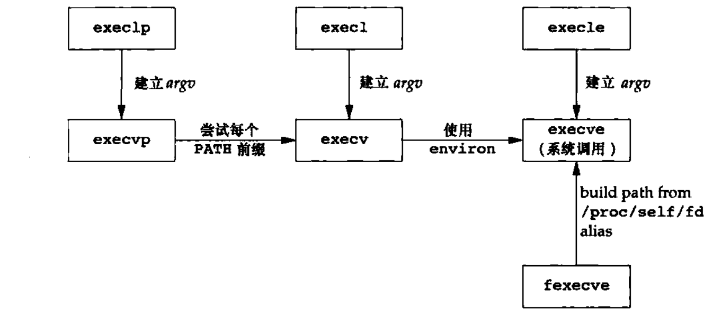

# APUE

## 0. 前置知识

- ``IS_ERR`` ``PRR_ERR`` ``ERR_PTR``

    内核空间的最后一个页专门为错误码保留，即内核用最后一页捕捉错误，因此一般人不会用到指向内核空间最后一页的指针

- ``likely`` ``unlikely``

    ```c++
    #define likely(x) __builtin_expect(!!(x), 1)
    #define unlikely(x) __builtin_expect(!!(x), 0)
    // 可以优化程序编译后的指令序列，从而优化流水线的效率
    ```

- ``BUG_ON ...``

    ```c++
    BUG() // 无条件触发
    BUG_ON(condiction)
    WARN_ON(condiction)
    ...
    ```

- ``restrict``

    用于告知编译器一个指针式访问数据对象的唯一且初始的方式，这能够使得编译器假设指针所指向的数据不会被其他指针所改变，从而带来更好的编译优化效果

- ``offsetof`` ``coniner_of``

    ```c++
    #define offsetof(TYPE, MEMBER) ((size_t) &((TYPE *)0)->MEMBER) // 把0地址强制转化为type类型，然后取成员地址，转化成为偏移即可
    #define container_of(ptr, type, member) ({          \
        const typeof( ((type *)0)->member ) *__mptr = (ptr);    \
        (type *)( (char *)__mptr - offsetof(type, member) );})

    ```

- ``__user`` ``__kernel`` ``__iomem``

    保证指针空间必须在用户/内核/设备地址空间

- ``LDREX`` ``STREX``

    ```c++
    /*
    LDREX : Load Register Exclusive
    STREX : Store Register Exclusive


    ldrex 指令从内存中加载一个值到寄存器，并标记该内存地址开始一个独占访问。这意味着该指令告诉处理器，接下来对这个地址的操作希望是独占的，即在本次 ldrex 操作和接下来的 strex 操作完成之前，不希望其他处理器对这个地址进行写操作。

    strex 指令尝试将一个寄存器的值存储到先前由 ldrex 指令标记为独占的内存地址。如果自 ldrex 执行以来没有其他处理器写入该内存地址，strex 将写入成功，并返回 0；如果有其他处理器介入修改了该地址，则 strex 写入失败，返回非零值。

    STERXPL STREXEQ 是拓展的条件执行版本，允许在满足特定条件的情况下才执行存储操作
    */
    ```

- 内嵌汇编指令

    ```c++
    // 基本语法如下所示：
    asm volatile (assembly code : output operands : input operands : clobbered registers); // volatile 可选，告诉编译器不要优化这段编译代码

    // 操作数约束 r(寄存器) m(内存) g(编译器选择最合适的方式) i(立即数) ...
    // 特殊约束操作符 =(约束的是一个输出操作数) &(通常和=搭配使用，表示不能与任何输入操作数共享寄存器)
    // 按顺序使用 %0， %1 ... 引用操作数
    ```

## 00. Linux 中常见的数据结构

### 基础数据结构

- 链表

    >如果链表不能包容万物，就让万物包容链表

    ```c++
    struct list_head {
        struct list_head *next, *prev;
    };
    ```

- 哈希表

    ```c++
    struct hlist_head {
        struct hlist_node *first;
    };

    struct hlist_node {
        struct hlist_node *next, **pprev;
    };

    // 通过这种设计，可以优化内存使用
    ```

### 并发控制

- ``atomic_t``

    ```c++
    typedef struct {
        volatile int counter;
    } atomic_t;
    // volatile 关键字保证编译器不在进行优化，系统总是重新从他所在的内存读取数据
    ```

    单处理器系统中，处理器的执行流程只会收到中断机制的影响，因此可以通过 “提供能完成多步操作的单条指令” 或者 ”关中断“ 的方式实现原子操作

    多处理器系统中，即使是一条指令执行的期间也会收到其他干扰，不同架构提供了不同的实现原子操作的方式，比如 **X86** 架构可以通过对总线加锁保证只允许一个处理器访问， **ARM** 可以通过独占内存实现， RISC-V 可以通过 **CAS** 实现原子操作

    ```c++
    // X86 架构实现
    static inline void atomic_add(int i, atomic_t *v)
    {
        asm volatile(LOCK_PREFIX "addl %1,%0"
                : "+m" (v->counter)
                : "ir" (i));
    }

    // ARM 架构实现
    static inline int atomic_add_return(int i, atomic_t *v)
    {
        unsigned long tmp;
        int result;

        smp_mb();

        __asm__ __volatile__("@ atomic_add_return\n"
    "1:	ldrex	%0, [%2]\n" // 独占内存指令
    "	add	%0, %0, %3\n"
    "	strex	%1, %0, [%2]\n"
    "	teq	%1, #0\n"
    "	bne	1b"
            : "=&r" (result), "=&r" (tmp)
            : "r" (&v->counter), "Ir" (i)
            : "cc");

        smp_mb();

        return result;
    }
    ```

- ``per-cpu``

    静态的 ``per-cpu`` 变量会在链接时被放置在ELF文件的特定段 ``.data..percpu`` 中，所有变量的布局是连续的，从 ``__per_cpu_start`` 开始到 ``__per_cpu_end`` 结束，每个 **cpu** 都会有一个独立的内存副本。变量的访问通过计算偏移量实现，内核使用一个数组 ``__per_cpu_offset`` 存储每个 **cpu** 的偏移量。

    动态的 ``per_cpu`` 变量通过内核的动态内存分配机制实现，内核维护了一个专用的 ``per_cpu`` 内存池实现

- ``memory_barrier``

    确保内存操作执行顺序符合预期，防止由于处理器乱序执行或者编译器优化策略导致数据不一致的静态条件

    常见的比如 ``mb`` ``smp_mb`` ``smp_wmb`` ``smp_rmb``

    ```c++
    // 一些使用场景记录
    
    // case1: 多核数据共享
    // Core 1
    data = 42;
    smp_wmb();  // 写内存屏障
    flag = 1;

    // Core 2
    while (flag == 0);
    smp_rmb();  // 读内存屏障
    assert(data == 42);

    // case2: 锁实现
    lock();
    smp_mb();  // 获取锁后的屏障
    critical_section();
    smp_mb();  // 释放锁前的屏障
    unlock();
    ```

- ``spinlock_t``

    ``spinlock_t`` 简化的定义如下所示

    ```c++
    typedef struct raw_spinlock {
        arch_spinlock_t raw_lock;
    } raw_spinlock_t;

    typedef struct spinlock {
        struct raw_spinlock rlock; 
    } spinlock_t;
    ```

    `spin_lock` 源码解析

    ```c++
    static inline void spin_lock(spinlock_t *lock)
    {
        raw_spin_lock(&lock->rlock);
    }

    #define raw_spin_lock(lock)    _raw_spin_lock(lock)

    // 在UP环境中，由于同一时刻只有一个执行线程，自旋锁主要通过禁用抢占和中断来保证代码块的原子执行，而不是通过真正的自旋等待。
    // 在SMP环境中，自旋锁需要实现真正的自旋等待

    // UP中的实现：
    #define _raw_spin_lock(lock)            __LOCK(lock)
    #define __LOCK(lock) \
    do { preempt_disable(); __acquire(lock); (void)(lock); } while (0)

    // 通过preempt_disable 可以禁止抢占
    #define preempt_disable() \
    do { \
        inc_preempt_count(); \
        barrier(); \
    } while (0)

    // __acquire(lock) 用作静态代码检查，确保成对使用，默认情况下是一个空语句
    // (void)(lock) 空语句，防止编译器警告局部变量没有使用
    // do{ ... } whle(0) 保证宏语法的正确性，保证正确的代码块闭合

    // SMP的实现：
    #define _raw_spin_lock(lock) __raw_spin_lock(lock)
    static inline void __raw_spin_lock(raw_spinlock_t *lock)
    {
        preempt_disable();
        spin_acquire(&lock->dep_map, 0, 0, _RET_IP_);
        LOCK_CONTENDED(lock, do_raw_spin_trylock, do_raw_spin_lock);
    }

    static inline void do_raw_spin_lock(raw_spinlock_t *lock) __acquires(lock)
    {
        __acquire(lock);
        arch_spin_lock(&lock->raw_lock);
    }

    // ARM 架构下的arch_spin_lock实现
    typedef struct {
        volatile unsigned int lock;
    } arch_spinlock_t;

    static inline void arch_spin_lock(arch_spinlock_t *lock)
    {
        unsigned long tmp;

        __asm__ __volatile__(
    "1:	ldrex	%0, [%1]\n"             // 加载并且标记锁变量，和原子变量的实现类似，通过独占内存指令实现
    "	teq	%0, #0\n"                   // 测试锁是否为锁定状态，更新条件标志
    #ifdef CONFIG_CPU_32v6K       
    "	wfene\n"                        // wait for event指令，在自旋等待中减少能耗
    #endif
    "	strexeq	%0, %2, [%1]\n"         // 在 %0 为 0 的条件下执行，尝试将 %2 的值写入到lock中，并且把是否成功的信息保存在 0% 中
    "	teqeq	%0, #0\n"               // 检查是否成功获取到锁
    "	bne	1b"                         // 如果没有退回到1
        : "=&r" (tmp)
        : "r" (&lock->lock), "r" (1)
        : "cc");

        smp_mb();                       // 全屏障，确保在获取锁之后的任何指令不会被重排到获取锁之前
    }

    /*
    实际上这种简单的实现，会带来极大的不公平性，由于存在缓存一致性的问题 ——> 释放锁之后，可能会导致其他cpu保存在 L1 Cache 中的数据失效，
    从而释放锁变量的 cpu 能够有更大的机会获取锁，这是一种不公平的竞争，下面展示了一种新的定义方式
    */
    // ticket_based spin lock 
    typedef struct {
        union {
            u32 slock;
            struct __raw_tickets {
                u16 next;  // 当前持有锁的票据号
                u16 owner;   // 下一个将要获取锁的票据号
            } tickets;
        };
    } arch_spinlock_t;

    static inline void arch_spin_lock(arch_spinlock_t *lock)
    {

        /*
        主要包括了三个动作：
            * 或许了自己的号码牌（next值）和允许哪一个号码牌进入临界区（owner）
            * 设定下一个进入临界区的号码牌（next++）
            * 判断自己的号码牌是否是允许进入的那个号码牌，如果是则进入，不是则等待 
        */

        unsigned long tmp;
        u32 newval;
        arch_spinlock_t lockval;

        prefetchw(&lock->slock);
        __asm__ __volatile__(
    "1:     ldrex   %0, [%3]\n"     /* 原子方式，读取锁的值赋值给lockval */
    "       add     %1, %0, %4\n"   /* 将next字段++之后的值存在newval中 */
    "       strex   %2, %1, [%3]\n" /* 原子方式，将新的值存在lock中，写入否成功结果存入在tmp中 */
    "       teq     %2, #0\n"       /* 判断是否写入成功，不成功跳到标号1重新执行 */
    "       bne     1b"
            : "=&r" (lockval), "=&r" (newval), "=&r" (tmp)
            : "r" (&lock->slock), "I" (1 << TICKET_SHIFT)
            : "cc");

        /* 查询是否可以拿锁，若next != owner说明已有人持锁，自旋 */
        while (lockval.tickets.next != lockval.tickets.owner) {
            wfe();
            lockval.tickets.owner = READ_ONCE(lock->tickets.owner);
        }
    
        smp_mb();   
    }
    
    /* 释放锁比较简单，将owner++即可 */
    static inline void arch_spin_unlock(arch_spinlock_t *lock)
    {
        smp_mb();
        lock->tickets.owner++;
        dsb_sev();
    }

    /*
    实际上针对不同的中断类型，spin_lock给出了不同的接口
    不会在任何中断例程中操作临界区: spin_lock
    软件/硬件中断可能会操作临界区: spin_lock_bh/spin_lock_irq
    ...
    */

    ```

- ``rwlock_t``

    简化的定义如下所示：

    ```c++
    typedef struct {
        arch_rwlock_t raw_lock;
    } rwlock_t;
    
    // arm 架构下的定义如下
    typedef struct {
	    volatile unsigned int lock;
    } arch_rwlock_t;
    ```

    具体实现分析

    ```c++
    // UP环境下的rwlock实现和UP环境的spinlock实现没有区别

    // arch/arm/include/asm/spinlock.h
    // rwlock 的 write_lock 和 write_unlock 的实现和 spin_lock基本一致，最终会进入到arch_write_lock函数
    static inline void arch_write_lock(arch_rwlock_t *rw)
    {
        unsigned long tmp;

        __asm__ __volatile__(
            ...
        : "r" (&rw->lock), "r" (0x80000000)
        // 写入0x0x80000000表示被一个写者拥有
        : "cc");

        smp_mb();
    }

    static inline void arch_write_unlock(arch_rwlock_t *rw)
    {
        smp_mb();

        __asm__ __volatile__(
        "str	%1, [%0]\n"
        :
        : "r" (&rw->lock), "r" (0)
        : "cc");

        dsb_sev(); // barrier + send event
    }

    static inline void arch_read_lock(arch_rwlock_t *rw)
    {
        unsigned long tmp, tmp2;

        __asm__ __volatile__(
    "1:	ldrex	%0, [%2]\n"             // 把rw->lock的值加载到寄存器 %0 中                  
    "	adds	%0, %0, #1\n"           // 将 %0 寄存器中的值加 1 同时更新条件标志位
    "	strexpl	%1, %0, [%2]\n"         // strexpl指令会在满足条件（之前的adds指令没有被设置负标志）执行
    #ifdef CONFIG_CPU_32v6K
    "	wfemi\n"                        // 在支持该指令的架构中，减少等待循环的能耗，使处理器进入一个事件等待模式
    #endif
    "	rsbpls	%0, %1, #0\n"           // 如果上一条strex指令不成功， %1 不为 0，这条指令把 %0 设置为 -%1，如果成功，不执行该指令
    "	bmi	1b"                         // 如果最后的结果为负，重回1
        : "=&r" (tmp), "=&r" (tmp2)
        : "r" (&rw->lock)
        : "cc");

        smp_mb();
    }

    static inline void arch_read_unlock(arch_rwlock_t *rw)
    {
        unsigned long tmp, tmp2;

        smp_mb();

        __asm__ __volatile__(
    "1:	ldrex	%0, [%2]\n"
    "	sub	%0, %0, #1\n"
    "	strex	%1, %0, [%2]\n"
    "	teq	%1, #0\n"
    "	bne	1b"
        : "=&r" (tmp), "=&r" (tmp2)
        : "r" (&rw->lock)
        : "cc");

        if (tmp == 0)
            dsb_sev();
    }
    ```

- ``seqlock_t``

    >读操作不用加锁，，写操作通过自旋锁保护，非常适合读多写少的场景

    通过奇偶性判断是否存在写进程

    ```c++
    typedef struct {
        unsigned sequence;
        spinlock_t lock;
    } seqlock_t;

    static inline void write_seqlock(seqlock_t *sl)
    {
        spin_lock(&sl->lock);
        ++sl->sequence;
        smp_wmb();  // 确保序列号增加操作完成
    }

    static inline void write_sequnlock(seqlock_t *sl)
    {
        smp_wmb();  // 确保写操作完成
        sl->sequence++;
        spin_unlock(&sl->lock);
    }

    static __always_inline unsigned read_seqbegin(const seqlock_t *sl)
    {
        unsigned ret;

    repeat:
        ret = sl->sequence;
        smp_rmb();
        if (unlikely(ret & 1)) {
            cpu_relax();
            goto repeat;
        }

        return ret;
    }

    static __always_inline int read_seqretry(const seqlock_t *sl, unsigned start)
    {
        smp_rmb();

        return (sl->sequence != start);
    }

    ```

- ``mutex``

- ``rw_semaphore``

- ``rcu-head``

    ```c++
    /**
     * struct rcu_head - callback structure for use with RCU
    * @next: next update requests in a list
    * @func: actual update function to call after the grace period.
    */
    struct rcu_head { // read-copy update  -> 随意读，但更新数据的时候，需要先复制一份副本，在副本上修改，在一次性的替换旧数据
        struct rcu_head *next;
        void (*func)(struct rcu_head *head);
    };
    ```

### 文件管理

- ``files_struct`` ``fdtable`` ``file``

    每个进程会维护一个 ``files_struct`` 来记录该进程打开文件的信息

    ```c++
    struct fdtable {
        unsigned int max_fds;
        struct file ** fd;      /* current fd array */
        fd_set *close_on_exec;
        fd_set *open_fds;
        struct rcu_head rcu;
        struct fdtable *next;
    };
    ```

    ```c++
    struct files_struct {
    /*
    * read mostly part
    */
        atomic_t count;
        struct fdtable *fdt;
        struct fdtable fdtab;        
    /*
    * written part on a separate cache line in SMP
    */
        spinlock_t file_lock ____cacheline_aligned_in_smp;
        int next_fd;
        struct embedded_fd_set close_on_exec_init;
        struct embedded_fd_set open_fds_init;
        struct file * fd_array[NR_OPEN_DEFAULT];
    };
    ```

    

    系统中的每个打开的文件在内核空间都有一个关联的 ``file`` , 在文件的所有实例都关闭后，内核会释放这个结构

    一个磁盘上的文件可以对应多个 ``file``

    ```c++
    struct file {
        union {
            struct list_head	fu_list;
            struct rcu_head 	fu_rcuhead;
        } f_u;
        struct path		f_path;
    #define f_dentry	f_path.dentry
    #define f_vfsmnt	f_path.mnt
        const struct file_operations	*f_op;
        spinlock_t		f_lock;         /* f_ep_links, f_flags, no IRQ */
        atomic_long_t		f_count;    // 文件计数
        unsigned int 		f_flags;    // 文件标志
        fmode_t			f_mode;         // 访问模式
        loff_t			f_pos;          // 文件偏移量
        struct fown_struct	f_owner;    // 与异步IO通知相关
        const struct cred	*f_cred;    // 打开文件使用的安全凭证
        struct file_ra_state	f_ra;   // 用于管理文件的预读取状态
        ...
    };

    ```

- ``dentry ( directory entry )``

    ``inode`` 仅仅保存了文件对象的属性信息，包括权限、属组、数据块的位置、时间戳等，但是没有包含文件名，通过 ``dentry`` 能够在内存中维护文件系统的目录树，是一个纯粹的内存结构，由文件系统提供文件访问的过程中直接在内存建立

    ``inode``可以理解为对应于物理磁盘上的具体对象， ``dentry`` 是一个内存实体，每个 ``dentry`` 都有唯一对应的 ``inode``

    ```c++
    struct dentry {
        atomic_t d_count;
        unsigned int d_flags;		/* protected by d_lock */
        spinlock_t d_lock;		    /* per dentry lock */
        int d_mounted;
        struct inode *d_inode;		/* Where the name belongs to - NULL is negative */
        /*
        * The next three fields are touched by __d_lookup.  Place them here
        * so they all fit in a cache line.
        */
        struct hlist_node d_hash;	/* lookup hash list */
        struct dentry *d_parent;	/* parent directory */
        struct qstr d_name;

        struct list_head d_lru;		/* LRU list */
        /*
        * d_child and d_rcu can share memory
        */
        union {
            struct list_head d_child;	/* child of parent list */
            struct rcu_head d_rcu;
        } d_u;
        struct list_head d_subdirs;	/* our children */
        struct list_head d_alias;	/* inode alias list */
        unsigned long d_time;		/* used by d_revalidate */
        const struct dentry_operations *d_op;
        struct super_block *d_sb;	/* The root of the dentry tree */
        void *d_fsdata;			    /* fs-specific data */

        unsigned char d_iname[DNAME_INLINE_LEN_MIN];	/* small names */
    };
    ```

- ``vfs_mount``

    ```c++
    struct vfsmount {
        struct list_head mnt_hash;
        struct vfsmount *mnt_parent;	/* fs we are mounted on */
        struct dentry *mnt_mountpoint;	/* dentry of mountpoint */
        struct dentry *mnt_root;	/* root of the mounted tree */
        struct super_block *mnt_sb;	/* pointer to superblock */
        struct list_head mnt_mounts;	/* list of children, anchored here */
        struct list_head mnt_child;	/* and going through their mnt_child */
        int mnt_flags;
        /* 4 bytes hole on 64bits arches */
        const char *mnt_devname;	/* Name of device e.g. /dev/dsk/hda1 */
        struct list_head mnt_list;
        struct list_head mnt_expire;	/* link in fs-specific expiry list */
        struct list_head mnt_share;	/* circular list of shared mounts */
        struct list_head mnt_slave_list;/* list of slave mounts */
        struct list_head mnt_slave;	/* slave list entry */
        struct vfsmount *mnt_master;	/* slave is on master->mnt_slave_list */
        struct mnt_namespace *mnt_ns;	/* containing namespace */
        int mnt_id;			/* mount identifier */
        int mnt_group_id;		/* peer group identifier */
        /*
        * We put mnt_count & mnt_expiry_mark at the end of struct vfsmount
        * to let these frequently modified fields in a separate cache line
        * (so that reads of mnt_flags wont ping-pong on SMP machines)
        */
        atomic_t mnt_count;
        int mnt_expiry_mark;		/* true if marked for expiry */
        int mnt_pinned;
        int mnt_ghosts;
    #ifdef CONFIG_SMP
        int __percpu *mnt_writers;
    #else
        int mnt_writers;
    #endif
    };
    ```

- ``path``

    ```c++
    struct path {
        struct vfsmount *mnt;
        struct dentry *dentry;
    };
    ```

- ``fs_struct``

    ```c++
    struct fs_struct {
        int users;
        rwlock_t lock;
        int umask;
        int in_exec;
        struct path root, pwd;
    };
    ```

- ``inode``

- ``super_block``

- ``vs_area_struct``

### 进程管理

- ``task_struct``

## 3. 文件 I/O

### ``open`` ``openat``

```c++
int open(const char *path, int flag, ... /* mode_t mode*/);
int openat(int fd, const char *path, int flag, ... /* mode_t mode*/);
// 当路径为相对路径的时候，打开的是相对于fd所指向目录的路径

int create(const char *path,, mode_t);

// ... -> do_sys_open -> get_unused_fd_flags -> alloc_fd(0, (flags)) -> do_filp_open -> fd_install
// 在alloc_fd 的过程中会修改fdtable->close_on_exec
// do_filp_open 会记录其他flags的信息
```

### ``close``

```c++
int close(int fd);
```

### ``lseek``

```c++
off_t lseek(int fd, off_t offset, int whence); // SEEK_SET -> 0, SEEK_CUR -> 1, SEEK_END -> 2

off_t offset = lseek(fd, 0, 1); // 获取当前文件偏移量

off_t ret = lseek(fd, size, 0); // 创建一个size大小的空洞文件
```

### ``read`` ``write``

```c++
sszie_t read(int fd, void *buf, size_t nbytes);
ssize_t write(int fd, const void *buf, size_t nbytes);
```

### 原子操作

```c++
sszie_t pread(int fd, void *buf, size_t nbytes, off_t offset);
size_t pwrite(int fd, const void *buf, size_t nbytes, off_t offset);

// 将寻位和读写封装成原子操作，O_APPEND也可以实现同样的效果
// pread不从文件表获取当前偏移，直接使用用户传递的偏移，不会更改当前文件的偏移量

/*
    关于append能够实现原子的读写:                
        write -> vfs_write(file, buf, count, &pos) -> do_sync_write -> file->f_op->aio_write
        Linux 大多数文件系统将 aio_write 绑定到 generic_file_aio_write

        generic_file_aio_write中的部分实现: （通过加锁对inode进行了保护） 
            mutex_lock(&inode->i_mutex);
            ret = __generic_file_aio_write(iocb, iov, nr_segs, &iocb->ki_pos);
            mutex_unlock(&inode->i_mutex);
        
        __generic_file_aio_write -> generic_write_check:
            if (file->f_flags & O_APPEND)
                *pos = i_size_read(inode);
        
        可以看到对于表示append的文件，会直接读取文件的大小，进行操作，因此lseek不会对append表示的文件产生任何的影戏那个
*/
```

### ``dup`` ``dup2``

```c++
int dup(int fd);
int dup2(int fd, int fd2);

// 默认不会保留CLOEXEC标识
// 根本原因在于CLOEXEC标识的记录方式和其他flag不同，其他flag直接会保存到 struct file -> flags 中
// 标识CLOEXEC的文件会通过 fdtable->close_on_exec 保存

// 但是dup的调用逻辑 get_unused_fd(0, 0) -> alloc_fd -> fd_install
// 这里使用的get_unused_fd直接使用了0作为flag，所以会导致dup出来的fd没有办法继承CLOEXEC
```

### ``sync`` ``fsync`` ``fdatasync``

```c++
int fsync(int fd);      // 等待写操作结束才返回
int fdatasync(int fd);  // 只影响文件的数据部分
void sync(void);        // 将所有修改过的块缓冲区排入写队列，不等待实际的写磁盘操作结束
```

### ``fcntl``

```c++
int fcntl(int fd, int cmd, .../* int arg */);

/*
复制一个已有的描述符    F_DUPFD F_DUPFD_CLOEXEC
获取/设置文件描述符     F_GETFD F_SETFD --> FD_CLOEXEC ( 1 for set )
获取/设置文件状态标志   F_GETFL F_SETFL 在修改时候要谨慎，应该在当前的flag的基础上进行修改
获取/设置异步I/O所有权
获取/设置记录锁
*/
```

## 4. 文件和目录

### ``stat`` ``fstat`` ``fsatat`` `lstat`

```c++
int stat(const char *restrict pathname, struct stat *restrict buf);
int fstat(int fd, struct stat *buf);
int lstat(const char *restrict pathname, struct stat *restrict buf); // 返回符号链接本身，而不是引用文件的信息
int fstat(int fd, const char *restrict pathname, struct stat *restrict buf, int flag); 

// stat -> vfs_stat -> vfs_getattr -> generic_fillattr
// 通过 st_mode 可以查看文件类型和文件权限
```

### 文件类型

- 普通文件
- 目录文件
- 块特殊文件
- 字符特殊文件
- 命名管道
- 套接字
- 符号链接

### 文件访问权限

- 用名字打开任一类型的文件时，对该名字中包含的每一个目录，都应该具有执行权限，目录的执行权限位常常被称为搜索位
- 在目录中创建/删除文件，必须要有对目录的写权限和搜索权限

### `access` 和 ``faccessat``

```c++
int access(const char *pathname, int mode); // mode: R_OK W_OK X_OK
int faccess(int fd, const char *pathname, int mode); // pathname为绝对路径，或者fd取值为AT_FDCWD效果相同
```

### ``umask``

```c++
mode_t umask(mode_t umask);
// 返回原始的权限
```

### ``chmod`` ``fchowd`` ``fchownad``

```c++
int chmod(const char *pathname, mode_t mode);
int fchmod(int fd, mode_t mode);
int fchmodat(int fd, const char *pathname, mode_t mode, int flag);  // flag可以用来控制是否跟随符号链 
                                                                    // AT_SYMLINK_NOFOLLOW
```

### ``chown`` ``fchown`` ``fchownat`` ``lchown``

```c++
int chown(const char *pathname, uid_t owner, gid_t group);
int fchown(int fd, uid_t owner, gid_t group);
int fchownat(int fd, const char *pathname, uid_t owner, gid_t group, int flag);
int lchown(const char *pathname, uid_t owner, gid_t group);
```

### 文件截断

```c++
int truncate(const char *pathname, off_t length);
int ftruncate(int fd, off_t length);
```

### ``link`` `linkat` ``unlink`` ``unlinkat`` ``remove``

```c++
int link(const char *existingpath, const char *newpath);
int linkat(int efd, const char *existingpath, int nfd, const char *newpath, int flag);
int unlink(const char *pathname);
int unlinkat(int fd, const char *pathname, int flag); // 可以通过设置为AT_REMOVEDIR来达到删除目录的效果
int remove(const char *pathname) // 对于文件，功能和unlink相同，对于目录，功能和rmdir相同
```

### ``rename`` ``renameat``

```c++
int rename(const char *oldname, const char *newname);
int renameat(int oldfd, const char *oldname, int newfd, const char *newname);
```

### 创建和读取符号链接

```c++
int symlink(const char *actualpath, const char *sympath);
int symlinkat(const char *actualpath, int fd, const char *sympath);

size_t readlink(const char *restrict pathname, char *restrict buf, size_t bufsize);
size_t readlinkad(int fd, const char *restrict pathname, char *restrict buf, size_t bufsize);
```

### ``mkdir`` ``mkdirat`` ``rmdir``

```c++
int mkdir(const char *pathname, mode_t mode);
int mkdirat(int fd, const char *pathname, mode_t mode);
int rmdir(const char *pathname);
```

### 读目录

```c++
DIR *opendir(const char *pathname);
DIR *fdopendir(int fd);
struct dirent *readdir(DIR *dp);
void rewinddir(DIR *dp);
int closedir(DIR *dp);
long telldir(DIR *dp);
void seekdir(DIR *dp, long loc);
```

### ``chdir`` ``fchdir`` `getcwd`

```c++
int chdir(const char *pathname);
int fchdir(int fd);
char *getcwd(char *buf, size_t size);
```

## 5. 标准 IO 库

### 流 和 FILE 对象

```c++
int fwide(FILE *fp, int mode);
```

### 缓冲

```c++
void setbuf(FILE *restrict fp, char *restrict buf);
int setvbuf(FILE *restrict fp, char *restrict buf, int mode, size_t size); // mode : _IOFBF _IOLBF _IONBF

int fflush(FILE *fp);
```

### 打开流

```c++
FILE *fopen(const char *restrict pathname, const char *restrict type);
FILE *freopen(const char *restrict pathname, const char *restrict type, FILE *restrict fp);
// 在一个指定的流上打开指定的文件，如果流已经打开，则先关闭流；
FILE *fdopen(int fd, const char *type);
```


除非终端设备，不然默认全缓冲

### 读和写流

```c++
int getc(FILE *fp);         // 可能被实现为宏
int fgetc(FILE *fp);        // 一定是一个函数
int getchar(void);          // getc(stdin)

// 由于出错和EOF的返回值是一样的，为了区分这两种情况，需要调用
int ferror(FILE *fp);
int feof(FILE *fp);
void clearerr(FILE *fp);

int ungetc(int c, FILE *fp);
```

```c++
int putc(int c, FILE *fp);
int fputc(int c, FILE *fp);
int putchar(int c);
```

### 每次一行 IO

```c++
char *fgets(char *restrict buf, int n, FILE *restrict fp);
char *gets(char *buf);

int fputs(const char *restrict str, FILE *restrict fp);
int puts(const char *str);
```

### 二进制 IO

```c++
size_t fread(void *restrict ptr, size_t size, size_t nobj, FILE *restrict fp);
size_t fwrite(const void *restrict ptr, size_t size, size_t nobj, FILE *restrict fp);

// 只能在同一系统，原因有二：
// 同一个结构，不同的系统，可能会有不同的布局
// 不同系统的浮点数二进制格式可能也不相同
```

### 定位流

```c++
long ftell(FILE *fp);
int fseek(FILE *fp, long offset, int whence);
void rewind(FILE *fp);

off_t ftello(FILE *fp);
int fseeko(FILE *fp, off_t offset, int whence);

int fgetpos(FILE *restrict fp, fpos_t *restrict pos);
int fsetpos(FILE *fp, const fpos_t *pos);
```

### 格式化 IO

```c++
int printf(const char *restrict format, ...);
int fprintf(FILE *restrict fp, const char *restrict format, ...);
int dprintf(int fd, const char *restrict format, ...);
int sprintf(char *restrict buf, const char *restrict format, ...);
int snprintf(char *restrict buf, size_t n, const char *restrict format, ...);

int scanf(const char *restrict format, ...);
int fscanf(FILE *restrict fp, const char *restrict format, ...);
int sscanf(const char *restrict buf, const char *restrict format, ...);
```

### 实现细节

```c++
int fileno(FILE *fp);
```

### 临时文件

```c++
char *tmpnam(char *ptr);  // 多次调用会冲刷内部的静态缓冲区，因此要及时保存，不是原子操作，会存在竞态条件
FILE *tmpfile(void);    
```

### 内存流

```c++
FILE *fmemopen(void *restrict buf, size_t size, const char *restrict type);
```

## 进程控制

### `fork` `vfork` `clone`

- 调用方式

    ```c++
    pid_t fork(void);
    pid_t vfork(void);
    pid_t clone(int (*fn)(void *), void *child_stack, int flags, void *arg, ...);

    // ... -> do_fork -> copy_process
    ```

- 源码剖析

    ```c++
    // copy_process -> copy_files -> dup_fd

    // -------------------copy_files 代码截取-------------------
    ...

    if (clone_flags & CLONE_FILES) {
        atomic_inc(&oldf->count);
        goto out;
    }   // 可以看到这里如果标记了CLONE_FILES，子进程不会创建一个新的files_struct实例，能够实现高效的进程分叉

    newf = dup_fd(oldf, &error);

    // -------------------dup_fd 代码截取-------------------

	for (i = open_files; i != 0; i--) {
		struct file *f = *old_fds++;
		if (f) {
			get_file(f); // 这里只是增加了对应file结构体的引用计数，而没有产生真的复制，所以fork出来的子进程实际上会共享父进程的打开文件副本
		} else {
			FD_CLR(open_files - i, new_fdt->open_fds);
		}
		rcu_assign_pointer(*new_fds++, f);
	}
    ...

    ```

### `wait`

```c++
pid_t wait(int *status);
pid_t waitpid(pid_t pid, int *status, int options);

// waitpid可以指定要回收的进程，并且通过options参数实现了更精细的控制

/*
WNOHANG         ： 使waitpid成为非阻塞调用，如果指定的子进程没有结束，waitpid会立即返回0
WUNTRACED       ： 除了返回已终止的子进程信息外，还返回因信号而停止的子进程的信息
WCONTINUED      ： 返回哪些已经由停止状态继续执行但还未终止的子进程状态
WNOWAIT         ：（在某些系统中支持）是的调用清除子进程的状态，子进程状态仍然可以用于后续的waitpid调用
*/

int waitid(idtype_t idtype, id_t id, siginfo_t *infop, int options);

// idtype : P_PID, P_PGID, P_ALL
// options     ： WCONTINUED WEXITED WNOHANG WNOWAIT WSTOPPED  能够实现更精细的控制

pid_t wait3(int *statloc, int options, struct rusage *rusage);
pid_t wait4(pid_t pid, int *staloc, int options, struct rusage *rusage);
// 通过rusage能够返回更多的信息
```

### ``exec``



## 进程关系

## 信号

## 线程

## 线程控制

## 守护进程

## 高级 IO

## 进程间通信

## 网路IPC

## 高级IPC

## 终端IO

```c++
```

```c++
```

```c++
```

```c++
```

```c++
```

```c++
```

```c++
```

```c++
```

```c++
```

```c++
```
