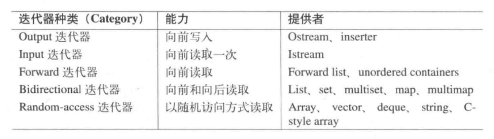
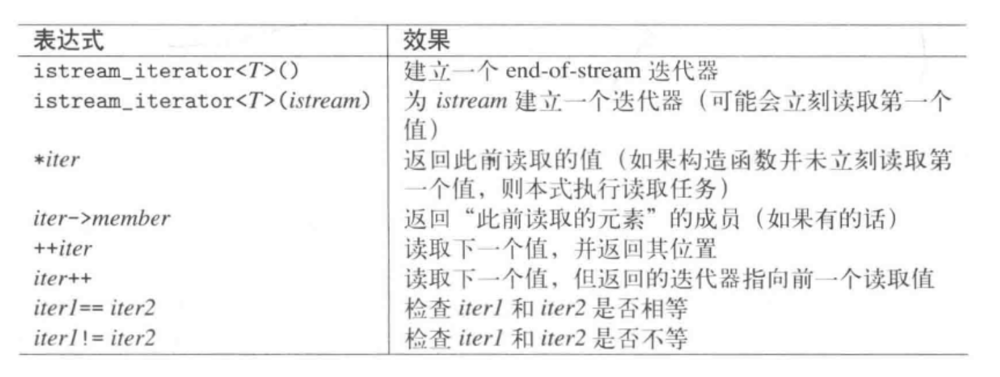

# 3. 语言新特性

## `nullptr`

- ``nullptr`` 是一种更安全、更清晰的方式来表示空指针，它解决了使用 ``NULL`` 可能遇到的一些类型歧义问题。

## `explicit`

- 单参构造函数用``exlicit``修饰提高安全性，避免不合时宜的类型转换

	```c++
	class Timer {
	public:
		// 使用 explicit 防止隐式转换
		explicit Timer(int seconds) {
			// 初始化代码
			std::cout << "Timer initialized to " << seconds << " seconds." << std::endl;
		}
		Timer(int seconds, int minutes) {}
	};

	void setAlarm(Timer t) {
		// 设置定时器
		std::cout << "Alarm set." << std::endl;
	}

	int main() {
		setAlarm(5); // 这行现在会引发编译错误
		setAlarm({5, 4});   // 这样才会隐式类型转换，所以可以不用explicit修饰
		setAlarm(Timer(5)); // 正确的使用方式
		return 0;
	}
	```

## 类型推导

- ``auto`` 和 ``decltype`` 都是在编译时进行类型推导，不增加运行时成本

- 通过`auto`在进行类型推导的时候，除非显示指定，不然不会保留引用

	```c++
	const int x = 1;
	auto& y = x; // OK，y -> const int&
	auto z = y;  // OK, z -> int
	```

- ``auto&&``可以接收任何类型的返回值，包括左值引用和右值引用，同时对左值返回类型推导为左值引用，对右值返回类型推导为右值引用

- ``decltype`` 与函数

	```c++
	int sum1(int x, int y) {return x + y;}
	decltype(sum1(1, 1)) a; 
	decltype(sum1) *sum2; // sum2 -> int(*)(int, int) 
	sum2 = sum1;
	sum2(1, 1);
	decltype(&sum1); // int(*)(int, int)
	```

- ``decltype``的一些类型推导原则

	```c++
	int arr[5];
	int *ptr = arr;

	struct S { int d; } s;

	void Overloaded(int);
	void Overloaded(double);

	int && RvalRef();
	const int & CLvalRef();

	// 规则1:单个标记符表达式以及访问类成员，推导为本类型
	decltype(arr) var1;    
	decltype(ptr) var2;
	decltype(s.d) var3;
	decltype(Overloaded) var4; // ERROR，重载函数无法通过编译

	// 规则2:将亡值，推导为右值引用
	decltype(RvalRef()) var5 = 1;

	// 规则3:左值，推导为引用
	decltype((var3)) var6 = var3;
	decltype(++var3) var7 = var3;
	decltype(arr[0]) var8 = var3;
	decltype(*ptr) var9 = var3;
	decltype(true ? var3 : var3) var10 = var3;
	decltype(CLvalRef()) var11 = var3; // 函数调用推导为函数的返回值类型，const int & 

	// 规则4:纯右值推导为本类型
	decltype(1) var12;
	decltype(var3++) var13;
	```

## 一致性初始化

- 一致性初始化防止类型窄化

	````c++
	int x{5.0};     // ERROR
	char c1{7};     // OK
	char c2{999};   // ERROR
	````

- **初值列构造函数的优先级 高于 “指明参数个数”的构造函数**

- **一致性初始化会调用构造函数和拷贝构造函数，但是不会调用到拷贝赋值函数**

	````c++
	class A {
	public:
		explicit A(int x) {}
		A(int x, int y) {}
		A& operator= (const A& a) {}
	};

	A a {1};        // OK 直接列表初始化，编译器尝试找到一个最匹配给定参数列表的构造函数进行初始化，如果没有合适的构造函数，但类型是聚合类型，那么将进行聚合初始化
	A a = {1};      // ERROR 复制列表初始化，不能调用explicit关键字修饰的构造函数
	A a = {1, 2};   // OK 不会调用复制构造函数
	A a {1, 2};     // OK 
	A b {a};        // OK 调用默认的拷贝构造函数
	A b = {a};      // OK
	// 使用 () 会比使用 {} 有更好的灵活性，允许更宽松的类型转换，但是具有更差的安全性
	````

- ``initialer_list`` 的底层通常是一个非常轻量级的对象，通常包含两个指针或者一个指针和一个大小，不拥有所包含元素的存储，而是指向由编译器在某个 **只读内存区域中静态分配的临时数组**，本质提供了对 `const T` 类型数组的只读访问

	````c++
	class A {
	public:
		A(std::initializer_list<int> initList) {
			// 这里不能用&接收参数，因为不能用非常量左值引用接收右值
			// 但是可以使用&&接收
			// 不过直接采用值传递就可以了，因为initList是一个轻量化的对象
			for(auto & ele : initList) {
				vec.push_back(ele); //这里的访问类型是const，不可以修改
			}
		}
	private:
		std::vector<int> vec;
	};

	A a{1, 2, 3, 4, 5}; // 这里的列表被用来构造一个initialer_list对象，生命周期会随构造结束而结束

	std::initialer_list<int> initList{1, 2, 3, 4, 5}; // 生命周期是一对{}
	````

## 左值 右值 引用 右值引用

- 右值分为纯右值和将亡值，纯右值一般指算术表达式的结果，返回临时对象的函数调用；将亡值一般指返回右值引用的函数调用，比如``move`` 将亡值是一种特殊的右值，表示一个对象即将被销毁，并且可以从中安全的“移动资源”。

	``````c++
	std::vector<int> getVec(int size) {
		return std::vector<int> (size);
	}

	std::vector<int> &&v1 = getVec(size); // 这里的v1是一个左值，虽然通过右值引用的方式进行定义，可以延长临时变量的生命周期，使用的是相同的内存
	std::vector<int> v2 = getVec(size); // 如果编译器不执行返回值优化，那么可能会涉及到移动构造
	// 所谓 RVO，指的是当一个函数返回一个局部对象时，编译器可以直接在调用函数的返回值存储位置上构造这个对象
	// RVO 是在编译时期决定的的，所以针对条件性的返回， RVO难以实施
	std::vector<int> v3 = v1; // 这里并不会影响v1

	v1.front() = 1;
	*next(v1.begin()) = 2; // OK, 虽然next(v1.begin())是一个右值，但是他的解引用是一个左值
	``````

- 右值引用最大的作用在于让一个左值达到类似右值的效果

- 接收左值 or 右值

	```` c++
	void foo(X&);         // 可以因lvalue被调用，但是不可以因为rvalue被调用
	void foo(const X&);   // 可以因lvalue和rvalue被调用，右值不应该被修改，所以应该用const修饰

	void foo(X&&);        // 可以区分为左值服务还是为右值服务，不能把一个左值绑定到一个右值引用上

	template<typename T>
	void foo(T &&);       // “通用引用” “转发引用” 通过引用折叠，既可以接受左值也可以接受右值。如果传递左值，推导为T&；传递右值，推导为T
	````

- 是可以通过修改右值引用影响原值的

	```c++
	int x1 = 1;
	int &&x2 = std::move(x1);
	x2++; // x1 = 2;

	class A{
	public:
		A(){ x.push_back(1); }
		std::vector<int> && getRRef() {
			return std::move(x);
		}
		std::vector<int> x;
	}a;
	
	auto &&rv = a.getRRef();
	rv.push_back(2); // a.x.size() == 2
	```

## 移动语义

- 实现原理

	```c++
	template<typename T>
	struct remove_reference{
		using type = T;
	};
	template<typename T>
	struct remove_reference<T&>{
		using type = T;
	};
	template<typename T>
	struct remove_reference<T&&>{
		using type = T;
	};
	template<typename T>
	typename remove_reference<T>::type && move(T&& arg) noexcept {
		return static_cast<typename remove_reference<T>::type && >(arg);
	}   // 这里必须使用 T&& 接受参数
	
    ```

## 完美转发

- 完美转发的实现依赖于 万能引用 + ``forward``

- ``forward``实现原理

	````c++
	template<typename T>
	T&& forward(typename remove_reference<T>::type & arg) noexcept {
		return static_cast<T&&>(arg);
	}
	template<typename T>
	T&& forward(typename remove_reference<T>::type && arg) noexcept {
		return static_cast<T&&>(arg);
	}
	````

- 完美转发的应用

    - 泛型编程中转发参数

		````c++
		void Print() {}

		template<typename T, typename... Types>
		void Print(const T& firstArg, const Types&... args) {
			std::cout << firstArg << std::endl;
			Print(args...);
			// ... 放在参数包或函数参数包之后，用于在函数调用中直接展开参数包。
		}

		template<typename... Types>
		void wrapper(Types&&... args) {
			Print(forward<Types>(args)...);
			// ... 放在包含参数包的表达式之后，用于对每个参数包中的元素应用表达式，然后展开结果。
		}

		````

    - 实现包装器或代理函数

		````c++
		template<typename Fun, typename... Types>
		void funWithLog(Fun&& f, Types&&... args) {
			std::cout << "function starts" << std::endl;
			forward<Fun>(f)(forward<Types>(args)...);
			std::cout << "function ends" << std::endl;
		}
		````

    - 构造函数或函数模板中的参数转发

		````c++
		template<typename T>
		class Wrapper {
		public:
			template<typename... Args>
			Wrapper(Args&&... args) : t(std::forward<Args>(args)...) {}

		private:
			T t;
		};

		class Example {
		public:
			Example(const std::string& str, int x) {}
		};
		````

## `noexcept`

- 编译器可以执行更多的优化，因为不需要插入异常处理代码

- 调用``terminate``的情况：

    - 未捕获的异常
    - `noexcept`函数抛出异常
    - 析构函数函数抛出异常
    - 线程对象被销毁但是没有调用 ``join`` 和 ``detach``

- 可以通过 `std::set_terminate` 设置自定义的终止处理函数
  
	````c++
	void customTerminateHandler() {
		std::cerr << "A fatal error has occurred. Program will terminate.\n";
		// 执行必要的清理工作...

		std::abort(); // 确保程序终止
	}
	int main() {
		// 设置自定义的终止处理函数
		std::set_terminate(customTerminateHandler);

		// 强制调用 std::terminate 来测试自定义处理函数
		std::terminate(); // 这会导致 customTerminateHandler 被调用

		return 0; // 这行代码永远不会被执行
	}
	````

- ``terminate`` 和 `exit` 区别

    - `exit` 确保程序以一种相对有序的方式中止，确保了全局对象的析构函数函数被调用
    - `terminate` 不会清理动态分配的资源，不会调用局部或全局对象的析构函数

## `constexpr`

- 在 c++11 中其修饰的变量只能用常量表达式赋值，其修饰的函数只能包含一条返回语句(在编译时就计算结果)

- 与 ``const`` 的区别
    - `constexpr` 是编译时常量 ``const`` 既可以是编译时常量也可以是运行时常量
    - 一般来讲，数组的大小应该在编译时已知，这样有更好的移植性，并且可以在编译时判断是否数组访问出界，提高安全性

- 和 ``const`` 一样，修饰的变量具有内部链接属性

## `template`

- 模板新特性

    - 可变模板参数

		````c++
		void Print() {}
		template<typename T, typename... Types>
		void Print(const T& firstArg, const Types&... args) {
			std::cout << fisrtArg << std::endl;
			Print(args...);
		}
		````
  
    - ``Alias Template``

- 虽旧尤新的模板特性

	- 模板函数的特化和重载：函数选择的优先级，省略模板参数后推导的规则

		> 非模板函数 > 模板重载函数（最合适的模板函数） > 泛型模板特化版本

		``` c++
		// Example 1

		// first template
		template <typename A, typename B>
		void f(A a, B b) {
			std::cout << "Template 1" << std::endl;
		}

		// second template
		template <typename A>
		void f(A a, int b) {
			std::cout << "Template 2" << std::endl;
		}

		template<>
		void f<int, int>(int a, int b) {
			std::cout << "Full Special version of template 1" << std::endl; // a
		}

		template<>
		void f<int> (int a, int b) {
			std::cout << "Full Special version of template 2" << std::endl; // b
		}

		template<>
		void f<> (int a, int b) {} // ERROR 这种情况编译器会自动推导类型为int 实际上和定义b发生了冲突定义


		f(1, 1); // print: Full Special version of template 2 
		```

		```c++
		// Example 2

		// first template
		template<typename T>
		void f(T){
			std::cout << "Template 1" << std::endl;
		}
		// second template
		template<typename T>
		void f(T*) {
			std::cout << "Template 2 " << std::endl;
		}

		template<>
		void f<>(int *) {	// 全特化 并且 可以根据参数类型推导出模板参数类型的情况下可以省略模板类型
			std::cout << "Full Special version of template 2" << std::endl;
		} 

		int *p;
		f(p); // print: Full Special version of template 2

		```

		```c++
		// Example 3

		// first template
		template<typename T>
		void f(T){
			std::cout << "Template 1" << std::endl;
		}

		template<>
		void f<>(int *) {	// 模板1的全特化，会把类型推导为int*
			std::cout << "Full Special version of template 1" << std::endl;
		} 

		// second template
		template<typename T>
		void f(T*) {
			std::cout << "Template 2 " << std::endl;
		}

		int *p;
		f(p); // print: Template 2

		```

	- 非参数类型模板参数

		````c++
		template<typename T, int N>
		void getSize(T (&)[N]) {
			return N;
		}

		//  数组的引用 int (&arr)[N]
		//  函数指针 int (*p)()
		//  函数指针数组 int (*p[N])()
		//  指针数组 int *p[N]
		
		template<typename T, int N>
		class myArray {};

		template<typename T>
		class myArray<T, 5> {
		public:
			void Print() { std::cout << "size = 5" << std::endl; }
		};
		````

	- 成员模板

        - 不能是虚函数。模板函数的实例化是根据使用情况动态生成的，这与虚函数需要在编译时已知的静态虚表机制不兼容

        - ``template`` 构造函数

			````c++
			template<typename T>
			class A {
			public:
				template<typename U> 
				A(const A<U> & a) {
					value = a.getValue();
				}
				T getValue() const { return value; }   // 必须要用const修饰，并且必须通过getValue的方式进行访问
			private:
				T value;
			};

			A<double> a1;
			A<double> a2(a1);   // calls implicitly generated copy constructor
			A<int> a3(a1);      // calls template constructor
			````

	- 模板类中的静态变量

		- 整型或者枚举型的常量静态成员可以在类内进行初始化，因为他们是编译时常量，可以不占用存储空间，编译器把他们视为字面值（直接替换需要用到他们的地方），而不是真正的变量

			````c++
			template<typename T>
			class A{
			public:
				static const int value = 0; //常量声明式
			};

			A<int> a1;
			std::cout << &(a1.x) << std::endl; // ERROR 不可以取地址

			template<typename T>        
			const int A<T>:: x; // 如果想要取地址，需要通过这种方式声明，分配内存
								// 常量定义式
			````

		- 不同的实例化模板类拥有自己的静态变量

			````c++
			template<typename T>
			class A{
			public:
				static T value;
			};  

			template<typename T>      
			T A<T>:: value = 0;

			template<>
			T A<int>::value = 12;

			A<int> a1;      // a1.value = 12, 冲突时采用偏刻画
			A<double> a2;   // value保存在不同的地址

			````

## `Lambda`

- ``Lambda``表达形式

	

- 值捕获 & 引用捕获

    - 使用到的外部变量（全局变量除外），必须要出现在捕获列表里
    - 不可以重复捕获，并且默认捕获方式必须要在前面
    - 值捕获在定义时获得拷贝，调用对应类的拷贝构造函数，默认类型为const

- ``lambda`` 原理
  
    - 在编译时被转化为一个匿名的函数对象类
    - 类型是一个``function``对象，而不是函数指针
    - 相比于函数指针，仿函数和匿名函数有着更大的被内联调用的可能，通常会有更好的效率

## `Scoped Enumeration`

- 避免隐式类型转换、命名污染
- 需要通过作用域访问
- 允许前向声明和明确低层类型

    ````c++
    enum class MyEnum : int;
    MyEnum* p;
    enum class MyEnum : int { Value1, Value2 };
    enum class SmallEnum : unsigened char {Value1, Value2};
    // unsigned char 是C++中的一种整数类型，强制转化为int并不会损失精度
    ````

# 4. 一般概念

## 头文件的风格
  
````c++
#include <string>   // c++ class string
#include <cstirng>  // char* functions from c, was <string.h>
````

## 差错和异常的处理

## 并发与多线程

STL容器和容器适配器保证：

- 并发的只读访问是允许的
- 并发处理同一容器的不同元素是可以的，除了 ``vector<bool>``

    - 被特化以一种高效的方式存储布尔值，通常是每个布尔值一个比特，而不是使用一个完整的 ``char`` 或者 ``int``，不能取地址

# 5. 通用工具

## ``pair`` 和 ``tuple``

- ``pair``在使用某个类作为实例化类型的时候，要求这个类型必须提供一个``const copy``构造函数

    ````c++
    class A {
    public:
        A() = default;
        A(A& a) {}
    };
    std::pair<int, A> a; // ERROR
    ````
  
- ``template constructor``

    ```c++
    //使用tmeplate constructor要允许复制时的隐式类型转换
    class A {
    public:
        A() = default;
    };
    class B{
    public:
        B() = default;
        B(const A &) {} // 这里的const不是必须的，使用const的好处在于左值右值都可以接收
    };
    
    std::pair<int, A> a;                // OK
    std::pair<int, B> b{a};             // OK
    std::pair<int, B> b{std::move(a)};  // OK
    std::pair<int, B> b = {a};          // OK，拷贝列表初始化，但是被explicit修饰时ERROR

    std::pair<const int, std::string> s{std::make_pair<int, const char *>(1, "hello")}; // OK
    std::pair<const int, std::string> s{1, "hello"}; // OK
    std::pair<const int, const char *> s{std::make_pair<int, std::string>(1, "hello")}; // ERROR
    ```

- `Piecewise Construction`

    ```c++
    class A{
    public:
        template<typename... Types>

        explicit A(const Types&... args) {}

        explicit A(const std::tuple<int, float> &t) {}
    };
    std::tuple<int, double> t{1, 1.1};
    std::pair<int, A> p1{1, t}; // OK 
    std::pair<int, A> p2{std::piecewise_construct, std::make_tuple(1), t}; // OK
    std::pair<int, A> p3 = {1, t};  // ERROR 列表复制初始化拒绝隐式类型转换
    std::pair<int, A> p4 = {std::piecewise_construct, std::make_tuple(1), t}; // OK 分段构造函数不会被explicit影响，直接就地构造
    ```

- `make_pair`
  
    ```c++
    template<typename T1, typename T2>
    pair<T1, T2> make_pair(T1&& x T2&& y) 
    ```

## 智能指针

- ``shared_ptr``

    - 构造方式
        - ``make_shared``效率更高（只进行一次动态内存分配，同时为对象和其控制块分配内存），更安全（单一操作，出现异常可以释放内存）
        - `reset` 有更好的灵活性，允许在创建后更换其管理的对象
        - 直接调用构造函数，定制性较高，允许自定义删除器

    - 析构策略

        `````c++
        std::shared_ptr<int> p{new int[3]{1, 2, 3}, [](int *p){
            delete []p
        }};
        std::shared_ptr<int> p{new int[3]{1, 2, 3}, std::default_delete<int[]>()};
        // shared_ptr提供的defalut_delete调用的是delete而不是delete[]
        std::unique_ptr<int> p{new int[3]{1, 2, 3}}; // complile but wrong
        std::unique_ptr<int[]> p{new int[3]{1, 2, 3}}; // OK
        std::unique_ptr<int, std::function<void(int*)>> p{new int[3]{1, 2, 3}, [](int *p){
            delete []p;
        }}; // OK，资源能够释放，但是不能调用[]重载

        // unique_ptr针对array类型提供了对[]的重载，但是shared_ptr没有
        `````

    - 误用
        - 循环引用 -> `weak_ptr`
        - 重复释放 -> ``enable_shared_from_this``

          ````c++
          int *p = new int;
          std::shared_ptr<int> sp1(p);
          std::shared_ptr<int> sp2(p); // ERROR
          std::shared_ptr<int> sp3(sp1); // OK

          // 解决方案：使用enable_shared_from_this()
          // 注意点：不能在构造函数中使用
          // 不应该用同一个指针初始化不同的智能指针

          std::shared_ptr<void> sp1{new int};
          std::shared_ptr<int> sp2{static_cast<int*>(sp1.get())};
          // compiles but wrong，相当于用一个指针初始化了不同的智能指针
          // 解决方案：
          std::shared_ptr<int> sp3 = static_point_cast<int>(sp1);
          // 并不会修改sp1的类型，但是会增加对应内存的引用计数
          ````

    - 进阶技巧

        - 别名构造函数

            ```c++
            class Member{
            public:
                std::string name;
                Member(const std::string &Name) : name(Name) {}
            };
            class Family{
            public:

                Member Father;
                Member Mother;

                Family() : Father("Father"), Mother("Mother") {}
            };

            std::shared_ptr<Family> sp{new Family};

        	std::shared_ptr<Member> sp1{sp, &sp->Mother};
	        std::shared_ptr<Member> sp2{sp, &sp->Father};
            ```

        - ``make_shared`` 细节

            ```c++
			A a; // &a 表示对象在栈空间上分配的地址
			std::shared_ptr<A> sp = std::make_shared<A>(a);
			// make_shared会新 new 一个对象，所以这里会调用A的拷贝构造函数，而且make_shared必须要传递模板参数来申请内存空间
			std::cout << sp.get() << std::endl; // 这里表示新对象的堆空间的地址
			std::cout << &sp << std::endl;	// 这里表示sp栈空间的地址，实际上是 &a - 16
            ```

			- 为什么 ``make_shared`` 一定需要写模板类型，但是 `make_pair` 不需要 **?**

				因为 `make_shared` 传递的参数用于构造模板类型，而不是推导模板类型

        - ``get_deleter``

            ```c++
            // 定义一个不可以修改的删除器
            auto deleter = [](int *p){
                delete []p;
            };
            std::shared_ptr<int> sp{new int[3]{1, 2, 3}, deleter};
            auto dp = std::get_deleter<decltype(deleter)>(sp);
            // auto dp = std::get_deleter<std::function<void(int*)>>(sp)
            // 这里的 lambda 是一个function对象
            // 类型必须匹配，不然获得一个nullptr 
            
            //可以通过函数指针定义可以修改的删除器
            void D1(int *p) { delete p; }
            void D2(int *p) { delete []p; }

            std::shared_ptr<int> sp{new int[3]{1, 2, 3}, D1};
            auto dp = std::get_deleter<decltype(&D1)>(sp);
            *dp = D2;            
            ```

        - 内部有两个指针组成，一个指向所拥有的资源，一个指向控制块。控制块通常包含引用计数、弱引用计数、自定义删除器、自定义分配器，控制块是共享的

- ``weak_ptr``
    - 使用``expire``能够获得更好的效率
    - 必须使用``lock``才能访问资源，确保资源访问时存在
    - 内部同样使用两个指针，一个指向资源，一个指向控制块

- `unique_ptr`
    - 提供了针对``array``类型的偏特化，提供了针对``[]``的重载，而不是`*` `->`
    - ``release``能够释放对象的所有权（不是释放资源）
    - 能够使用类而不是可调用对象生命自己的``deleter``

        ```c++
        template<typename T>
        class Delete {
        public:
            void operator()(T *p) {
                delete []p;
            }
        };        
        std::unique_ptr<int[], Delete<int>> uq{new int[3]{1, 2, 3}};
        ```

    - 基本可以达到裸指针的性能，空间开销和时间开销都比``shared_ptr``要小
    - 作为参数和返回值

        ```c++
        class A{
        public:
          A(int x = 0, int y = 0){
            std::cout << "from default ctor" << std::endl;
          }
          A(const A& a) {
            std::cout << "from copy ctor" << std::endl;
          }
          A(A&& a) {
            std::cout << "from move ctor" << std::endl;
          }
          A& operator= (const A& rhs) {
            std::cout << "from assign copy" << std::endl;
            return *this;
          }
        private:
          int x, y;
        };

        void Fun(std::unique_ptr<A> up) {}
        std::unique_ptr<A> up1(new A);
        Fun(std::move(up1));

        std::unique_ptr<A> Fun() {
          return std::unique_ptr<A> (new A);
        }
        std::unique_ptr<A> up2 = Fun();
        std::unique_ptr<A> up2(Fun());
        // 这里直接rvo，原地构造对象
        ```

## 数字极值

- ``climits``

    ````c++
    std::cout << std::numeric_limits<short>::max() << std::endl;
    ````

- ``limits``

    ````c++
	std::cout << INT_MAX << std::endl;
    ````

## ``Type Trait`` 和 ``Type Utility``

- 弹性重载

    ````c++
    template<typename T>
    void foo_impl(T&& val, std::true_type) {
        std::cout << "true" << std::endl;
    }

    template<typename T>
    void foo_impl(T&& val, std::false_type) {
        std::cout << "false" << std::endl;
    }

    template<typename T>
    void foo(T&& val) {
        foo_impl(val, std::is_integral<T>());
    }
    ````

## 辅助函数

  - 最大值最小值
  - 交换
  - 增补的“比较操作符”

## ``ratio``

## ``Clock``

## 头文件

- ``<cstddef>``

- ``<cstdlib>``

- ``<cstring>``

# 6. 标准模板库

## 容器

- 序列式容器
- 关联式容器
- 无序容器
- 容器适配器

## 迭代器

- 前向迭代器： `unordered` `forward_list`

- 双向迭代器： 红黑树、列表

- 随机访问迭代器：``vector`` ``deque`` ``array``

    ```c++
    for(auto pos = coll.begin(); pos < coll.end(); ++pos) // 只有随机访问迭代器支持 <
    ```

- 输入型迭代器
  
- 输出型迭代器

## 算法
  
- 区间 `sort` `reverse` `find` `find_if` `max_element`

- 多重区间 `equal` `copy`

    - ``copy`` 采用的不是安插动作，是覆写动作，因此需要提供足够的空间

## 迭代器适配器

- ``Insert iterator``
    - `back inserter`

        ```c++
        // 相当于push_back
        // vector、deque、list、string
        std::copy(v1.begin(), v1.end(), back_inserter(v2))        
        ```  

    - `front inserter`

        ```c++
        // 相当于push_front
        // forward_list、list、deque
        std::copy(v1.begin(), v1.end(), front_inserter(d1));
        ```  

    - `general inserter`

        ```c++
        // 相当于insert，元素排列顺序和插入顺序相同
        // 所有STL容器都提供insert接口
        std::copy(v1.begin(), v1.end(), inserter(v3, v3.begin()));
        ```  

- ``Stream iterator``

    ```c++
	std::vector<int> v;

	std::copy(std::istream_iterator<int>(std::cin), std::istream_iterator<int>(), std::inserter(v, v.begin()));

	std::sort(v.begin(), v.end());

	std::unique_copy(v.begin(), v.end(), std::ostream_iterator<int>(std::cout, "\n"));
    ```

- ``Reverse iterator``

    - `rend` 指向容器内的第一个元素的前一个位置
    - 同样使用 `operator++` 就可以
    - 示例

        ```c++
        std::vector<int> v{1, 2, 3, 4, 5, 6, 7};
        for(auto ite = v.rbegin(); ite != v.rend(); ite++) {
            std:: cout << *ite << std::endl;
        }
        ```
  
- ``Move iterator``

## 更易型算法

- 移除元素 `remove`

    ```c++
    std::list<int> l{1, 1, 3, 3, 2};

	auto end = std::remove(l.begin(), l.end(), 3);
	
	std::cout << std::endl <<std::distance(end, l.end()) << " elements has been deleted" << std::endl;

	l.erase(end, l.end());

    // 算法并不知晓自己作用于什么容器，因此只会完成一些“四平八稳”的工作
    ```

    - 对于关联容器和无序容器不能使用更易型算法，会破坏容器本身对次序的维护
    - 使用容器自身的成员函数往往能够获得更好的性能

- 以函数作为算法的实参
    - `for_each`

        ```c++
        std::vector<int> v{1, 2, 3, 4, 5};
        std::for_each(v.begin(), v.end(), [](int &ele) { ele *= 2; });        
        ```

    - `transform`

        ```c++
        std::vector<int> v{1, 2, 3, 4, 5};
        std::set<int> s;
        std::transform(v.begin(), v.end(), std::inserter(s, s.begin()), [](int x){ return ++x; });
        // 这里的lambda要有返回值
        ```

    - `find_if`
    - `sort`

- 使用`lambda`

    - ``lambda`` 为运用 STL 算法提供了最高级、第一等的方便性、可读性、快速性、可维护性

        ````c++
        std::vector<int> v{1, 2, 3, 4, 5};
        int x = 2, y = 4;
        auto pos = std::find_if(v.begin(), v.end(), [=](const int& ele){ return ele > x && ele < y; });

        /*
            相比于手写循环，能够使用预定义的函数，并且避免丑陋的break
            相比于预先定义一个判断函数，编译器能够提供更好的支持
            相比于使用函数对象，节省了大量的代码片段
        */
        ````

    - `lambda` 的局限性

        ```c++
        auto comp = [](const A& a1, const A& a2) -> bool {
            return a1.x < a2.x || ((a1.x == a2.x) && a1.y < a2.y);
        };
        std::set<A, decltype(comp)> s{comp};
        // 在为关联容器生成排序准则的时候，需要更复杂的写法
        ```

## 函数对象

- 函数对象是一种带状态的函数，传入一个函数对象通常比一个寻常函数速度快

	````c++
	template<int X>
	struct myAdd {
		void operator() (int& ele) {
			ele += X;
		}
	};

	std::vector<int> v{1, 2, 3, 4, 5};
	std::for_each(v.begin(), v.end(), myAdd<5>());
	````

- 预定义的函数对象 `less<int>` `greater<int>` `negate<int>` `multiplies<int>`

- ``bind``

	````c++
	std::set<int, std::greater<int>> s{1, 2, 3, 4, 5};
	std::vector<int> v;

	std::transform(s.begin(), s.end(), std::back_inserter(v), std::bind(std::multiplies<int>(), std::placeholders::_1, 10));

	v.erase(std::find_if(v.begin(), v.end(), 
		std::bind(std::logical_and<bool>(), 
			std::bind(std::greater_equal<int>(), std::placeholders::_1, 20), 
			std::bind(std::less_equal<int>(), std::placeholders::_1, 40))));

	void Print(int x, int y) { std::cout << x << ", " << y << std::endl; }

	std::function<void(int, int)> fun = std::bind(Print, std::placeholders::_2, std::placeholders::_1);
	std::bind(Print, 1, 2)();
	````

# 7. STL容器

## 容器的共通能力和共通操作

- **所有容器提供的都是 值语义 而不是 引用语义**
- 容器的初始化

	```c++
	std::list<int> L{1, 2, 3, 4, 5};
	std::vector<float> v{L.begin(), L.end()};

	std::list<std::string> L {"1", "2", "3", "4"};
	std::vector<std::string> v{std::make_move_iterator(L.begin()), std::make_move_iterator(L.end())};

	int carray[] = {1, 2, 3, 4, 5};
	std::set<int> s{std::begin(carray), std::end(carray)};

	std::deque<int> q {std::istream_iterator<int>(std::cin), std::istream_iterator<int>()};        
	// 这里最好要使用一致性初始化，不然要用(())，否则会产生歧义，被编译器理解为函数的声明
	```

- 所有的容器都提供内置的`swap`，除了``array``都保证常量的时间复杂度
- ``empty()`` 通常比 ``size == 0`` 有更好的效率

## `Array`

- 定义

    ```c++
    template<typename T, size_T N>    
    class array;
    // 不允许指定自己的分配器
    // 默认在栈上分配内存
    std::array<int, 5> *arrayPtr = new std::array<int, 5>{1, 2, 3, 4, 5};
    ```

- **提供随机访问迭代器，因此对它使用任何 STL 算法**
- 初始化
    - 默认构造函并非建立一个空容器，会返回一个``size``大小并且初值不明确的``array``
    - 没有提供针对初值列的构造函数或者赋值构造

		````c++
		std::array<int, 4> a({1, 2, 3, 4}); // ERROR
		std::vector<int> v({1, 2, 3, 4}); // OK
		````

- ``swap``

    ```c++
   	std::array<int, 3> l1;
	l1.fill(1);

	std::array<int, 3> l2;
	l2.fill(2);

	auto &ref = l1.front(); // 这里用const接收，只是表明不能通过修改ref修改原值，不代表原值不能被修改
	auto ite = l1.begin();
	
	l1.swap(l2);
    // ref == 2, *ite = 2
    // 由于ref 和 ite 指向的实际的内存是没有交换的，所以指向的还是l1容器的元素
    ```

## `Vector`

- 定义

    ```c++
    template<typename T, typename Allocator = allocator<T>>    
    class vector;
    ```

- 容量
    - `size` `empty` `capicity` `max_size`  
    - 扩容
        - 每次以两倍容量进行扩容
        - 扩容后由于存储空间发生改变，导致引用和指针会失效

			````c++
			std::vector<int> v;
			v.assign(8, 1);

			auto &ref = v.front();
			auto ite = v.begin();

			v.push_back(1); //ref, ite 失效
			// 由于vector 元素的存储位置会发生变化，所以一定要注意ref、ite的有效性
			````

    - `reserve` 可以保留内存，并且不进行类型初始化，不会调用默认构造函数，相比于``resize`` 和在构建``vector``时传递大小参数有更好的效率
    - 容量缩减

      ```c++
        std::vector<int> v{1, 2, 3};
        v.reserve(30);
        std::vector<int>(v).swap(v); 
      ```
  
- `emplace` `emplace_back` 直接在原地构造，不涉及拷贝或者移动

- 异常处理
    - 只支持最低限度的逻辑差错检查，``at``是唯一认可的以抛出异常的函数
    - `pop_back()` 绝对不会抛出任何异常

- 针对``bool`` 类型进行了特化处理，使用内存较少，但是更慢

## `Deque`

- 定义

    ```c++
    template<typename T, typename Allocator = allocator<T>>    
    class deque;
    ```

- `Deque`不支持对容器容量和内存重新分配时机的控制，除了头尾两端，在任何地点安插、删除元素都可能导致`ite`、``ref``失效
- `Deque` 会释放不再使用的内存区块
- 提供的接口基本和`vector`相同，额外提供了对前端的操作，不提供 `reserve` 和 `capicity`

## `List`

- 定义

    ```c++
    template<typename T, typename Allocator = allocator<T>>    
    class list;
    ```
  
- 安插删除操作并不会导致`ite`、``ref``失效
- 提供自己的``remove``、``remove_if``
- 特殊更易类型函数

    ```c++
    // splice, merge, sort, unique
    std::list<int> l1{1, 2, 3};
	std::list<int> l2{4, 5, 6};
	
	l1.splice(l1.begin(), l2); // l1 = {4, 5, 6, 1, 2, 3}

	auto pos = std::find(l1.begin(), l1.end(), 1);
	l1.splice(l1.begin(), l1, pos, l1.end()); // 可以实现翻转链表 l1 = {1, 2, 3, 4, 5, 6}

	l1.insert(l1.end(), {1, 1, 1});
	l1.unique();	// l1 = {1, 2, 3, 4, 5, 6, 1};

	l1.unique([](int first, int second){
		return first + 1 == second;
	}); // l1 = {1, 3, 5, 1}

	l1.remove(1); // l1 = {3, 5}

	l2 = {1, 2};
	l1.merge(l2); // l1 = {1, 2, 3, 5}
    ```

## `Forward List`

- 定义

    ```c++
    template<typename T, typename Allocator = allocator<T>>    
    class forward_list;
    ```

- 不提供``size``函数

    ```c++
    std::cout << std::distance(fl.begin(), fl.end()) << std::endl;
    // 可以通过这种方式获得size
    ```

- 提供`before_begin()` 函数，便于修改第一个元素。并不代表合法位置，作为 STL 任何算法的实参都会导致运行时出错
- 提供`insert_after()` `emplace_after()` `emplace_front()` `erase_after()`

## `Set` `Multiset`

- 定义

    ```c++
    template<typename T, typename Compare = less<T>, typename Allocator = allocator<T>>    
    class set;
    ```

- 排序
    - 自动排序意味着不能直接改变元素值，因为会打乱原本正确的顺序，必须要先删除旧元素，再插入新元素
    - 排序准则的定义
        - 通过``template``的参数定义

			```c++
			struct Comp {
				bool operator()(const int& x, const int& y) const {
					return x > y;
				}
			};
			std::set<int, Comp> s;
	        ```

        - 通过构造函数定义

			```c++
			bool Comp(const int& a, const int& b) {
				return a > b;
			}
			std::set<int, decltype(&Comp)> s{{1, 2, 3, 4}, Comp};

			auto Comp = [](const int &a, const int &b) {
				return a > b;
			};
			std::set<int, decltype(Comp)> s{{1, 2, 3, 4}, Comp};
			```

        - 动态定义排序准则

			```c++
			struct Comp {
				enum Mode {Up, Down} m;

				Comp(Mode M = Down) : m(M) {}

				bool operator() (int x, int y) const {
					return m == Up ? ( x < y) : (x > y);
				}
			};

			int main() {
				std::set<int, Comp> s1;

				s1.insert({1, 2, 3, 4, 5});

				Comp up(Comp::Mode::Up);

				std::set<int, Comp> s2(s1.begin(), s1.end(), up);
			}

			```

- 特殊的查找函数
    - `find` `count`  
    - `lower_bound` `upper_bound` `equal_bound`

- 赋值操作

    - 两端的容器必须具有相同的类型，尽管“比较准则”可能不相同，但是其类型必须相同

		```c++
		bool Comp1(const int & a, const int & b) { return a > b; }

		bool Comp2(const int & a, const int & b) { return a < b; }

		std::set<int, decltype(&Comp1)> s1{{1, 2, 3}, Comp1};
		std::set<int, decltype(&Comp2)> s2{{4, 5, 6}, Comp2};

		// 这里s1 != s2
		
		s1 = s2;   // 同时也会赋值“比较准则” 
		```

- 插入操作
    - `insert(pos, val)` `emplace_hint(pos, args...)` 提示安插动作的查找起点，可以加速，可以退化成常数的时间复杂度
    - `insert`

        ```c++
        std::set<int, decltype(&Comp1)> s1{{1, 2, 3}, Comp1};
        auto ret = s1.insert(1);
        std::cout << *ret.first << std::endl; // 1
        std::cout << ret.second << std::endl; // 0
        ```

- `erase` 可以传递值（返回删除的个数），也可以传递位置（无返回值， c++11之后返回下一个``ite``）

## `Map` `Multimap`

- 定义

    ```c++
    template<typename Key, typename T, 
             typename Compare = less<Key>, 
             typename Allocator = allocator<pair<const Key, T>>>    
    class map;
  
    ```

- 元素访问

    ```c++
    std::map<int, int> m{{1, 2}, {2, 3}, {3, 4}};
	std::for_each(m.begin(), m.end(), [](std::pair<const int, int> &ele){
		ele.second++;
	}); // 注意使用pair的情况下，要声明成const，来保证key是不可修改的

    std::for_each(m.begin(), m.end(), [](std::map<int, int>::value_type &ele){
		ele.second++;
	});
	std::for_each(m.begin(), m.end(), [](decltype(m)::value_type &ele){
		ele.second++;
	});

    // map提供的一种简单的方法来改变元素的key
    m[4] = m[1];
    m.erase(1);
    ```

- 元素删除

    ```c++
	std::map<int, int> m {{1, 2}, {2, 3}, {3, 4}};

	for(auto ite = m.begin(); ite != m.end();) {
		if(ite->first == 1) {
			// 如果直接删除，会导致ite不再成为一个有效的迭代器，后续直接++ite会导致runtime_error

			m.erase(ite++);  // c++11 之前的写法			
			ite = m.erase(ite); // c++11 之后，会返回下一位的ite
		}
		else {
			ite++;
		}
	}

    ```

- 视为关联式数组
  
    ```c++
    struct A {
        A() = default;
        A(int x) {}
    };

    int main() {
        std::map<int, A> m;
        m[1] = 1;
    /*
    针对m[1] = 1的处理如下：
        如果存在 key 为 1 的元素，会返回直接返回引用
        如果不存在 key 为 1 的元素，会安插一个 key 为 1 的元素，value调用默认构造完成，并返回一个引用，然后完成赋值
    */

    //通过这种方式会得到较低的较低的效率，因为会先调用默认构造函数，然后完成赋值
    }  
    ```

## 无序容器

- 定义

    ```c++
    template<typename T, 
             typename Hash = hash<T>
             typename EqPred = equal_to<T>
             typename Allocator = allocator<t>>
            class unordered_set;

    template<typename Key, typanme T, 
             typename Hash = hash<T>
             typename EqPred = equal_to<T>
             typename Allocator = allocator<pair<const Key, T>>>
            class unordered_set;
    
    // 底层使用vector作为容器，使用开链法解决冲突
    // 桶的数量一般为质数 0 2 5 7 11 23 47 97 ...

    std::unordered_set<Elem, Hash, Comp> us
    // 构造函数形式
    us(beg, end, bnum, hf, comp);
    ```

- 布局相关的函数
  
	```c++
	us.bucket_count();
	us.bucket_size(size_t);
	us.max_load_factor(val); // 可选
	us.load_factor();
	us.key_eq();
	us.hash_function();        
	```

    - ``rehash`` ``reserve``

        ```c++
        std::unordered_multiset<int> um({1, 2, 1,}, 5);
        um.max_load_factor(0.5);
        um.rehash(12);      // bucket_count = 13，至少的桶的数量
        um.reserve(12);     // bucket_count = 23，至少的元素的数量
        ```

- ``bucket``相关的函数

    ```c++
    std::unordered_multiset<int, decltype(&hashFunction)> us(1, hashFunction);

	us.insert({1, 1, 1, 1});

	int id = us.bucket(1);  
	for(auto ite = us.begin(id); ite != us.end(id); ++ite) {
		std::cout << *ite << std::endl;
	}
    // 通过这种方式可以遍历一个桶，begin和end如果不传参数，返回的是容器级别的迭代器
    ```

## 其他 STL 容器

- ``begin`` ``end``

    ```c++
    // 可以通过 begin、end 非侵入式的方式转化传统的C-array
	int a[] = {1, 2, 3, 4, 5};
	std::copy(std::begin(a), std::end(a), std::ostream_iterator<int>(std::cout, ", "));
    ```

- STL 容器的引用语义

  ```c++
    // 可以通过reference_wrapper实现引用语义
    std::vector<std::reference_wrapper<int>>  v;
    int x = 1;
    v.push_back(x);
    v[0].get()++;
    std::cout << x << std::endl;
  ```

# 9. STL迭代器

## 关于``++v.begin()``的一些细节

```c++
// C++ 不能修改基础类型的临时值
struct A {
	A& operator++() {
		...
		return *this;
	}
};
int sum(int x, int y) { return x + y; }
A getA() { return A(); }
++getA(); // OK
++sum();  // ERROR
```

## 关于 ``++ite`` 和 ``ite++`` 的一些细节

  ```c++
  std::vector<int> v{1, 2, 3};
  auto ite = v.begin();
  ++(++ite); // *ite = 3
  ++(ite++); // *ite = 2
  (++ite)++; // *ite = 3;
  (ite++)++; // *ite = 2;
  // 这里的代码不具有移植性，不同的编译器对于vector迭代器的实现形式不同，如果是基础指针，那么后置递增没有办法通过编译

  // 这种结果的产生，在于递增操作的实现形式不同
  iterator& operator() {
    ++ptr;
    return *this;
  } // 返回的原对象的引用
  iterator operator(int) {
    iterator temp = *this;
    ++(*this);
    // 这里采用这种写法能够有更好的一致性和复用性
    return temp;
  } // 返回拷贝
  ```

## 迭代器类型



- `outputIterator`
    - 支持 `*ite = val` ``++ite`` ``ite++``

- `InputIterator`
    - 支持 `*ite` ``++ite`` ``ite++`` `ite1 == ite2`

- `ForwardIterator`
    - 支持默认构造函数
    - 支持赋值操作
    - 可以多次遍历序列

## 迭代器相关辅助函数

- ``advance``

	```c++
	// void advance(InputIterator& pos, Dist n);
	// 直接修改迭代器，并没有返回值
	std::vector<int> v{1, 2, 3, 4, 5};
	auto ite = v.end();
	std::advance(ite, 3);
	std::cout << *ite << std::endl;

	// 对于随机迭代器，复杂度是常数的，对于其他类型的迭代器，复杂度是线性的
	```

- ``next`` ``prev``

    ```c++
    ForwardIterator next(ForwardIterator pos);
    ForwardIterator next(ForwardIterator pos, Dist n);
    BidirectionalIterator next(BidirectionalIterator pos);
    BidirectionalIterator next(BidirectionalIterator pos, Dist n);
    ```

- ``distance``

    ```c++
    Dist distance(InputIterator pos1, InputIterator pos2);
    // 两个迭代器必须指向一个容器
    ```

- ``iter_swap``

    ```c++
    // void iter_swap(ForwardIterator pos1, ForwardIterator pos2);

    std::vector<int> v{1, 2, 3, 4, 5};
	std::deque<int> d{5, 6, 7, 8};
	std::iter_swap(v.begin(), d.begin());
    // 内存空间并没有发生交换
    // 迭代器的类型不必相同，但是其所指的类型必须能够相互赋值
    ```

## 迭代器适配器详解

- 反向迭代器

    ```c++
    void Print(int x) { std::cout << x << ", "; }

	std::vector<int> v{1, 2, 3, 4, 5, 6, 7};

	std::vector<int> :: iterator beg, end;

	beg = std::find(v.begin(), v.end(), 3);
	end = std::find(v.begin(), v.end(), 6);

	std::for_each(beg, end, Print); // 3, 4, 5

	std::vector<int> :: reverse_iterator rbeg(beg), rend(end);
	
	std::for_each(rend, rbeg, Print); // 5, 4, 3
    ```

    - `base`

        ```c++
        std::vector<int> v{1, 2, 3, 4, 5, 6, 7};

        std::vector<int> :: iterator ite1(std::next(v.begin()));

        std::vector<int> :: reverse_iterator ite2(ite1);

        std::vector<int> :: iterator ite3(ite2.base());
        ```

- 插入型迭代器

    - `back_insert_iterator` 创建方式

        ```c++
        std::back_insert_iterator<std::vector<int>> ite(coll);
        // 不存在默认构造函数

        auto ite = std::back_inserter(coll);

        ite = 1;
        std::back_inserter(coll) = 1;
        ```

    - `back_insert_iterator` 实现细节

        ```c++
        template<typename Container>
        class back_insert_iterator {
        protected:
            Container* container;

        public:
            explicit back_insert_iterator(Container& x) : container(&x) {}
            // 这里不能是const 不然要定义const类型的指针
            // 编译器会进行安全检查，如果类型是const，那么指向他的指针和引用都应该是const
            // 另一个细节在于通过explicit修饰可以有效的防止单参构造函数的隐式类型转换

            back_insert_iterator<Container>& operator=(const typename Container::value_type& value) {
                container->push_back(value);
                return *this;
            }

            // 忽略递增和递减操作，因为它们对于 back_insert_iterator 来说没有意义
            back_insert_iterator<Container>& operator*() { return *this; }
            back_insert_iterator<Container>& operator++() { return *this; }
            back_insert_iterator<Container>& operator++(int) { return *this; }
        };
        ```

    - `insert_iterator` 实现细节

        ```c++
        template<typename Container>
        class insert_iterator {
        protected:
            Container* container; // 指向容器的指针
            typename Container::iterator iter; // 维护一个迭代器，指向插入点

        public:

            // 构造函数
            insert_iterator(Container& x, typename Container::iterator i)
                : container(&x), iter(i) {}

            // 赋值操作符，执行插入操作
            insert_iterator<Container>& operator=(const typename Container::value_type& value) {
                iter = container->insert(iter, value); // 在iter指向的位置插入value
                ++iter; // 移动到新插入元素之后的位置，为下一次插入准备
                return *this;
            }

            // 递增操作符（前缀和后缀），这些操作对insert_iterator没有实际意义，但需要定义它们以满足迭代器的接口
            insert_iterator<Container>& operator*() { return *this; }
            insert_iterator<Container>& operator++() { return *this; }
            insert_iterator<Container>& operator++(int) { return *this; }
        };

        ```
  
- 串流迭代器

    - `ostream_iterator`实现细节

      ```c++
        protected:
            ostream_type* stream; // 指向输出流的指针
            const charT* delimiter; // 用于分隔元素的字符串

        public:
            ostream_iterator(ostream_type& s, const charT* delim = nullptr)
                : stream(&s), delimiter(delim) {}
            
            ostream_iterator& operator=(const T& value) {
                *stream << value;
                if (delimiter != nullptr) {
                    *stream << delimiter;
                }
                return *this;
            }
      ```

    - `istream_iterator`使用

        
  
    - 综合使用

        ```c++
        std::istream_iterator<int> cinPos(std::cin);
        std::ostream_iterator<int> coutPos(std::cout, " ");

        while(cinPos != std::istream_iterator<int>()) {
            std::advance(cinPos, 1);
            if(cinPos != std::istream_iterator<int>()) {
                coutPos = *cinPos++;
            }
        }
        // input: 1 2 3 4 5 6
        // output: 2 4 6
        ```

# 10. STL函数对象以及Lambda

## 函数对象的三大优点

  - 函数对象可以拥有状态，可以动态调整
  - 函数对象有类别，可以作为模板的参数，容器类型也会因为函数对象的类型不同而不同
  - 相对于函数指针有着更好的效率

## 拥有内部状态

```c++
struct IntSequence{
	int value;
	IntSequence(int initialValue = 0) : value(initialValue) {}
	int operator() () {
		return ++value;
	}
};

std::vector<int> v;
std::generate_n(std::back_inserter(v), 5, IntSequence());
// 1 2 3 4 5
std::generate(std::next(v.begin()), std::prev(v.end()), IntSequence(20));
// 1 21 22 23 5
```

## 在外部获取函数对象的状态

- 传递函数对象引用

    ```c++
	IntSequence fo(1);

	std::generate_n<std::back_insert_iterator<std::vector<int>>, int, IntSequence&> (std::back_inserter(v), 5, fo);
	std::generate_n(std::back_inserter(v), 5, std::ref(fo));
    ```

- `for_each`

    ```c++
    struct ValueCount{
        int num, sum;
        ValueCount() : num(0), sum(0) {}
        void operator() (int value) {
            sum += value;
            ++num;
        }
        double getMean() {
            return double(sum) / double(num);
        }
    };
	auto valueCount = std::for_each(v.begin(), v.end(), ValueCount());
    ```

# 11. STL算法

## STL 算法采用覆盖模式而不是安插模式

## 非更易型算法

- 元素计数

	```c++
	difference_type count(InputIterator beg, InputIterator end, const T& value);
	difference_type count_if(InputIterator beg, InputIterator end, UnaryPredicate op);

	// 谓词（op）在调用的过程中不应该改变状态，op不应该改变传入的参数
	```

- 最大值和最小值

	```c++
	ForwardIterator min_element(ForwardIterator beg, ForwardIterator end);
	ForwardIterator min_element(ForwardIterator beg, ForwardIterator end, CompFunc op);
	// 返回第一个最小元素
	ForwardIterator max_element(ForwardIterator beg, ForwardIterator end);
	ForwardIterator max_element(ForwardIterator beg, ForwardIterator end, CompFunc op);
	// 返回第一个最大元素
	pair<ForwardIterator, ForwardIterator> minmax_element(ForwardIterator beg, ForwardIterator end);
	pair<ForwardIterator, ForwardIterator> minmax_element(ForwardIterator beg, ForwardIterator end, CompFunc op);
	// 返回最后一个最大元素
	// 时间复杂度线性
	```

- 查找元素

    ```c++
    InputIterator find(InputIterator beg, InputIterator end, const T& value);
    InputIterator find_if(InputIterator beg, InputIterator end, UnaryPredicate op);
    InputIterator find_if_not(InputIterator beg, InputIterator end, UnaryPredicate op);
    // 时间复杂度线性
    // 注意find_if和count_if的区别

    ForwardIterator search_n(ForwardIterator beg, ForwaredIterator end, Size count, const T& value);
    ForwardIterator search_n(ForwardIterator beg, ForwaredIterator end, Size count, const T& value, BinaryPredicate op);
    // 使用二元谓词，接收两个参数
    // 连续子区间

    std::vector<int> v{1, 2, 3, 4, 5, 6};
    auto pos = std::search_n(v.begin(), v.end(), 3, 0, [](int elem, int value){
        return elem > 3;
    });        

    // 查找第一个子区间
    ForwardIterator1 search(ForwardIterator1 beg, ForwaredIterator1 end, FowarwardIterator2 searchBeg, ForwaredIterator2 searchEnd);
    ForwardIterator1 search(ForwardIterator1 beg, ForwaredIterator1 end, FowarwardIterator2 searchBeg, ForwaredIterator2 searchEnd, BinaryPredicate op);
    
    std::vector<int> v1{1, 2, 3, 4, 5, 6};
    std::vector<int> v2{3, 4, 5};
    auto pos = std::search(v1.begin(), v1.end(), v2.begin(), v2.end(), [](int ele, int searchEle){
        return (searchEle - ele) == 1;
    });

    // 查找最后一个子区间
    ForwardIterator1 find_end(ForwardIterator1 beg, ForwaredIterator1 end, FowarwardIterator2 searchBeg, ForwaredIterator2 searchEnd);
    ForwardIterator1 find_end(ForwardIterator1 beg, ForwaredIterator1 end, FowarwardIterator2 searchBeg, ForwaredIterator2 searchEnd, BinaryPredicate op);


    InputIterator find_first_of(InputIterator beg, InputIterator end, ForwaredIterator searchBeg, ForwardIterator searchEnd);
    InputIterator find_first_of(InputIterator beg, InputIterator end, ForwaredIterator searchBeg, ForwardIterator searchEnd, BinaryPredicate op);

    // 可以通过反向迭代器达到查找最后一个的效果
    std::vector<int> v1{1, 2, 3, 4, 5, 6};
    std::vector<int> v2{3, 4, 5};
    auto pos = std::find_first_of(v1.rbegin(), v1.rend(), v2.begin(), v2.end());

    // 查找两个连续且相等的元素
    ForwardIterator adjacent_find(ForwardIterator beg, ForwardIterator end);
    ForwardIterator adjacent_find(ForwardIterator beg, ForwardIterator end, BinaryPredicate op);

    ```

- 区间的比较

    ```c++
    bool equal(InputIterator1 beg, InputIterator1 end, InputIterator2 cmpBeg);
    bool equal(InputIterator1 beg, InputIterator1 end, InputIterator2 cmpBeg, BinaryPredicate op);
    // 区间2的长度大于区间1的长度 并不会影响比较结果

    // 忽略顺序的比较
    bool is_permutation(ForwardIterator1 beg1, ForwardIterator1 end1, ForwardIterator2 beg2);
    bool is_permutation(ForwardIterator1 beg1, ForwardIterator1 end1, ForwardIterator2 beg2, CompFunc op);
    
    // 第一处不相等
    pair<InputIterator1, InputIterator2> mismatch(InputIterator1 beg, InputIterator1 end, InputIterator2 cmpBeg);
    pair<InputIterator1, InputIterator2> mismatch(InputIterator1 beg, InputIterator1 end, InputIterator2 cmpBeg, BinaryPredicate op);
    ```

- ``Predicate`` 用以检验区间

    ```c++
    bool is_sorted(ForwardIterator beg, ForwardIterator end);
    bool is_sorted(ForwardIterator beg, ForwardIterator end, BinargPredicate op);

    ForwardIterator is_sorted_until(ForwardIterator beg, ForwardIterator end);
    ForwardIterator is_sorted_until(ForwardIterator beg, ForwardIterator end, BinaryPredicate op);
    ```

## 更易型算法详解

- 复制元素

    ```c++
    OutputIterator copy(InputIterator sourceBeg, InputIterator sourceEnd, OutputIterator destBeg);
    OutputIterator copy_if(InputIterator sourceBeg, InputIterator sourceEnd, OutputIterator destBeg, UnaryPredicate op);
    OutputIterator copy_n(InputIterator sourceBeg, Size num, OutputIterator destBeg);
    BidirectionalIterator2 copy_backward(BidirectionalIterator1 sourceBeg, BidirectionalIterator1 sourceEnd, BidirectionalIterator2 destBeg);
    
    // 返回目标区间第一个没有被覆盖的位置
    std::vector<int> v1 {1, 2, 3, 4, 5};
    std::vector<int> v2(v1.size() + 1);
    *std::copy(v1.begin(), v1.end(), v2.begin()) = 6;

    // 区间重叠
    class notPod{
    public:
        notPod(int initX): x(initX) {}
        notPod& operator= (const notPod & other) {
            x = other.x;
            return *this;
        }
        int getValue() const { return x; }
    private:
        int x;
    };

    std::vector<notPod> v1 {1, 2, 3, 4, 5};
 	std::copy(v1.begin(), std::next(v1.begin(), 3), next(v1.begin(), 2)); // ERROR 1 2 1 2 1
    std::copy_backward(v1.begin(), std::next(v1.begin(), 3), (v1.end())); // OK
    // 编译器会进行一些优化，底层可能会调用memmove或者memcpy，因此在一些Pod类型的情况下，及时区间重叠也可能不会导致错误
    ```

- 搬移元素

    ```c++
    OutputIterator move(InputIterator sourceBeg, InputIterator sourceEnd, OutputIterator destBeg);
    BidirectionalIterator2 move_backward(BidirectionalIterator1 sourceBeg, BidirectionalIterator1 sourceEnd, BidirectionalIterator2 destBeg); 
    ```

- 转换和结合元素

    ```c++
    OutputIterator transform(InputIterator sourceBeg, InputIterator sourceEnd, OutputIterator destBeg, UnaryFunc op); 
    // 如果操作的是同一个容器for_each能够取得更好的效率
    OutputIterator transform(InputIterator1 source1Beg, InputIterator1 source1End, InputIterator2 source2Beg, OutputIterator destBeg, BinaryFunc op); 
    ```

- 互换元素

    ```c++
    ForwardIterator2 swap_ranges(ForwardIterator1 beg1, ForwardIterator1 end1, ForwardIterator2 beg2);
    // 不是单纯的交换内部的指针，所以不会导致引用、指针失效
    ```

- 赋值

    ```c++
    void fill(ForwardIterator beg, ForwardIterator end, const T& newValue);
    void fill_n(OutputIterator beg, Size num, const T& newValue);

    void generate(ForwardIterator beg, ForwardIterator end, Func op);
    void generate_n(OutputIterator beg, Size num, Func op);

    // 赋予一些列递增值
    void iota(ForwardIterator beg, ForwardIterator end, T startValue);
    ```

- 替换元素

    ```c++
    void replace(ForwardIterator beg, ForwardIterator end, const T& oldValue, const T& newValue);
    void replace_if(ForwardIterator beg, ForwardIterator end, UnaryPredicate op, const T& newValue);
    OutputIterator replace_copy(InputIterator sourceBeg, InputIterator sourceEnd, OutputIterator destBeg, const T& oldValue, const T& newValue); 
    OutputIterator replace_copy_if(InputIterator sourceBeg, InputIterator sourceEnd, OutputIterator destBeg, UnaryPredicate op, const T& newValue); 
    ```

## 移除型算法

- 移除某些元素
- 移除重复元素

## 变序型算法

- 反转元素次序
- 旋转元素
- 排列元素
- 对元素重新洗牌
- 将元素向前搬
- 划分为两个子区间

## 排序算法

- 对所有元素排序
- 局部排序
- 根据第 n 个元素排序
- Heap 算法

## 已排序区间算法
  
- 查找元素
- 合并元素

## 数值算法

- 运算后产生结果
- 相对数列和绝对数列之间的转换

# 12. 特殊容器

# 13. 字符串

# 14. 正则表达式

# 15. 以 stream 完成I/O

- ``I/O Stream`` 的共通基础
- 基本 ``Stream Class`` 和其对象
- 标准的 Stream 操作符
- ``Stream`` 的状态
- 标准 I/O 函数
- 操控器
- 格式化
- 文件访问
- 为 ``String`` 设计的 ``Stream Class``

# 16. 国际化

# 17. 数值

# 18. 并发

# 19. 分配器
