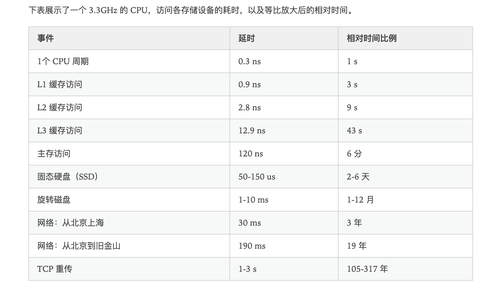

# C++性能优化指南

> 相比于 C 中线性的效率（一条C代码对应 5-6 条汇编语句），不良的 C++ 代码可能导致非常差的效率（对应 300+ 条）

## 0. 性能前言

### 常见时钟周期



## 4. 优化字符串的使用

### string 底层实现

- 基本原则，不同的编译器（VC++、GNU、Clang++）以及不同的版本都有不同的实现

- 三种基本实现方式

    > 每种实现都应该包含：字符串大小、容量、内容

    - 深拷贝
    - COW   （需要atmoic支持，损失性能）
    - SSO   （Short String Optimization）

- folly 中 fbstring 能够根据不同的字符串长度实现不同的策略

### 使用 += 代替 +

```c++
std::string s1 = "hello"
std::string s2;

s2 = s1 + s2;   // 构造函数、op(+)、析构函数
s2 += s1;       // op(+=)
```

### 提前预留空间

- 减少调用分配器分配内存的次数

### 消除对参数的复制

```c++
std::string remove_ctrl_ref_args(std::string const& s) {     
    std::string result;     
    result.reserve(s.length());     
    for (int i=0; i<s.length(); ++i) {         
        if (s[i] >= 0x20)             
            result += s[i];     
    }     
    return result; 
}
// 这里每次访问 s[i] 都是相当于一次二次间接寻址
```

- 使用引用的方式传参，能够消除参数的复制、移动；但是会增加很多指针的解引用（内存寻址）

### 消除指针解引用

```c++
std::string remove_ctrl_ref_args(std::string const& s) {     
    std::string result;     
    result.reserve(s.length());     
    for (auto it = s.begin(), end = s.end(); it != end; ++it) { 
        // 这里算是一个小trick   
        if (*it >= 0x20)             
            result += *it;     
    }     
    return result; 
}

/*
    可以避免重复计算偏移量、一些场景有更好的局部性、边界检查优化
*/
```

### 消除返回字符串的复制

### 用字符数组代替字符串

## 6. 优化动态分配内存的变量

## 7， 优化热点语句

### 从循环中移除代码

### 从函数中移除代码

### 优化表达式

### 优化程序控制流

<!-- ##  -->