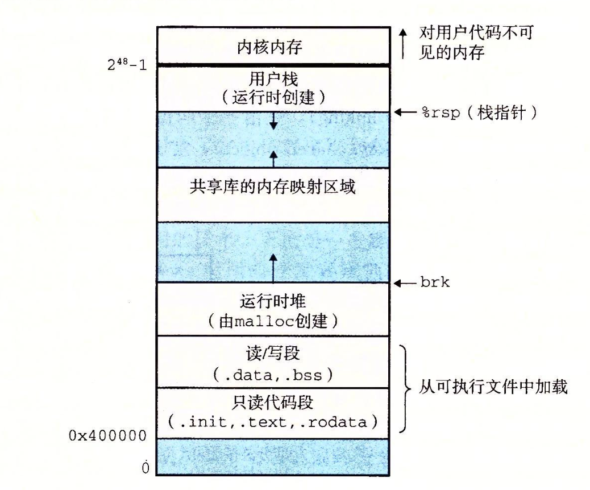

# 深入理解计算机系统

## 第一章 计算机系统漫游

### 程序被其他程序翻译成不同的格式

## 第二章 信息的表示和处理

## 第三章 程序的机器级表示

## 第四章 处理器体系结构

## 第五章 优化程序性能

### 优化编译器的能力和局限性

### 表示程序性能

### 程序示例

### 消除循环的低效率

### 减少过程调用

### 消除不必要的内存引用

### 理解现代处理器

### 循环展开

### 理解并行性

### 优化合并代码的结果小结

### 一些限制因素

### 理解内存性能

### 应用：性能提高技术

### 确认和消除性能瓶颈

## 第六章 存储器层次结构

## 第七章 链接

**链接是将各种代码和数据片段收集并组合成为一个单一的文件的过程，这个文件可以被加载（复制）到内存执行**

链接可以执行与编译时、加载时，运行时

链接的好处在于使得 “分离编译成为可能”

### ELF 文件

- `Executable and Linkable Format`

    - 可以通过 ``readelf -e`` 读取详细信息

        

    - 典型的 `elf` 文件

        

    - 典型的 内存映像

        

## 第八章 异常控制流

## 第九章 虚拟内存

## 第十章 系统级 I/O

## 第十一章 网络编程

## 第十二章 并发编程
