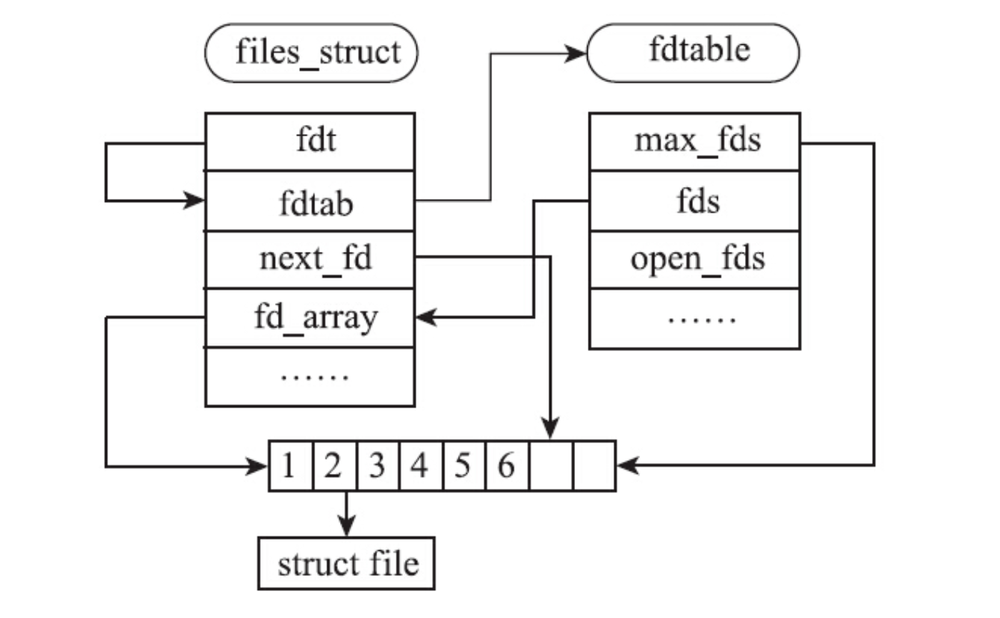

# Linux 环境编程：从应用到内核

## 0. 基础知识

### 一个 Linux 程序诞生记

- `gcc -E test.c > test.i` 保存预处理之后的文件
- `gcc -S test.c > tset.s` 保存编译之后的文件
- `-Wall` 打开所有的警告信息
- `-v` 显示更详细的编译信息

### 程序的构成

- 使用 `readelf` 工具产看二进制文件
- ``text``  ``rodata`` ``bss`` ``data`` ``debug`` ``dynamic`` ``fini`` ``init`` ``symtab``

### 程序是如何“跑”的

- 使用 ``strace`` 追踪

## 1. 文件 I/O

### Linux 中的文件

内核中进程对应的结构是 ``task_strcut`` 进程的文件表保存在 ``task_struct->files`` 中

```c
struct embedded_fd_set {
    unsigned long fds_bits[1];
    // "结构的尾部扩展" 使用大小为1的数组模拟柔性数组
};

struct fdtable {
    unsigned int max_fds;
    struct file ** fd;      /* current fd array */
    fd_set *close_on_exec;
    fd_set *open_fds;
    struct rcu_head rcu;
    struct fdtable *next;
};

/*
* Open file table structure
*/
struct files_struct {
/*
* read mostly part
*/
    atomic_t count; // 文件表的引用计数
    struct fdtable *fdt;
    struct fdtable fdtab; // 一种内核的优化策略，默认大小的文件表足以应付大多数情况，可以避免频繁的内存申请
/*
* written part on a separate cache line in SMP
*/
    spinlock_t file_lock ____cacheline_aligned_in_smp;
    int next_fd;    // Linux 文件描述符策略永远选择最小的可用的文件描述赋
    struct embedded_fd_set close_on_exec_init;
    struct embedded_fd_set open_fds_init;
    struct file * fd_array[NR_OPEN_DEFAULT]; // 最大值默认64
};
```



```c++
struct files_struct init_files = {
    .count		= ATOMIC_INIT(1),
    .fdt		= &init_files.fdtab,
    .fdtab		= {
        .max_fds	= NR_OPEN_DEFAULT,
        .fd		= &init_files.fd_array[0],
        .close_on_exec	= (fd_set *)&init_files.close_on_exec_init,
        .open_fds	= (fd_set *)&init_files.open_fds_init,
        .rcu		= RCU_HEAD_INIT,
    },
    .file_lock	= __SPIN_LOCK_UNLOCKED(init_task.file_lock),
};
```

### 打开文件

- ``open`` 介绍

    ```c++
    int open(const char *pathname, int flags);
    int open(const char *pathname, int flags, mode_t mode);

    /*
    flags: 
        O_RDONLY
        O_WRONLY
        O_RDWR
        O_APPEND
        O_ASYNC
        O_CLOEXEC
        O_CREAT
        O_DIRECT
        O_DIRECTORY
        O_EXCL             
        O_LARGEFILE          : 表明文件为大文件
        O_NOATIME            : 读取文件时，不更新最后的访问时间
        O_NONBLOCK O_NDELAY
        O_SYNC
        O_TRUNC              : 打开文件时，把文件长度截断为0，写文件时，如果作为新文件重新写入，一定要使用O_TRUNC
    */
    ```

- `open` 源码追踪

    ```c++
    // 内部的实现主要依靠 get_unused_fd_flags 和 fd_install
    long do_sys_open(int dfd, const char __user *filename, int flags, int mode)
    {
        char *tmp = getname(filename);
        int fd = PTR_ERR(tmp);

        if (!IS_ERR(tmp)) {
            fd = get_unused_fd_flags(flags);
            if (fd >= 0) {
                struct file *f = do_filp_open(dfd, tmp, flags, mode, 0);
                if (IS_ERR(f)) {
                    put_unused_fd(fd);
                    fd = PTR_ERR(f);
                } else {
                    fsnotify_open(f->f_path.dentry);
                    fd_install(fd, f);
                }
            }
            putname(tmp);
        }
        return fd;
    }
    ```

### ``creat`` 简介

是对 ``open`` 的一种封装

```c++
SYSCALL_DEFINE2(creat, const char __user *, pathname, int, mode)
{
	return sys_open(pathname, O_CREAT | O_WRONLY | O_TRUNC, mode);
}
```

### 关闭文件

- ``close`` 源码追踪

    ```c++
    SYSCALL_DEFINE1(close, unsigned int, fd)
    {
        struct file * filp;
        struct files_struct *files = current->files;
        struct fdtable *fdt;
        int retval;

        spin_lock(&files->file_lock);
        fdt = files_fdtable(files);
        if (fd >= fdt->max_fds)
            goto out_unlock;
        filp = fdt->fd[fd];
        if (!filp)
            goto out_unlock;
        rcu_assign_pointer(fdt->fd[fd], NULL);
        FD_CLR(fd, fdt->close_on_exec);
        __put_unused_fd(files, fd);
        spin_unlock(&files->file_lock);
        retval = filp_close(filp, files);

        /* can't restart close syscall because file table entry was cleared */
        if (unlikely(retval == -ERESTARTSYS ||
                retval == -ERESTARTNOINTR ||
                retval == -ERESTARTNOHAND ||
                retval == -ERESTART_RESTARTBLOCK))
            retval = -EINTR;

        return retval;

    out_unlock:
        spin_unlock(&files->file_lock);
        return -EBADF;
    }

    static void __put_unused_fd(struct files_struct *files, unsigned int fd)
    {
        struct fdtable *fdt = files_fdtable(files);
        __FD_CLR(fd, fdt->open_fds);
        if (fd < files->next_fd)
            files->next_fd = fd;
    }
    ```

- 自定义 ``files_operations``

    ```c++
    static const struct file_operations socket_file_ops = {
        .owner =	THIS_MODULE,
        .llseek =	no_llseek,
        .aio_read =	sock_aio_read,
        .aio_write =	sock_aio_write,
        .poll =		sock_poll,
        .unlocked_ioctl = sock_ioctl,
    #ifdef CONFIG_COMPAT
        .compat_ioctl = compat_sock_ioctl,
    #endif
        .mmap =		sock_mmap,
        .open =		sock_no_open,	/* special open code to disallow open via /proc */
        .release =	sock_close,
        .fasync =	sock_fasync,
        .sendpage =	sock_sendpage,
        .splice_write = generic_splice_sendpage,
        .splice_read =	sock_splice_read,
    };
    ```

- 遗忘 `close` 可能会造成文件描述符始终没有被释放，用于文件管理的某些内存结构没有被释放
    - ``expand_files`` 用于扩展当前的文件表
    - ``get_empty_filp`` 用于申请空闲的 ``file`` 结构

- 针对常驻进程忘记关闭文件的危害，可以通过 ``lsof`` 查找问题

### 文件偏移

- `lseek` 简介

    ```c++
    off_t lseek(int fd, off_t offset, int whence); // SEEK_SET、SEEK_CUR、SEEK_END
    ```

### 读取文件

```c++
ssize_t read(int fd, void *buf, size_t count);

// 文件中剩余字节数小于count时，行为需要具体分析，直接返回还是阻塞
```

```c++
SYSCALL_DEFINE3(read, unsigned int, fd, char __user *, buf, size_t, count)
{
	struct file *file;
	ssize_t ret = -EBADF;
	int fput_needed;

	file = fget_light(fd, &fput_needed);
	if (file) {
		loff_t pos = file_pos_read(file);
		ret = vfs_read(file, buf, count, &pos);
		file_pos_write(file, pos);
		fput_light(file, fput_needed);
	}

	return ret;
}
```

### 写入文件

```c++
ssize_t write(int fd, const void *buf, size_t count);
```

通过 ``O_APPEND`` 可以实现在文件的末尾原子追加新数据

### 文件的原子读写

```c++
ssize_t pread(int fd, void *buf, size_t count, off_t pos);
ssize_t pwrite(int fd, const void *buf, size_t count, off_t pos);

//  不从文件表中获得偏移量，直接使用用户提供的偏移量
```

### 文件描述符的复制

```c++
int dup(int oldfd);                             // 使用最小的未使用文件描述符作为复制后的文件描述符
int dup2(int oldfd, int newfd);                 // 使用指定的，如果newfd是已经打开的文件描述符，会先关闭然后在复制
int dup3(int oldfd, int newfd, int flags);      // 定义__GNU_SOURCE的情况下可以使用，可以原子的进行dup操作的同时将fd设置为O_CLOEXEC，避免将文件内容暴露给子进程
```

```c++
SYSCALL_DEFINE1(dup, unsigned int, fildes)
{
	int ret = -EBADF;
	struct file *file = fget(fildes);

	if (file) {
		ret = get_unused_fd();
		if (ret >= 0)
			fd_install(ret, file);
		else
			fput(file);
	}
	return ret;
}
```

### 文件数据的同步

```c++
void sync(void);

int fsync(int fd);
// 同步所有数据和元数据

int fdatasync(int fd);
// 和fsync 蕾丝，但是只会同步文件的实际数据修改，和会影响后面操作的元数据
```

### 文件的元数据

```c++
int stat(const char *path, struct stat *buf);

int fstat(int fd, struct stat *buf);

int lstat(const char *path, struct stat *buf);
// 和 stat 基本相同，只有当path是一个链接文件时，lstat得到的是链接文件本身的信息
```

```c++
SYSCALL_DEFINE2(stat, char __user *, filename, struct __old_kernel_stat __user *, statbuf)
{
	struct kstat stat;
	int error;

	error = vfs_stat(filename, &stat);
	if (error)
		return error;

	return cp_old_stat(&stat, statbuf);
}

int vfs_getattr(struct vfsmount *mnt, struct dentry *dentry, struct kstat *stat)
{
	struct inode *inode = dentry->d_inode;
	int retval;

	retval = security_inode_getattr(mnt, dentry);
	if (retval)
		return retval;

	if (inode->i_op->getattr)
		return inode->i_op->getattr(mnt, dentry, stat);
        // 实际上进行的是inode信息的的拷贝

	generic_fillattr(inode, stat);
	return 0;
}
```

### 文件截断

```c++
int truncate(const char *path, off_t length);
int ftruncate(int fd, off_t length);

// 保证旧数据不会对新数据产生干扰，也可以通过O_TRUNC进行操作
```

## 2. 标准 I/O 库

### IO 缓存

- 全缓存

    一般用于访问真正的磁盘文件，C库会为文件访问申请一块内存，只有当文件内容将缓存填满或者执行冲刷函数时，才会写入内核

- 行缓存

    一般用于访问终端，遇到一个换行符，会引发真正的IO操作，但是行缓存的大小也是固定的，缓存已满也会引发IO

- 无缓存 没有任何缓存

## 3. 进程环境

## 4. 进程控制：进程的一生

## 5. 进程控制：状态、调度和优先级

## 6. 信号

## 7. 理解 Linux 线程

## 8. 理解 Linux 县城

## 9. 进程间通信：管道

## 10. 进程间通信：System V IPC

## 11. 进程间通信：POSIX IPC

## 12. 网络通信：连接的建立

## 13. 网络通信：数据报文的发送

## 14. 网络通信：数据报文的接受

## 15. 编写安全无错代码
