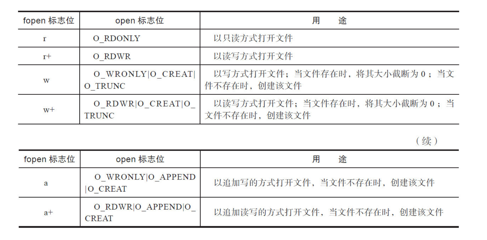

# Linux 环境编程：从应用到内核

## 0. 基础知识

### 一个 Linux 程序诞生记

- `gcc -E test.c -o test.i` 保存预处理之后的文件
- `gcc -S test.c`
- `-Wall` 打开所有的警告信息
- `-v` 显示更详细的编译信息

### 程序的构成

- 使用 `readelf` 工具产看二进制文件
- ``text``  ``rodata`` ``data`` ``bss`` ``debug`` ``dynamic`` ``fini`` ``init`` ``symtab``

- ELF 文件的类型

    ```text
    Relocatable File        .o .a
    Executable File         
    Shared Object File      .so 
    Core Dump File  

    ELF 文件基本结构
    +====================+
    +     ELF header     + // 包含了整个文件的基本属性，如：文件版本，目标机器型号，入口地址。
    +====================+
    +Program header table+ // 程序标头表是一组程序标头，它们定义了运行时程序的内存布局。对于.obj文件可选的
    +====================+
    +      .interp       + // 可执行文件所需要的动态链接器的位置。
    +--------------------+
    +   .note.ABI-tag    + // 用于声明ELF的预期运行时ABI。包括操作系统名称及其运行时版本。
    +--------------------+
    + .note.gnu.build-id + // 表示唯一的构建ID位串。
    +--------------------+
    +     .gnu.hash      + // 符号hash表。若段名是.hash，则使用的是SYSV hash，其比gnu hash性能差。
    +--------------------+
    +      .dynsym       + // 动态符号表用来保存与动态链接相关的导入导出符号，不包括模块内部的符号。
    +--------------------+
    +      .dynstr       + // 动态符号字符串表，用于保存符号名的字符串表。静态链接时为.strtab。
    +--------------------+
    +    .gnu.version    + // 表中条目与.dynsym动态符号表相同。每个条目指定了相应动态符号定义或版本要求。
    +--------------------+
    +   .gnu.version_r   + // 版本定义。
    +--------------------+
    +     .rela.dyn      + // 包含共享库（PLT除外）所有部分的RELA类型重定位信息。
    +--------------------+
    +     .rela.plt      + // 包含共享库或动态链接的应用程序的PLT节的RELA类型重定位信息。
    +--------------------+
    +       .init        + // 程序初始化段。
    +--------------------+
    +        .plt        + // 过程链接表(Procedure Linkage Table)，用来实现延迟绑定。
    +--------------------+
    +      .plt.got      + // 暂无。。。。。
    +--------------------+
    +       .text        + // 代码段
    +--------------------+
    +       .fini        + // 程序结束段
    +--------------------+
    +      .rodata       + // 只读变量（const修饰的）和字符串变量。
    +--------------------+
    +      .rodata1      + // 据我所知，.rodata和.rodata1是相同的。一些编译器会.rodata分为2个部分。
    +--------------------+
    +   .eh_frame_hdr    + // 包含指针和二分查找表，(一般在C++)运行时可以有效地从eh_frame中检索信息。
    +--------------------+
    +     .eh_frame      + // 它包含异常解除和源语言信息。此部分中每个条目都由单个CFI（呼叫帧信息）表示。
    +--------------------+
    +    .init_array     + // 包含指针指向了一些初始化代码。初始化代码一般是在main函数之前执行的。
    +--------------------+
    +    .fini_array     + // 包含指针指向了一些结束代码。结束代码一般是在main函数之后执行的。
    +--------------------+
    +      .dynamic      + // 保存动态链接器所需的基本信息。
    +--------------------+
    +        .got        + // 全局偏移表，存放所有对于外部变量引用的地址。
    +--------------------+
    +      .got.plt      + // 保存所有对于外部函数引用的地址。延迟绑定主要使用.got.plt表。
    +--------------------+
    +       .data        + // 全局变量和静态局部变量。
    +--------------------+
    +       .data1       + // 据我所知，.data和.data1是相同的。一些编译器会.data分为2个部分。
    +--------------------+
    +        .bss        + // 未初始化的全局变量和局部局部变量。
    +--------------------+
    +      .comment      + // 存放编译器版本信息
    +--------------------+
    +   .debug_aranges   + // 内存地址和编译之间的映射
    +--------------------+
    +    .debug_info     + // 包含DWARF调试信息项（DIE）的核心DWARF数据
    +--------------------+
    +   .debug_abbrev    + // .debug_info部分中使用的缩写
    +--------------------+
    +    .debug_line     + // 程序行号
    +--------------------+
    +     .debug_str     + // .debug_info使用的字符串表
    +--------------------+
    +      .symtab       + // 静态链接时的符号表，保存了所有关于该目标文件的符号的定义和引用。
    +--------------------+
    +      .strtab       + // 默认字符串表。
    +--------------------+
    +     .shstrtab      + // 字符串表。
    +====================+
    +Section header table+ // 用于引用Sections的位置和大小，并且主要用于链接和调试目的。对于Exec文件可选
    +====================+
    ```

### 程序是如何“跑”的

- 使用 ``strace`` 追踪系统调用

### ``gcc``一些编译选项

- 控制警告
    - `-Wall`：开启所有警告信息，帮助识别潜在问题
    - ``-Wextra``：开启额外的警告，更严格。
    - ``-Werror``：将所有警告当作错误处理，编译中断。

- 优化选项 ``-O``
- 调试选项 ``-g``
- 链接选项
    - ``-l``：指定链接的库名
    - ``-L``：用于在编译时指示库的路径，加载路径默认为 ``/lib`` 和 ``/usr/lib``
- 预处理选项 `-D` ``-U``
- 输出控制选项 ``-o <file>``
- 搜索路径 ``-I``
- 其他
    - `-c`：进行编译和汇编，生成 ``.o`` 文件 可以直接传递 ``.i`` 或者 ``.s`` 文件
    - `-shared`：生成动态库
    - `-fpic`：生成位置无关代码
    - `-fpie`：生成位置无关的可执行文件
    - `-static`：使用静态链接

### 变参函数

```c++
// 不同 arch有不同的实现，根据函数调用传参规则实现
void va_start(va_list ap, prev_param);
type va_list(va_list ap, type);
void va_end(va_lsit ap);
```

## 1. 文件 I/O

### Linux 中的文件

使用文件描述符即句柄，有两个好处。一是增加安全性，二是增加了可拓展性

[相关数据结构介绍](./APUE.md#文件管理)

```c++
// init 是Linux的第一个进程，他的文件表是一个全局变量
struct files_struct init_files = {
    .count		= ATOMIC_INIT(1),
    .fdt		= &init_files.fdtab,
    .fdtab		= {
        .max_fds	= NR_OPEN_DEFAULT,
        .fd		= &init_files.fd_array[0],
        .close_on_exec	= (fd_set *)&init_files.close_on_exec_init,
        .open_fds	= (fd_set *)&init_files.open_fds_init,
        .rcu		= RCU_HEAD_INIT,
    },
    .file_lock	= __SPIN_LOCK_UNLOCKED(init_task.file_lock),
};
```

### 打开文件

- ``open`` 介绍

    ```c++
    int open(const char *pathname, int flags);
    int open(const char *pathname, int flags, mode_t mode);

    /*
        C语言不支持函数重载，为什么open可以有两个函数原型？
            当我们调用open函数时，实际上调用的是glibc封装的函数，然后由glibc通过自陷指令，进入真正的系统调用
            *所有的系统调用都要先经过glibc才会进入操作系统*
            glibc提供了一个变参函数来满足open的两个函数原型
        
        描述符分配策略：永远分配最小的可用描述符
    */

    /*
    flags: 
        O_RDONLY               : 打开文件仅供读取。
        O_WRONLY               : 打开文件仅供写入。
        O_RDWR                 : 打开文件同时用于读写。
        O_APPEND               : 每次写操作都将数据追加到文件的末尾。
        O_ASYNC                : 启用信号驱动的异步I/O，当I/O操作可以进行时，将向进程发送信号。
        O_CLOEXEC              : 设置执行时关闭（close-on-exec）标志，当执行新程序时文件将被自动关闭。
        O_CREAT                : 如果指定文件不存在，则创建它。使用这个选项通常需要提供一个额外的模式参数，指定新文件的权限。
        O_DIRECT               : 最小化或跳过缓存和缓冲，直接从硬件读写数据。
        O_DIRECTORY            : 如果文件路径不是目录，则失败。这个标志用于打开目录。
        O_EXCL                 : 与 O_CREAT 一起使用时，如果文件已存在，则失败。这对于在创建文件时检查是否存在相同文件很有用。
        O_LARGEFILE            : 表明文件为大文件
        O_NOATIME              : 读取文件时，不更新最后的访问时间
        O_NONBLOCK O_NDELAY    : 打开文件或设备时，非阻塞模式（读写操作立即返回，而不是等待）。O_NONBLOCK 和 O_NDELAY 在许多系统上有相同的效果，尽管历史上可能有所不同。
        O_SYNC                 : 打开文件用于同步I/O。每次 write() 都等待物理 I/O 操作完成。
        O_TRUNC                : 打开文件时，把文件长度截断为0，写文件时，如果作为新文件重新写入，一定要使用O_TRUNC
    */
    ```

- `open` 源码追踪

    ```c++
    # define open(name, flags)	__open_nocancel (name, flags)
    /*
        User(glibc):
            open -> __open_nocancel(name, flags) -> INLINE_SYSCALL_CALL(openat, AT_FDCWD, file, oflag, mode)
        Kernel(Linux):
            openat -> do_sys_open
    */

   int
    __open_nocancel (const char *file, int oflag, ...)
    {
        int mode = 0;
        if (__OPEN_NEEDS_MODE (oflag))          // 只有在O_TMPFILE 和 O_CREAT模式下打开的文件 mode 参数才有效
        {
            va_list arg;
            va_start (arg, oflag);
            mode = va_arg (arg, int);
            va_end (arg); 
        }
        return INLINE_SYSCALL_CALL (openat, AT_FDCWD, file, oflag, mode);
    }

    long do_sys_open(int dfd, const char __user *filename, int flags, int mode)
    {
        char *tmp = getname(filename);          // 用于分配一个内核缓冲区并调用do_getname将用户空间的文件名拷贝到内核空间
        int fd = PTR_ERR(tmp);

        if (!IS_ERR(tmp)) {
            fd = get_unused_fd_flags(flags);    // 得到最小的没有使用的fd，内部调用alloc_fd(0, flags)
            if (fd >= 0) {
                struct file *f = do_filp_open(dfd, tmp, flags, mode, 0);
                if (IS_ERR(f)) {
                    put_unused_fd(fd);
                    fd = PTR_ERR(f);
                } else {
                    fsnotify_open(f->f_path.dentry);
                    fd_install(fd, f);
                }
            }
            putname(tmp);                       // 归还分配的内核空间
        }
        return fd;
    }
    ```

### ``creat`` 简介

是对 ``open`` 的一种封装

```c++
SYSCALL_DEFINE2(creat, const char __user *, pathname, int, mode)
{
	return sys_open(pathname, O_CREAT | O_WRONLY | O_TRUNC, mode);
}
```

### 关闭文件

- ``close`` 源码追踪

    ```c++
    SYSCALL_DEFINE1(close, unsigned int, fd)
    {
        ...
        rcu_assign_pointer(fdt->fd[fd], NULL); 
        FD_CLR(fd, fdt->close_on_exec);
        __put_unused_fd(files, fd);
        spin_unlock(&files->file_lock);
        retval = filp_close(filp, files);  
        ...
    }

    static void __put_unused_fd(struct files_struct *files, unsigned int fd)
    {
        struct fdtable *fdt = files_fdtable(files);
        __FD_CLR(fd, fdt->open_fds);
        if (fd < files->next_fd)
            files->next_fd = fd;
    }
    ```

- 遗忘 `close` 可能会造成文件描述符始终没有被释放，用于文件管理的某些内存结构没有被释放，如果进程是常驻进程，会导致严重的问题，``fdtable`` 会被无限拓展，会不断申请 ``struct file`` 结构体

    - ``expand_files`` 用于扩展当前的文件表

        ```c++
        // expand_files -> expand_fdtable
        static int expand_fdtable(struct files_struct *files, int nr)        
        {
            ...
            spin_unlock(&files->file_lock);
            new_fdt = alloc_fdtable(nr);
            spin_lock(&files->file_lock);           // 防止在持有自旋的时间由于分配内存被阻塞，因此先释放锁，在获取锁
            ...
            if (unlikely(new_fdt->max_fds <= nr))   // 在扩展期间，nr发生了了变化
            ...
            cur_fdt = files_fdtable(files);
            if (nr >= cur_fdt->max_fds) {
                copy_fdtable(new_fdt, cur_fdt);
                rcu_assign_pointer(files->fdt, new_fdt);
                if (cur_fdt->max_fds > NR_OPEN_DEFAULT)
                    free_fdtable(cur_fdt);
            } else {                                // 也许在我们释放锁的期间，其他的线程完成了扩展
                free_fdarr(new_fdt);
                free_fdset(new_fdt);
                kfree(new_fdt);
            }
            return 1;
        }
        ```

    - ``get_empty_filp`` 用于申请空闲的 ``file`` 结构

        ```c++
        struct file *get_empty_filp(void)
        {
            if (get_nr_files() >= files_stat.max_files && !capable(CAP_SYS_ADMIN)) {
                // 先粗略判断，直接返回count
                if (percpu_counter_sum_positive(&nr_files) >= files_stat.max_files)
                // 如果不行，精确判断，计算sum
                    goto over;
            }
            ...
        }
        ```

- 针对常驻进程忘记关闭文件的危害，可以通过 ``lsof`` 查找问题

### 文件偏移

- `lseek` 简介

    ```c++
    off_t lseek(int fd, off_t offset, int whence); // SEEK_SET、SEEK_CUR、SEEK_END
    // 返回值是相对于文件起始位置的偏移量
    ```

### 读取文件

```c++
ssize_t read(int fd, void *buf, size_t count);

// 文件中剩余字节数小于count时，行为需要具体分析，直接返回还是阻塞
```

```c++
SYSCALL_DEFINE3(read, unsigned int, fd, char __user *, buf, size_t, count)
{
	struct file *file;
	ssize_t ret = -EBADF;
	int fput_needed;

	file = fget_light(fd, &fput_needed);
	if (file) {
		loff_t pos = file_pos_read(file);
		ret = vfs_read(file, buf, count, &pos);
		file_pos_write(file, pos);
		fput_light(file, fput_needed);
	}

	return ret;
}
```

### 写入文件

```c++
ssize_t write(int fd, const void *buf, size_t count);
```

通过 ``O_APPEND`` 可以实现在文件的末尾原子追加新数据

### 文件的原子读写

```c++
ssize_t pread(int fd, void *buf, size_t count, off_t pos);
ssize_t pwrite(int fd, const void *buf, size_t count, off_t pos);

//  不从文件表中获得偏移量，直接使用用户提供的偏移量
```

### 文件描述符的复制

```c++
int dup(int oldfd);                             // 使用最小的未使用文件描述符作为复制后的文件描述符
int dup2(int oldfd, int newfd);                 // 使用指定的，如果newfd是已经打开的文件描述符，会先关闭然后在复制
int dup3(int oldfd, int newfd, int flags);      // 定义__GNU_SOURCE的情况下可以使用，可以原子的进行dup操作的同时将fd设置为O_CLOEXEC，避免将文件内容暴露给子进程
```

```c++
SYSCALL_DEFINE1(dup, unsigned int, fildes)
{
	int ret = -EBADF;
	struct file *file = fget(fildes);

	if (file) {
		ret = get_unused_fd();
		if (ret >= 0)
			fd_install(ret, file);
		else
			fput(file);
	}
	return ret;
}
```

### 文件数据的同步

```c++
void sync(void);

int fsync(int fd);
// 同步所有数据和元数据

int fdatasync(int fd);
// 和fsync 类似，但是只会同步文件的实际数据修改，和会影响后面操作的元数据
```

### 文件的元数据

```c++
int stat(const char *path, struct stat *buf);

int fstat(int fd, struct stat *buf);

int lstat(const char *path, struct stat *buf);
// 和 stat 基本相同，只有当path是一个链接文件时，lstat得到的是链接文件本身的信息
```

```c++
SYSCALL_DEFINE2(stat, char __user *, filename, struct __old_kernel_stat __user *, statbuf)
{
	struct kstat stat;
	int error;

	error = vfs_stat(filename, &stat);
	if (error)
		return error;

	return cp_old_stat(&stat, statbuf);
}

int vfs_getattr(struct vfsmount *mnt, struct dentry *dentry, struct kstat *stat)
{
	struct inode *inode = dentry->d_inode;
	int retval;

	retval = security_inode_getattr(mnt, dentry);
	if (retval)
		return retval;

	if (inode->i_op->getattr)
		return inode->i_op->getattr(mnt, dentry, stat);
        // 实际上进行的是inode信息的的拷贝

	generic_fillattr(inode, stat);
	return 0;
}
```

### 文件截断

```c++
int truncate(const char *path, off_t length);
int ftruncate(int fd, off_t length);

// 保证旧数据不会对新数据产生干扰，也可以通过O_TRUNC进行操作
```

## 2. 标准 I/O 库

### IO 缓存

- 全缓存

    一般用于访问真正的磁盘文件，C库会为文件访问申请一块内存，只有当文件内容将缓存填满或者执行冲刷函数时，才会写入内核

- 行缓存

    一般用于访问终端，遇到一个换行符，会引发真正的IO操作，但是行缓存的大小也是固定的，缓存已满也会引发IO

- 无缓存 没有任何缓存

### ``fopen`` 和 ``open`` 标识位对比



### `fdopen` 与 `fileno`

```c++
FILE *fdopen(int fd, const char *mode); // 建立一个新的文件流，并且及逆行绑定
int fileno(FLIE *stream); // 返回文件流绑定的文件描述符

//  关闭文件时都要使用 fclose 才能释放文件流占用的内存
```

### 小心 `getc` 和 `fgetc`

```c++
int fgetc(FILE *stream);
int getc(FILE *stream);

// fgetc 总是一个函数，但是 getc 可能是一个宏，所以当参数有副作用时，可能会有预期外的行为
```

### 注意 `fread` 和 `fwrite` 的返回值

```c++
size_t fread(void *ptr, size_t size, size_t nmemb, FILE *stream);
size_t fwrite(const void *ptr, size_t size, size_t nmeb, FILE *stream);
```

### 创建临时文件

## 3. 进程环境

### ``__attribute__``

- ``aligned(n)``
- ``packed``
- ``section("name")``
- ``unused``
- ``deprecated``
- ``noreturn``
- ``format``
- ``constructor``
- ``destructor``

### `exit`

- 调用流程

    ```c++
    // 调用流程 exit/quick_exit -> __run_exit_handlers(执行) -> _exit -> exit_group/exit -> do_group_exit -> do_exit
    void exit (int status){
        __run_exit_handlers (status, &__exit_funcs, true, true);
    }

    void __new_quick_exit (int status){   
         __run_exit_handlers (status, &__quick_exit_funcs, false, false);
    }

    // _run_exit_handlers 涉及到的数据结构
    struct exit_function_list{
        struct exit_function_list *next;
        size_t idx;
        struct exit_function fns[32];
        // 通过这种方式能够提高程序的局部性，减少内存碎片，提高内存分配效率
    };

    ```

- ``example case``

    ```c++
    // 通过_exit退出，不会冲刷缓冲区
    // 通过exit退出，会冲刷缓冲区，但是不会关闭文件流
    FILE *file = fopen("./test_exit.txt", "w");

    pid_t pid = fork();
    if (pid < 0) {
        perror("fork failed");
        fclose(file);
        return EXIT_FAILURE;
    } else if (pid == 0) {
        fprintf(file, "This is written by the child process using exit.\n");
        exit(0);  // 正常关闭流并冲刷缓冲区
    } else {
        fprintf(file, "This is written by the parent process using _exit.\n");
        wait(NULL);
        _exit(0);  // 不冲刷缓冲区，直接退出
    }
    // 这里可以看出来通过_exit直接退出，不会冲刷缓冲区，并且可以看出来父子进程的用户空间的缓冲区是不一样的
    // c++11 引入了quick_exit，不执行析构函数而只是使得程序终止，和exit一样，同属于正常的退出
    ```

- `__run_exit_handlers` 和 `do_exit` 分别执行的清理工作
    - ``__run_exit_handlers`` 执行的清理工作是用户级的
    - ``do_exit`` 是内核空间的清理，主要包括回收进程的内存页、进程描述符、关闭文件描述符、子进程处理、调度器交互等

### ``atexit``

```c++
int atexit(void (*function)(void));

// 只有使用 exit 退出或者使用 main 中的return退出才会调用，收到信号不会

// 调用流程 atexit -> __cxa_atexit
```

### 小心使用环境变量

```c++
int putenv(char *string);
int setenv(const char *name, const char *value, int overwrite);

// putenv 直接使用原始字符串，不进行复制，这导致如果修改了原始的字符串，环境变量也会被修改。
// putenv 总是会覆盖同名的字符串
// 应该使用 setenv 设置环境变量，有更好的安全性
```

### 使用动态库

- 静态库在链接阶段，会被直接链接进最终的二进制文件中，因此最终生成的二进制文件体积会比较大，但是不再依赖于库文件
- 动态库并不是被链接到文件中的，只是保存了依赖关系，生成的二进制文件体积比较小，但是在运行阶段需要加载动态库

- 动态库的生成

    ```c++
    // foo.c
    #include<stdio.h>
    void foo() { printf("foo works\n"); }
    
    // gcc -shared foo.c -o libfoo.so
    ```

- 动态库的使用

    - 系统自动加载动态库

        ```c++
        gcc test.c -lfoo -L . -o test
        export LD_LIBRARY_PATH=/home/parallels/test:$LD_LIBRARY_PATH
        ```

    - 手工加载动态库

        ```c++
        #include <dlfcn.h>
        
        void *dlib = dlopen("./libfoo.so", RTLD_NOW);

        if(!dlib) {
            printf("open failed\n");
            return -1;
        }

        void (*foo)(void) = dlsym(dlib, "foo");
        if(!foo) {
            printf("dlsym failed\n");
            return -1;
        }
        foo();
        dlclose(dlib);
        return 0;
        ```

    - 程序平滑无缝的升级

### 避免内存问题

- 慎用 ``realloc``

    ```c++
    *ptr = realloc(*ptr, new_size);
    if(!ptr) {
        ... // 错误处理
    }
    // 错误的写法，可能会造成内存泄露，如果内存分配失败，会返回null，导致之前的内存没有被释放，但是指针已经丢失了
    
    // 其他可能的bug
    // 如果传递空指针，会分配内存
    ```

- 防止内存越界

    - 同步修改缓存长度和复制长度

        ```c++
        char dst_buf[64];
        memcpy(dst_buf, src_buf, sizeof(dst_buf));
        ```

    - 使用安全的库函数

        ```c++
        char *strncat(char *dest, const char *src, size_t n);
        // 当src包含n个以上的字符时候，dest至少还要可以容纳 n + 1 个字符，因为还会追加'\0'
        char dest[20] = "hello";
        strnct(dest, src, sizeof(dest) - strlen(dest) - 1);

        char *strncpy(char *dest, const char *str, size_t n);
        strncpy(dest, src, sizeof(dest) - 1);
        
        // 使用 snprintf 代替 sprintf
        sprintf(char *str, const char *format, ...);
        snprintf(char *str, size_t size, const char *format, ...);
        
        // 使用 fgets 代替 gets
        gets(char *str);    // 非常危险的函数，读取一行，非常容易超出缓冲区的大小
        fgets(char *str, int num, FILE *stream); // 更安全的选择，从指定流中读取最多num - 1 个字符或直到一个换行符被读取
        ```

### 长跳转

## 4. 进程控制：进程的一生

### 进程ID

```c++
pid_t getpid(void);
pid_t getppid(void);
```

### 进程的层次

```c++
pid_t getpgrp(void);
pid_t getsid(pid_t pid);

int setpgid(pid_t pid, pid_t pgid); // 如果参数为0，修改调用进程的进程组id
// pid 必须为调用进程或者其子进程，pgid必须和当前进程组位于同一个会话

pid_t setsid(void);
```

### 进程的创建

```c++
pid_t fork(void);
/* 
调用流程
fork/vfork/clone -> do_fork -> copy_porcess -> copy_semundo/files/fs/sighand/signal/mm/namespace/io/thread
*/


// 必须要对返回值是 -1 的情况进行判断，不然可能会导致非常严重的后果，
// 一般来讲父进程会被优先调度，但是在应用中绝对不能对父子进程的执行顺序做任何的假设

// vfork vs. fork
// vfork 创建的子进程会导致父进程挂起，除非子进程 _exit 或者 exec
// vfork 创建的子进程会恭共享父进程的所有内存，直到子进程 exec 为止
// vfork 创建的子进程应该使用_exit退出
```

### 守护进程

- 生命周期很长，正常情况绝不终止
- 在后台执行，并且绝不与任何控制终端相关联

- `double-fork magic`

### 进程的终止

- 不考虑线程的情况下，进程的退出可以通过 5 种方式

    - ``exit``、``_exit``、`return`
    - ``abort``、被信号终止

- 等待子进程

    ```c++
    pid_t wait(int *status);
    pit_t waitpid(pid_t wait, int *sataus, int options);

    int waitid(idtype_t idtype, id_t id, siginfo_t *infop, int options);
    /*
    能够提供更精准的控制，可以区分终止事件和停止事件，可以不改变子进程状态
        WEXITED：等待子进程的终止事件
        WSTOPED：等待被信号暂停的子进程事件
        WCONTINUED：等待被暂停，但是被SIGCONT信号恢复执行的子进程
        WNOWAIT：只负责获取信息，不要改变子进程的状态
    */
    ```

- ``do_exit``中， 进程会释放基本所有的资源，但是还有两桩心愿：

    - 作为父亲进程，谁为他的子进程收尸
    - 作为子进程，需要通知父进程为自己收尸

    ```c++
    // do_exit -> exit_notify -> (forget_original_parent, do_notify_parent)

    // 多线程的情况，只有线程组的主线程才有资格通知父进程，线程组的其他线程终止的时候，不需要通知父进程
    // 如果主线程先死了，但是其他线程还没有终止，那么会在最后一个线程退出的时候通知父进程

    ```

### 等待子进程

### exec 家族

### system 函数

## 5. 进程控制：状态、调度和优先级

### 进程的状态

### 进程的调度概述

### 普通进程的优先级

### 完全公平调度的实现

### 普通进程的组调度

### 实时进程

### CPU 的亲和力

## 6. 信号

### 信号的完整生命周期

### 信号的产生

### 信号的默认处理函数

### 信号的分类

### 传统信号的特点

### 信号的可靠性

### 信号的安装

### 信号的发送

### 信号与线程的关系

### 等待信号

### 通过文件描述符来获取信号

### 信号递送的顺序

### 异步信号安全

## 7. 理解 Linux 线程

## 8. 理解 Linux 县城

## 9. 进程间通信：管道

## 10. 进程间通信：System V IPC

## 11. 进程间通信：POSIX IPC

## 12. 网络通信：连接的建立

## 13. 网络通信：数据报文的发送

## 14. 网络通信：数据报文的接受

## 15. 编写安全无错代码
