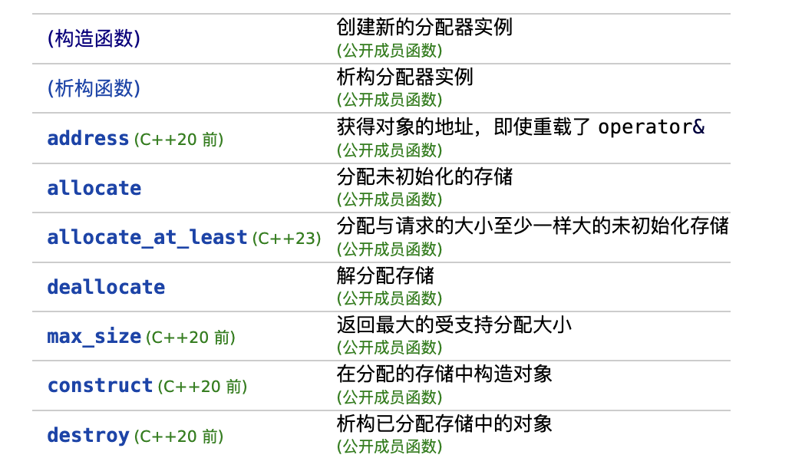

# SIG STL源码分析

## 2. 空间配置器

### 空间配置器的标准接口

- 定义

    ```c++
    template<typename T>
    struct allocator;
    ```

- 成员函数

    

### 具备次配置力的SGI空间配置器

### 内存基本处理工具

## 3. 迭代器与萃取编程

## 4. 序列式容器

## 5. 关联式容器

## 6. 算法

## 7. 仿函数

## 8， 适配器
